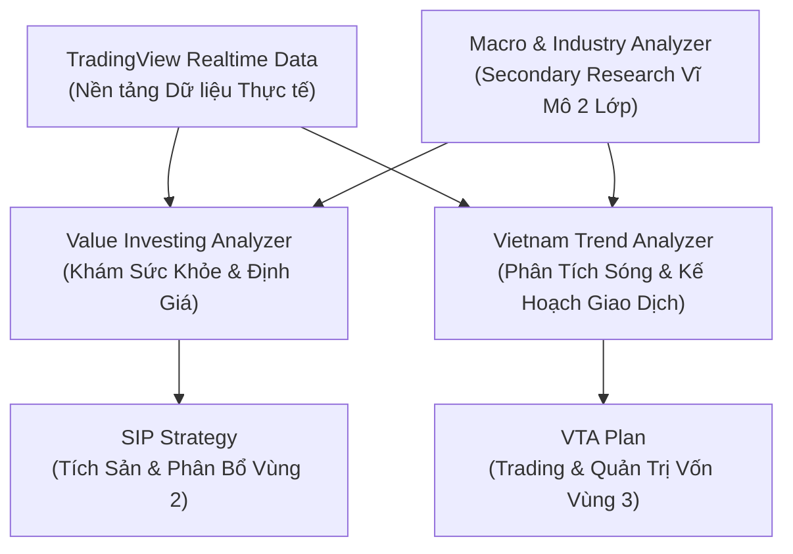

# PHÂN TÍCH CHUYÊN MÔN KỸ NĂNG TƯ VẤN MÔI GIỚI
## MÃ SỐ TÀI LIỆU: REF-08
### CHƯƠNG TRÌNH: KBSV NEXTGEN 2026
**Đơn vị tổ chức:** Sở Giao Dịch 3 (HO3) - KB Securities Vietnam & FinPeace

---

## 📌 HƯỚNG DẪN DÀNH CHO GIẢNG VIÊN & MENTOR
- **Mục đích:** Tài liệu tham chiếu bóc tách các kỹ năng phân tích chuyên môn của nhân viên môi giới tư vấn thế hệ mới.
- **Ứng dụng:** Giúp Mentor định hướng đào tạo học viên trong 2 tuần huấn luyện tập trung và cung cấp bộ khung kỹ thuật áp dụng trực tiếp trong cuộc thi thực chiến.

---

## I. TỔNG QUAN HỆ THỐNG KỸ NĂNG CHUYÊN MÔN (REF-08)
Hệ thống kỹ năng phân tích của Broker thế hệ mới (Digital Wealth Advisor / Financial KOC) được xây dựng dựa trên sự giao thoa giữa **Lý thuyết học thuật quốc tế kinh điển** và **Thực tế thị trường chứng khoán Việt Nam**. Hệ thống này gồm **5 kỹ năng cốt lõi** phục vụ hai mục đích chính: Tích sản dài hạn (SIP) và Giao dịch ngắn hạn theo xu hướng (Trend Trading).

---

## II. PHÂN TÍCH CHI TIẾT 5 KỸ NĂNG CHUYÊN MÔN

---

### Kỹ năng 1: Chiến Lược Tích Sản Cổ Phiếu (finpeace_sip_strategy)
*   **Mục đích:** Hướng dẫn Broker thiết lập danh mục tích lũy tài sản dài hạn (Vùng 2 Tích Lũy) cho khách hàng bằng phương pháp SIP định kỳ, loại bỏ hoàn toàn yếu tố cảm xúc ngắn hạn.
*   **Quy trình Lựa chọn Cổ phiếu Tích sản (4 Tiêu Chí Cốt Lõi):**
    1.  *Sức bền tài chính (Bắt buộc):* Doanh nghiệp đầu ngành, có dòng tiền vững vàng, không có nguy cơ sụt giảm lợi nhuận trên 50% trong 5 năm tới.
    2.  *Tiềm năng tăng trưởng:* Doanh nghiệp duy trì tốc độ phát triển bền vững theo chu kỳ kinh tế Việt Nam.
    3.  *Giá rẻ so với cung cầu (MA200):* Giá giao dịch quanh nền hoặc dưới đường MA200 để tránh mua đuổi vùng đỉnh.
    4.  *Giá rẻ so với định giá (Intrinsic Value):* Giá thị trường phải chiết khấu đủ sâu so với Giá trị nội tại.
*   **Hệ thống ra quyết định & Kêu gọi hành động (CTA):**
    *   **MUA TỐT (Strong Buy):** Giá thị trường < 90% Giá trị Nội tại (IV) **VÀ** Giá thị trường < 110% đường MA200 (Thỏa mãn cả chiết khấu sâu lẫn vùng tích lũy an toàn).
    *   **MUA ĐỊNH KỲ (Buy/Hold):** Tiếp tục mua tích sản đều đặn hàng tháng vào ngày nhận lương khi giá nằm trong biên độ cho phép, bỏ qua biến động giá ngắn hạn.

---

### Kỹ năng 2: Phân Tích Vĩ Mô & Ngành Thứ Cấp (macro_market_analyzer)
*   **Mục đích:** Giúp Broker đứng trên vai các báo cáo nghiên cứu chất lượng cao từ các Công ty Chứng khoán lớn (SSI, Vietcap, VCBS, MBS...) để chiết xuất ra **Góc nhìn sắc sảo (Insights)** ứng dụng trực tiếp cho khách hàng.
*   **Nguyên tắc Phân tích 2 Lớp (Bắt buộc):**
    *   *Lớp 1 - Ngành hẹp (Narrow Industry):* Đi sâu vào phân khúc cụ thể thay vì nói chung chung (ví dụ: Không nói "ngành thép", phải chỉ rõ "thép xây dựng xuất khẩu sang Mỹ", "tôn mạ nội địa"...). Định lượng bằng các con số phần trăm cụ thể.
    *   *Lớp 2 - Doanh nghiệp cụ thể:* Chỉ rõ mã cổ phiếu hưởng lợi lớn nhất (ví dụ: HPG, HAH, KBC) và ước tính phần trăm biên lợi nhuận cải thiện.
*   **Ý nghĩa thực chiến:** Giúp các Broker NextGen làm tư liệu sản xuất nội dung (Content Lab) hoặc cập nhật trong buổi họp sáng (Morning Briefing) để định hướng thông điệp tư vấn trong ngày.

---

### Kỹ năng 3: Khám Sức Khỏe & Định Giá Giá Trị (value_investing_analyzer)
*   **Mục đích:** Cung cấp bộ khung lọc tài chính bọc thép để đánh giá độ an toàn của một cổ phiếu trước khi quyết định đầu tư dài hạn.
*   **Khung Hệ Thống 4 Tầng Nguyên Tắc (4-Pillar Framework):**
    1.  *Biên An Toàn (Benjamin Graham):* Ưu tiên tiền mặt lớn hơn nợ (Cash > Debt), thanh toán hiện hành Current Ratio > 1.5 - 2.0, chỉ số P/E * P/B < 22.5.
    2.  *Con Hào Kinh Tế (Warren Buffett):* Tìm kiếm sức mạnh định giá (Pricing Power) và chính sách phân bổ vốn lành mạnh (trả cổ tức tiền mặt đều đặn, không phát hành giấy vô tội vạ).
    3.  *Công Thức Thần Kỳ (Joel Greenblatt):* Định vị doanh nghiệp Tốt có Giá Rẻ thông qua hai tỷ số: ROIC > 15% (Vốn sử dụng hiệu quả) và Earnings Yield (EBIT/EV) vượt trội lãi suất trái phiếu.
    4.  *Chống Gian Lận BCTC (Piotroski F-Score):* Chấm điểm từ 0-9 để loại bỏ các doanh nghiệp xào nấu doanh thu bằng các khoản phải thu ảo. Bắt buộc dòng tiền từ HĐKD phải dương (CFO > 0) và CFO > Lợi nhuận sau thuế.
*   **Nghệ thuật Thuyết phục (Storytelling Arsenal):**
    *   *Chàng kỹ sư cầu:* Dùng hình ảnh cây cầu chịu tải 30.000 pound cho xe 10.000 pound để giải thích ý nghĩa **Biên an toàn** - giúp khách hàng hiểu tại sao giá giảm sâu là cơ hội chứ không phải nguy cơ.

---

### Kỹ năng 4: Phân Tích Cấu Trúc Sóng & Xu Hướng (vietnam_trend_analyzer)
*   **Mục đích:** Lượng hóa trạng thái kỹ thuật của cổ phiếu để lên kế hoạch giao dịch ngắn/trung hạn (Vùng 3 Bứt Tốc).
*   **Hệ thống Chấm Điểm Ma Trận Tọa Độ 2 Chiều (Tối đa 10 điểm):**
    *   *Trend Score (Thang điểm 0/5 - Động lượng xu hướng):* 1 điểm cho mỗi chỉ báo thỏa mãn: Golden Cross cụm SMA30/SMA60, MACD nằm trên Signal Line, SuperTrend màu xanh, Parabolic SAR nằm dưới nến, và Gia tốc giá tăng dần.
    *   *Sideway Score (Thang điểm 0/5 - Độ nén & Dao động):* 1 điểm cho mỗi chỉ báo thỏa mãn: RSI trong vùng 50 - 70, giá chạm dải dưới Bollinger Bands (hoặc nén quanh trục giữa), Stochastic Slow cắt lên, nén chặt quanh Darvas Box (Cạnh dưới hộp), và chuỗi nến đảo chiều từ chối giảm.
*   **Quy trình Giao dịch 3 Bước (Identify -> Validate -> Execute):**
    *   *Bước 1 (Identify):* Nhận diện pha chu kỳ Wyckoff (Tích lũy, Đẩy giá, Phân phối, Đè giá).
    *   *Bước 2 (Validate):* Chấm điểm ma trận để lọc nhiễu. Ưu tiên Sóng và Volume là tín hiệu gốc, chỉ báo là xác nhận phụ.
    *   *Bước 3 (Execute):* Lập Trading Plan với Entry, Stop Loss, Take Profit rõ ràng. Giới hạn rủi ro thua lỗ tối đa không quá **2% tổng NAV**.

---

### Kỹ năng 5: Khai Thác Dữ Liệu Thời Gian Thực (tradingview_market_data)
*   **Mục đích:** Công cụ kỹ thuật hỗ trợ kết nối API TradingView để lấy báo cáo cập nhật giá khớp trực tiếp (Last Price) và các chỉ số cơ bản tức thời (P/E TTM, EPS, Vốn hóa basic) trước khi ra quyết định giao dịch hoặc tư vấn.
*   **Ý nghĩa:** Cung cấp nguồn dữ liệu sạch, nhanh chóng cho các thuật toán AI/Chatbot (SalesGPT) hoạt động, tăng tính chuẩn xác và tức thời trong phản hồi cho khách hàng.

---

## 🎯 III. ÁP DỤNG TRONG LỘ TRÌNH 42 NGÀY CỦA NEXTGEN 2026

Hệ thống kỹ năng chuyên môn này được lồng ghép chặt chẽ vào giáo trình đào tạo và thực chiến của học viên:

1.  **Tuần 1 (Huấn luyện tập trung - Module 1-3 FA):**
    *   Học viên học cách đọc hiểu BCTC doanh nghiệp thực tế theo tiêu chí VVIA (Graham, Buffett, Greenblatt, Piotroski).
    *   Thực hành sắm vai kể các câu chuyện (Storytelling) để giải thích khái niệm Biên an toàn cho khách hàng F0.
    *   Thi đấu hoạt động **FA Combat** bảo vệ luận điểm đầu tư của một mã dựa trên 4 tiêu chí tích sản SIP.
2.  **Tuần 2 (Huấn luyện tập trung - Module 4-6 TA & Kỹ năng):**
    *   Học viên làm quen với ma trận điểm số **Trend vs Sideway** và quy trình lập Trading Plan (Identify - Validate - Execute).
    *   Học cách sử dụng công cụ lấy giá thực tế và phân loại dữ liệu vĩ mô thành 2 lớp để viết kịch bản livestream.
3.  **Tuần 3 - 6 (Cuộc thi thực chiến NEXT GEN RISING STARS):**
    *   *Standup Meeting (8h30):* Dùng kỹ năng *Macro Market Analyzer* để phân tích tin tức trong ngày, chốt Deal Trading hỗ trợ khách hàng.
    *   *Content Lab (13h30):* Dùng dữ liệu vĩ mô và kỹ năng Storytelling để viết kịch bản video ngắn TikTok/Reels thu hút Lead mở tài khoản.
    *   *Livestream (90 phút):* Trực tiếp tư vấn trực quan bằng cách chấm điểm ma trận VTA để đưa ra Deal và kêu gọi mở tài khoản eKYC.

---
**Mã số tài liệu:** `REF-08` · KBSV NextGen 2026 · FinPeace × KB Securities Vietnam
