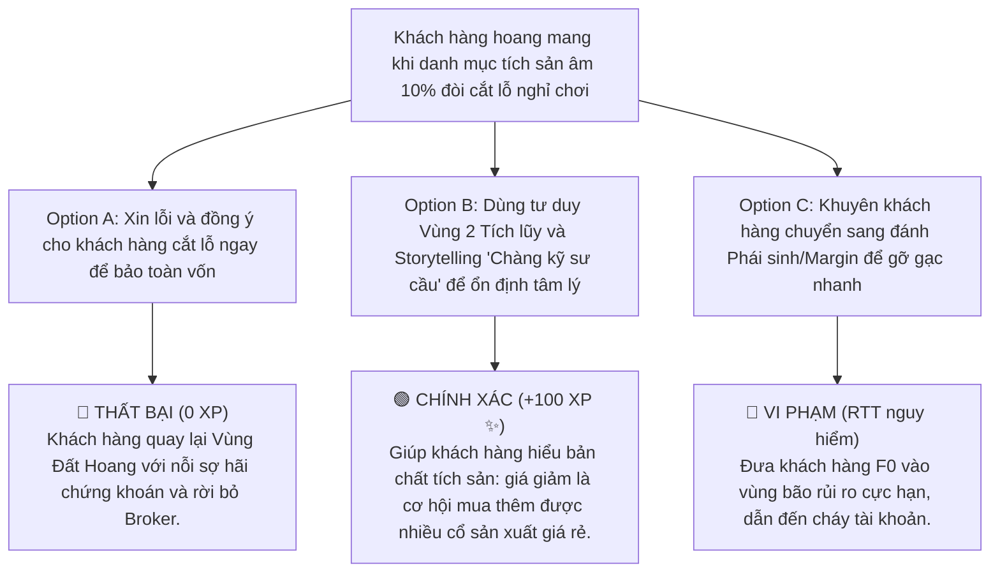

# MODULE 1: BẢN ĐỒ 3 VÙNG ĐẤT TÀI CHÍNH & HOẠCH ĐỊNH BÌNH AN
## Hướng Dẫn Định Vị Trạng Thái Tài Chính Khách Hàng & Tư Duy Môi Giới Bình An
### MÃ SỐ TÀI LIỆU: DT-01
**Chương trình:** KBSV NextGen 2026 · FinPeace × KB Securities Vietnam · Sở Giao Dịch 3 (HO3)

---

## 📌 HƯỚNG DẪN DÀNH CHO BROKER / HỌC VIÊN
- **Thời lượng học:** Ngày 1 (D1) & Ngày 3 (D3) của tuần 1.
- **Mục tiêu học tập:** 
  1. Thấu hiểu triết lý *"3 Vùng Đất Tài Chính"* của FinPeace để phân loại tâm lý khách hàng.
  2. Nắm vững cấu trúc *Tháp Tài Sản 3 Tầng* để tư vấn phân bổ tài sản bọc thép.
  3. Sử dụng thành thạo nghệ thuật kể chuyện *Storytelling "Chàng kỹ sư cầu"* để giải thích Biên An Toàn cho khách hàng mới.

---

## 📌 I. TỔNG QUAN KIẾN THỨC CỐT LÕI (THEORETICAL FOUNDATION)

### 1. Triết Lý 3 Vùng Đất Tài Chính (The 3 Lands of Wealth)
Trong nghề tư vấn môi giới chứng khoán, sai lầm phổ biến nhất của các Broker là coi mọi khách hàng đều giống nhau và chỉ tập trung vào việc "phím mã" để tối ưu hóa phí giao dịch ngắn hạn. Triết lý của FinPeace và KBSV NextGen định nghĩa lại vị thế của Broker: Bạn là một **Cố vấn tài chính bình an (Digital Wealth Advisor)**. Bước đầu tiên và quan trọng nhất của quá trình tư vấn là định vị xem khách hàng đang sống ở vùng đất nào trên bản đồ tài chính:

```
                  ┌─────────────────────────────────┐
                  │      BẢN ĐỒ 3 VÙNG ĐẤT TÀI CHÍNH │
                  └────────────────┬────────────────┘
                                   │
         ┌─────────────────────────┼─────────────────────────┐
         ▼                         ▼                         ▼
┌─────────────────┐       ┌─────────────────┐       ┌─────────────────┐
│ VÙNG ĐẤT HOANG  │       │ VÙNG KIỂM SOÁT  │       │   VÙNG ỐC ĐẢO   │
│   (Wasteland)   │       │    (Control)    │       │     (Oasis)     │
├─────────────────┤       ├─────────────────┤       ├─────────────────┤
│ - Mơ hồ, lo âu  │       │ - Tự chủ tài sản│       │ - Tự do tài chính│
│ - Gom góp lướt  │       │ - Tích sản đều  │       │ - Đầu tư thảnh  │
│   sóng vô định  │       │   đặn dài hạn   │       │   thơi, bền vững│
└─────────────────┘       └─────────────────┘       └─────────────────┘
```

#### 🌵 Vùng Đất Hoang (Wasteland): Trạng thái mơ hồ & lo âu
*   **Đặc điểm:** Khách hàng không kiểm soát được dòng tiền thu nhập và chi tiêu. Họ tham gia thị trường chứng khoán với tâm lý cờ bạc, muốn làm giàu nhanh chóng, thường xuyên lướt sóng T+ theo tin đồn, không có kiến thức quản trị rủi ro.
*   **Trạng thái tâm lý:** Cực kỳ hoảng loạn khi thị trường giảm điểm và hưng phấn quá đà khi thị trường tăng. Dễ rơi vào bẫy tâm lý sợ hãi và tham lam (Fear & Greed).
*   **Nhiệm vụ của Broker:** Kéo khách hàng ra khỏi Vùng Đất Hoang bằng cách thiết lập kỷ luật tiết kiệm, hướng dẫn mở tài khoản tích sản đều đặn.

#### 🛡️ Vùng Đất Kiểm Soát (Control): Trạng thái tự chủ tài chính
*   **Đặc điểm:** Khách hàng đã có thặng dư tài chính hàng tháng, sở hữu quỹ dự phòng khẩn cấp và bắt đầu thiết lập các mục tiêu đầu tư dài hạn. Họ hiểu giá trị của sự tích lũy bền vững và phân bổ tài sản có hệ thống.
*   **Trạng thái tâm lý:** Bình thản trước biến động ngắn hạn của thị trường. Đầu tư kỷ luật theo kế hoạch.
*   **Nhiệm vụ của Broker:** Hướng dẫn khách hàng xây dựng danh mục tích sản cổ phiếu dài hạn (SIP) với bộ lọc bọc thép 4 tiêu chí InvestWise.

#### 🌴 Vùng Đất Ốc Đảo (Oasis): Trạng thái thảnh thơi tài chính
*   **Đặc điểm:** Khách hàng đã đạt đến tự do tài chính. Dòng tiền từ các tài sản đầu tư đủ chi trả cho mọi chi phí cuộc sống. Họ đầu tư với tư thế chủ động, sẵn sàng nắm bắt các cơ hội tăng trưởng đột phá hoặc đầu tư mạo hiểm với tỷ trọng nhỏ mà không ảnh hưởng đến cuộc sống.
*   **Nhiệm vụ của Broker:** Cung cấp các deal giao dịch có tỷ lệ lợi nhuận/rủi ro cao (VTA Strategy) và tối ưu hóa chi phí Margin, thuế phí.

---

### 2. Cấu Trúc Tháp Tài Sản 3 Tầng (The 3-Layer Asset Pyramid)
Để đưa khách hàng đến sự bình an tài chính, Broker phải thiết kế cho họ một cấu trúc tài sản cân bằng, vững chãi như kim tự tháp:

```
                     / \
                    /   \     TẦNG 3: BỨT TỐC (Cơ hội - Trading VTA)
                   / T3  \    (Tối đa 20% tổng NAV)
                  /───────\
                 /   T2    \  TẦNG 2: TÍCH LŨY (Bền vững - SIP Strategy)
                /───────────\ (50% - 60% thặng dư thu nhập)
               /     T1      \ TẦNG 1: BẢO VỆ (Quỹ khẩn cấp, Bảo hiểm)
              /───────────────\ (3-6 tháng chi phí thiết yếu)
```

*   **Tầng 1: Tầng Bảo vệ (Vùng 1):** Bao gồm tiền mặt gửi tiết kiệm kỳ hạn ngắn (Quỹ dự phòng khẩn cấp từ 3-6 tháng chi phí) và các hợp đồng bảo hiểm. Đây là phần móng vững chắc giúp khách hàng không phải bán tháo cổ phiếu đầu tư khi gia đình gặp sự cố đột xuất.
*   **Tầng 2: Tầng Tích lũy (Vùng 2):** Trọng tâm của tháp tài sản. Đây là danh mục đầu tư tích sản cổ phiếu (SIP) dài hạn định kỳ hàng tháng bằng dòng tiền thặng dư từ thu nhập. Mục tiêu là gia tăng số lượng cổ sản xuất chất lượng cao qua nhiều năm.
*   **Tầng 3: Tầng Bứt tốc (Vùng 3):** Trọng lượng tối đa không quá 20% tổng NAV. Đây là phần vốn dành cho hoạt động giao dịch ngắn hạn theo xu hướng (Trend Trading VTA) nhằm tìm kiếm lợi nhuận tối ưu khi thị trường vào sóng mạnh.

---

## 📊 II. BÀI TẬP THỰC HÀNH TÍNH TOÁN BỐC TÁCH (PRACTICAL EXERCISES)

### 📝 Bài Tập 1: Lập Bảng Phân Bổ Tài Sản Bình An Cho Khách Hàng F0
**Thông tin khách hàng:**
*   Chị Mai (Nhóm tính cách S), 28 tuổi, nhân viên văn phòng.
*   Thu nhập cố định hàng tháng: 25.000.000 VNĐ.
*   Chi phí sinh hoạt thiết yếu hàng tháng: 15.000.000 VNĐ.
*   Tiền thặng dư tích lũy hiện tại đang để ở tài khoản thanh toán: 60.000.000 VNĐ.
*   Chị Mai chưa từng đầu tư chứng khoán, sợ rủi ro mất tiền nhưng muốn tìm kênh sinh lời tốt hơn gửi tiết kiệm truyền thống.

**Yêu cầu:** Hãy tính toán thiết lập quỹ dự phòng khẩn cấp (Vùng 1) và thiết kế kế hoạch đầu tư tích sản định kỳ (Vùng 2) tối ưu cho Chị Mai.

#### 💡 Lời Giải Chi Tiết:

1.  **Bước 1: Tính toán Quỹ dự phòng khẩn cấp (Tầng 1 - Bảo vệ):**
    *   Nguyên tắc bảo vệ: Dự phòng từ 3 đến 6 tháng chi phí sinh hoạt thiết yếu.
    *   Với chị Mai (nhóm S ưu tiên an toàn), Broker đề xuất mốc 4 tháng chi phí:
        $$\text{Quỹ khẩn cấp} = 15.000.000\text{ VNĐ} \times 4 = 60.000.000\text{ VNĐ}$$
    *   *Khuyến nghị hành động:* Giữ nguyên 60.000.000 VNĐ hiện có làm Quỹ dự phòng khẩn cấp dưới dạng tiền gửi tích lũy ngân hàng hoặc quỹ tiền tệ ngắn hạn an toàn cao. Tuyệt đối **không** dùng số tiền này để mua cổ phiếu đầu tư.

2.  **Bước 2: Xác định dòng tiền thặng dư hàng tháng dành cho đầu tư:**
    *   $$\text{Tiền thặng dư hàng tháng} = \text{Thu nhập} - \text{Chi phí} = 25.000.000 - 15.000.000 = 10.000.000\text{ VNĐ}$$

3.  **Bước 3: Thiết kế kế hoạch Tích sản cổ phiếu định kỳ (Tầng 2 - Tích lũy):**
    *   Trích 50% tiền thặng dư hàng tháng để đầu tư tích sản cổ phiếu đều đặn vào ngày nhận lương hàng tháng:
        $$\text{Số tiền tích sản hàng tháng} = 10.000.000\text{ VNĐ} \times 50\% = 5.000.000\text{ VNĐ}$$
    *   *Khuyến nghị danh mục:* Phân bổ vào 1-2 cổ phiếu phòng thủ đầu ngành tốt (ví dụ: HPG, FPT) thỏa mãn bộ lọc 4 tiêu chí InvestWise.

---

## 🎯 III. TÌNH HUỐNG RA QUYẾT ĐỊNH TƯƠNG TÁC (INTERACTIVE SCENARIO)

### 🛑 Tình Huống: Tâm Lý Khách Hàng Hoảng Sợ Khi Giá Cổ Phiếu Tích Sản Giảm 10%
*   **Bối cảnh (Context):** Anh Nam, một khách hàng mới chuyển từ Vùng Đất Hoang sang Vùng Kiểm Soát đang tham gia tích sản HPG với số tiền 10 triệu/tháng. Sau khi mua được 2 kỳ đầu tiên, thị trường chung điều chỉnh mạnh khiến mã HPG giảm 10% so với giá mua trung bình của anh. Anh Nam nhắn tin hoang mang: *"Em ơi, tài khoản anh âm hơn 2 triệu rồi! Anh có nên bán cắt lỗ hết nghỉ chơi không, thị trường này lừa đảo quá?"*



---

## 🧪 IV. BÀI KIỂM TRA ĐÁNH GIÁ (SELF-CHECK KNOWLEDGE QUIZ)

**Câu 1: Một khách hàng liên tục lướt sóng T+ theo tin đồn trên các hội nhóm zalo, không kiểm soát được rủi ro đang nằm ở vùng đất nào trên Bản đồ tài chính?**
*   A. Vùng Đất Kiểm Soát
*   B. Vùng Đất Ốc Đảo
*   C. Vùng Đất Hoang (Wasteland) **(Đáp án Đúng)**
*   D. Vùng Đất Thăng Hoa

**Câu 2: Tầng nào chiếm tỷ trọng lớn nhất và đóng vai trò làm móng bảo vệ tài sản gia đình chống chịu biến cố cuộc sống?**
*   A. Tầng 3: Bứt tốc (Trading)
*   B. Tầng 1: Bảo vệ (Quỹ khẩn cấp, Bảo hiểm) **(Đáp án Đúng)**
*   C. Tầng 2: Tích lũy (SIP)
*   D. Cả 3 tầng bằng nhau

**Câu 3: Quy tắc cốt lõi khi đầu tư tích sản cổ phiếu dài hạn (Vùng 2) khi thị giá giảm là gì?**
*   A. Bán tháo cắt lỗ ngay lập tức
*   B. Vui mừng vì có cơ hội tích lũy thêm tài sản sản xuất chất lượng cao với giá chiết khấu rẻ hơn **(Đáp án Đúng)**
*   C. Vay Margin kịch khung để trung bình giá xuống nhanh
*   D. Ngừng đầu tư hoàn toàn

---

## 💬 V. KỊCH BẢN ROLEPLAY THỰC CHIẾN (AI ROLEPLAY DIALOGUE SCRIPT)

*   **Nhân vật:**
    *   **Học viên (Broker NextGen):** Điềm tĩnh, thấu cảm, dùng storytelling thuyết phục.
    *   **Khán giả AI (Anh Nam):** Khách hàng F0, lo lắng về biến động tài khoản ngắn hạn.

```dialogue
Khán giả AI (Anh Nam): "Em ơi, HPG giảm sâu thế này anh xót ruột quá. Hay anh bán phắt đi gửi tiết kiệm cho lành em ạ, đầu tư thế này đau tim quá!"

Học viên (NextGen Broker): "Em rất hiểu cảm giác lo lắng của anh Nam lúc này ạ. Khi thấy tài khoản hiển thị sắc đỏ, việc xót ruột là phản ứng tâm lý hoàn toàn tự nhiên của bất kỳ ai, đặc biệt khi anh mới bắt đầu tham gia thị trường. 

Nhưng anh Nam ơi, em xin chia sẻ với anh câu chuyện về 'Chàng kỹ sư thiết kế cầu'. Khi xây dựng một cây cầu lớn chịu tải trọng 10.000 tấn, người kỹ sư luôn thiết kế cây cầu có sức chịu tải lên tới 30.000 tấn. Khoảng cách 20.000 tấn dư thừa đó được gọi là 'Biên an toàn'. 

Trong đầu tư tích sản cũng vậy. Lý do chúng ta chọn HPG vì doanh nghiệp này có sức bền tài chính cực mạnh, không thể sụp đổ trong 5 năm tới. Hiện tại thị giá HPG giảm 10% không phải vì doanh nghiệp yếu đi, mà do tâm lý ngắn hạn của thị trường chung hoảng loạn. 

Anh hãy hình dung HPG giống như một ngôi nhà mặt phố có giá trị thực 5 tỷ đồng, hôm nay có người đi ngang qua cửa nhà anh và hét lên: 'Tôi trả ngôi nhà này giá 4,5 tỷ!'. Liệu anh có vội vã bán rẻ ngôi nhà của mình chỉ vì người đi đường trả giá thấp không ạ?"

Khán giả AI (Anh Nam): "À... Tất nhiên là không rồi em, nhà mình giá trị thế sao bán rẻ thế được."

Học viên (NextGen Broker): "Chính xác anh ạ! Cổ phiếu Hòa Phát chính là tài sản sản xuất chất lượng cao giống như ngôi nhà mặt phố đó. Khi giá giảm ngắn hạn, với tư cách là người tích sản dài hạn ở Vùng 2, đây không phải là nguy cơ mà chính là **cơ hội tuyệt vời** để anh Nam gom thêm cổ phiếu HPG với giá chiết khấu rẻ hơn 10% so với kỳ trước. 

Quỹ dự phòng Vùng 1 của anh vẫn an toàn 60 triệu gửi tiết kiệm, cuộc sống của anh không bị ảnh hưởng. Vậy nên anh hãy điềm tĩnh, tiếp tục kế hoạch mua tích sản đều đặn vào ngày nhận lương tới nhé!"

Khán giả AI (Anh Nam): "Nghe em kể chuyện chàng kỹ sư cầu và ngôi nhà mặt phố anh thấy dễ hiểu hẳn. Anh hiểu bản chất tích sản rồi, anh sẽ kiên định tiếp tục gom HPG!"
```

---
**Mã số tài liệu:** `DT-01` · KBSV NextGen 2026 · FinPeace × KB Securities Vietnam
