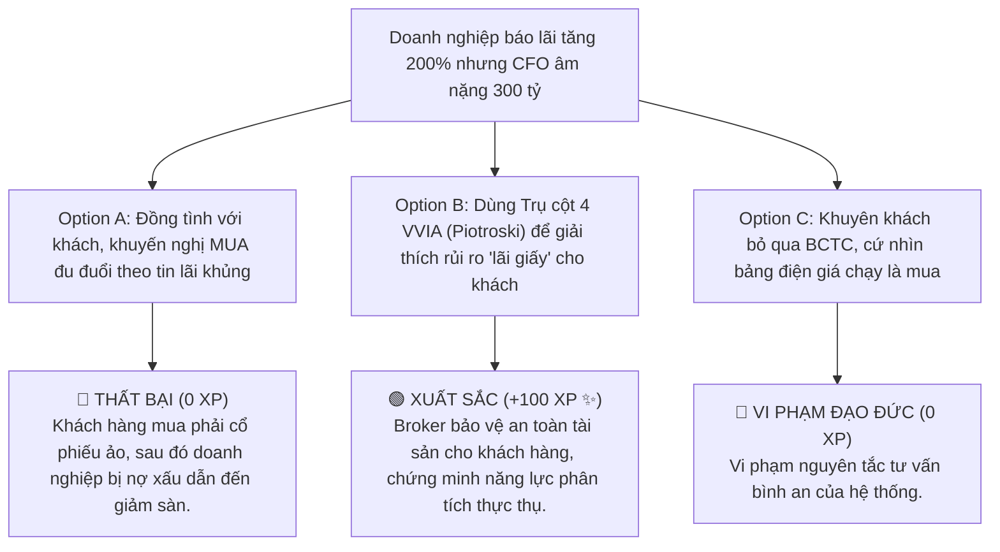

# MODULE 2: KHÁM SỨC KHỎE DOANH NGHIỆP (PHÂN TÍCH CƠ BẢN - FA)
## Hướng Dẫn Đọc Hiểu BCTC Nhanh & Lọc Cổ Phiếu Giá Trị Bọc Thép
### MÃ SỐ TÀI LIỆU: DT-02
**Chương trình:** KBSV NextGen 2026 · FinPeace × KB Securities Vietnam · Sở Giao Dịch 3 (HO3)

---

## 📌 HƯỚNG DẪN DÀNH CHO BROKER / HỌC VIÊN
- **Thời lượng học:** Ngày 2 (D2) & Ngày 4 (D4) của tuần 1.
- **Mục tiêu học tập:** 
  1. Làm chủ kỹ thuật đọc nhanh 3 loại báo cáo tài chính trong 15 phút.
  2. Áp dụng khung đánh giá VVIA (Graham, Buffett, Greenblatt, Piotroski) để kiểm chứng sức khỏe doanh nghiệp.
  3. Kể câu chuyện *See's Candy* để thuyết phục khách hàng hiểu về sức mạnh của Con Hào Kinh Tế và lợi thế định giá.

---

## 📌 I. TỔNG QUAN KIẾN THỨC CỐT LÕI (THEORETICAL FOUNDATION)

### 1. Kỹ Thuật Đọc BCTC Nhanh Trong 15 Phút Cho Broker
Một Broker chuyên nghiệp không cần phải là một kế toán trưởng để đọc hiểu BCTC. Bạn chỉ cần tập trung vào các điểm mấu chốt để đánh giá xem doanh nghiệp có "khỏe mạnh" hay không:
*   **Bảng Cân Đối Kế Toán (Balance Sheet):**
    *   *Cơ cấu tài sản:* So sánh Tiền và các khoản tương đương tiền với Nợ vay (Ngắn hạn + Dài hạn). Doanh nghiệp tốt phải có Tiền mặt & đầu tư tài chính ngắn hạn dồi dào, lý tưởng nhất là Tiền > Tổng nợ vay.
    *   *Chất lượng tài sản:* Kiểm tra tỷ lệ Phải thu ngắn hạn và Hàng tồn kho trên Tổng tài sản. Nếu hai khoản này chiếm quá 50% tài sản và tăng liên tục qua các quý, doanh nghiệp có nguy cơ bị đọng vốn hoặc ghi nhận doanh thu ảo.
*   **Báo Cáo Kết Quả Kinh Doanh (Income Statement):**
    *   *Doanh thu và LNST:* Xem xu hướng tăng trưởng qua các năm. LNST phải đi kèm với sự tăng trưởng của doanh thu thuần, tránh các khoản lợi nhuận đột biến từ hoạt động tài chính hoặc bán tài sản một lần.
    *   *Biên lợi nhuận gộp (Gross Margin):* Thể hiện hiệu quả sản xuất cốt lõi và sức mạnh thương hiệu.
*   **Báo Cáo Lưu Chuyển Tiền Tệ (Cash Flow Statement):**
    *   *Chất lượng lợi nhuận:* Bắt buộc dòng tiền từ hoạt động kinh doanh (CFO) phải dương. Doanh nghiệp báo lãi hàng trăm tỷ nhưng CFO liên tục âm nhiều năm là dấu hiệu của việc bán chịu, "lãi trên giấy".

---

### 2. Khung Hệ Thống Đánh Giá Sức Khỏe Tài Chính VVIA

```
┌────────────────────────────────────────────────────────┐
│               KHUNG VVIA - 4 TRỤ CỘT BỌC THÉP          │
├───────────────────────────┬────────────────────────────┤
│ 1. BIÊN AN TOÀN (Graham)  │ 2. CON HÀO KINH TẾ(Buffett)│
│ - Current Ratio > 1.5     │ - Sức mạnh định giá        │
│ - P/E * P/B < 22.5        │ - ROE > 15% bền vững       │
├───────────────────────────┼────────────────────────────┤
│ 3. GIÁ RẺ (Greenblatt)    │ 4. CHẤT LƯỢNG (Piotroski)  │
│ - ROIC lớn (Vốn hiệu quả) │ - F-Score từ 7-9 điểm      │
│ - Earnings Yield cao      │ - Dòng tiền CFO > LNST     │
└───────────────────────────┴────────────────────────────┘
```

#### Trụ cột 1: Biên An Toàn (Benjamin Graham)
*   Yêu cầu khả năng thanh toán hiện thời (Current Ratio = Tài sản ngắn hạn / Nợ ngắn hạn) phải $\ge 1.5$.
*   Chỉ số Graham Number ($IV_{Graham} = \sqrt{22.5 \times EPS \times BVPS}$) phải cao hơn thị giá trên sàn để đảm bảo có chiết khấu định giá.

#### Trụ cột 2: Con Hào Kinh Tế (Warren Buffett)
*   Tìm kiếm doanh nghiệp sở hữu lợi thế độc quyền (nhãn hiệu mạnh, chi phí chuyển đổi cao, hoặc lợi thế quy mô).
*   Chỉ số ROE (Lợi nhuận trên vốn chủ sở hữu) phải duy trì ổn định $\ge 15\%$ trong nhiều năm.

#### Trụ cột 3: Công Thức Thần Kỳ (Joel Greenblatt)
*   Xếp hạng doanh nghiệp dựa trên tỷ suất ROIC (Lợi nhuận trên vốn đầu tư) nhằm tìm kiếm những đơn vị sử dụng vốn hiệu quả nhất, kết hợp với chỉ số Earnings Yield (EBIT / EV) cao để đảm bảo giá mua là rẻ.

#### Trụ cột 4: Thang Điểm Piotroski F-Score (Chất lượng Kế toán)
*   Sử dụng bộ 9 tiêu chí chấm điểm từ 0 đến 9. Doanh nghiệp đạt **7-9 điểm** được coi là cực kỳ vững chắc về chất lượng tài chính. Bắt buộc dòng tiền từ hoạt động kinh doanh phải lớn hơn lợi nhuận sau thuế (CFO > LNST).

---

## 📊 II. BÀI TẬP THỰC HÀNH TÍNH TOÁN BỐC TÁCH (PRACTICAL EXERCISES)

### 📝 Bài Tập 1: Tính Toán Piotroski F-Score Cho Doanh Nghiệp Thép Y
**Số liệu tài chính của Doanh nghiệp Y (Năm 2025):**
1.  LNST năm nay dương (120 tỷ VNĐ) $\rightarrow$ Đạt (+1 điểm)
2.  ROA năm nay (6%) cao hơn ROA năm ngoái (5%) $\rightarrow$ Đạt (+1 điểm)
3.  Dòng tiền từ HĐKD (CFO) dương (150 tỷ VNĐ) $\rightarrow$ Đạt (+1 điểm)
4.  Chất lượng lợi nhuận: CFO (150 tỷ) > LNST (120 tỷ) $\rightarrow$ Đạt (+1 điểm)
5.  Nợ dài hạn năm nay giảm so với năm ngoái $\rightarrow$ Đạt (+1 điểm)
6.  Hệ số thanh toán hiện hành tăng từ 1.6 lên 1.8 $\rightarrow$ Đạt (+1 điểm)
7.  Số lượng cổ phiếu lưu hành không thay đổi (không phát hành thêm giấy) $\rightarrow$ Đạt (+1 điểm)
8.  Biên lợi nhuận gộp tăng từ 12% lên 15% $\rightarrow$ Đạt (+1 điểm)
9.  Vòng quay tài sản tăng từ 0.8 lên 0.9 $\rightarrow$ Đạt (+1 điểm)

**Yêu cầu:** 
1. Tính tổng điểm F-Score của Doanh nghiệp Y.
2. Đánh giá chất lượng tài chính của doanh nghiệp này có phù hợp để tư vấn đầu tư không.

#### 💡 Lời Giải Chi Tiết:
1.  **Tính điểm:** Doanh nghiệp Y đạt trọn vẹn cả 9 tiêu chí trên $\rightarrow$ **F-Score = 9/9 điểm**.
2.  **Đánh giá:** Với số điểm tối đa 9/9, Doanh nghiệp Y có sức khỏe tài chính bọc thép cực kỳ an toàn. Đặc biệt, tiêu chí CFO > LNST cho thấy lợi nhuận 120 tỷ là tiền tươi thóc thật, không có hiện tượng xào nấu sổ sách. Đây là một mã tuyệt vời để đưa vào danh mục khuyến nghị.

---

## 🎯 III. TÌNH HUỐNG RA QUYẾT ĐỊNH TƯƠNG TÁC (INTERACTIVE SCENARIO)

### 🛑 Tình Huống: Doanh Nghiệp Có Lợi Nhuận Tăng 200% Nhưng Dòng Tiền Âm
*   **Bối cảnh (Context):** Một doanh nghiệp xây lắp bất động sản công công bố báo cáo kết quả kinh doanh với lợi nhuận sau thuế tăng vọt 200% so với cùng kỳ. Khách hàng nhắn tin: *"Em ơi, mã này lãi khủng quá, anh muốn mua ngay!"*. Tuy nhiên, khi soi BCTC, Broker phát hiện ra các khoản Phải thu ngắn hạn tăng mạnh bằng đúng phần doanh thu ghi nhận, và dòng tiền từ HĐKD (CFO) bị âm nặng 300 tỷ VNĐ.



---

## 🧪 IV. BÀI KIỂM TRA ĐÁNH GIÁ (SELF-CHECK KNOWLEDGE QUIZ)

**Câu 1: Một doanh nghiệp báo cáo lợi nhuận rất cao nhưng Dòng tiền từ hoạt động kinh doanh (CFO) liên tục âm nhiều năm là dấu hiệu của rủi ro gì?**
*   A. Doanh nghiệp đang tái đầu tư mạnh mẽ
*   B. Lợi nhuận ảo ghi sổ trên các khoản phải thu, không có tiền mặt thực tế **(Đáp án Đúng)**
*   C. Doanh nghiệp trả cổ tức quá nhiều
*   D. Doanh nghiệp đang trả bớt nợ

**Câu 2: Thang điểm Piotroski F-Score tối đa là bao nhiêu và điểm số tối thiểu để được coi là doanh nghiệp khỏe mạnh là bao nhiêu?**
*   A. Tối đa 5 điểm, tối thiểu 3 điểm
*   B. Tối đa 9 điểm, tối thiểu 7 điểm **(Đáp án Đúng)**
*   C. Tối đa 10 điểm, tối thiểu 5 điểm
*   D. Tối đa 7 điểm, tối thiểu 4 điểm

**Câu 3: Công thức định giá Graham Number sử dụng hai biến số tài chính nào của doanh nghiệp?**
*   A. Doanh thu và Chi phí
*   B. EPS (Lợi nhuận trên mỗi cổ phiếu) và BVPS (Giá trị sổ sách trên mỗi cổ phiếu) **(Đáp án Đúng)**
*   C. Khối lượng giao dịch và Giá đóng cửa
*   D. Vốn hóa thị trường và Tổng nợ vay

---

## 💬 V. KỊCH BẢN ROLEPLAY THỰC CHIẾN (AI ROLEPLAY DIALOGUE SCRIPT)

*   **Nhân vật:**
    *   **Học viên (Broker NextGen):** Điềm tĩnh, tự tin, sử dụng storytelling và số liệu bọc thép.
    *   **Khán giả AI (Chị Lan):** Khách hàng cẩn trọng, muốn tìm hiểu lý do tại sao cổ phiếu tốt lại có giá đắt.

```dialogue
Khán giả AI (Chị Lan): "Em ơi, chị thấy cổ phiếu FPT rất tốt nhưng giá P/E của nó tận 20 lần, đắt hơn nhiều so với mặt bằng chung các cổ phiếu khác có P/E chỉ 8-10. Chị mua FPT tích sản lúc này có bị hớ không em?"

Học viên (NextGen Broker): "Em rất cảm ơn câu hỏi cực kỳ thông minh và thực tế của chị Lan ạ! Việc so sánh chỉ số P/E là rất cần thiết khi chọn mua cổ phiếu. 

Tuy nhiên, chị Lan ơi, em xin chia sẻ với chị câu chuyện về thương hiệu kẹo See's Candy nổi tiếng của Mỹ được Warren Buffett mua lại vào năm 1972. Lúc đó, See's Candy chỉ là một cửa hàng kẹo nhỏ, nhưng có một đặc điểm là: Mỗi khi ngày lễ đến, khách hàng sẵn sàng xếp hàng dài và trả mức giá cao hơn 20-30% để mua kẹo của họ làm quà tặng mà không hề phàn nàn. Thương hiệu See's Candy sở hữu một 'Con hào kinh tế' cực lớn về lòng trung thành của khách hàng, giúp họ có sức mạnh tự định giá bán mà không sợ mất khách. Warren Buffett đã trả mức giá P/E rất cao thời điểm đó để mua See's Candy, và sau đó nó đã mang về cho ông hàng tỷ USD lợi nhuận thặng dư.

Cổ phiếu FPT tại Việt Nam cũng sở hữu một 'Con hào kinh tế' tương tự như vậy nhờ năng lực công nghệ và các hợp đồng xuất khẩu phần mềm quy mô toàn cầu. FPT duy trì tốc độ tăng trưởng lợi nhuận đều đặn trên 18% mỗi năm suốt một thập kỷ qua, bất chấp khủng hoảng kinh tế hay dịch bệnh."

Khán giả AI (Chị Lan): "À, ra là vậy. Con hào công nghệ giúp FPT có quyền tự định giá và tăng trưởng bền vững."

Học viên (NextGen Broker): "Chính xác chị Lan ạ! Dưới góc nhìn của khung lọc VVIA, một doanh nghiệp có 'Con hào kinh tế' rộng và ROE luôn duy trì trên 20% như FPT xứng đáng được thị trường trả một mức định giá cao hơn. 

Mua một doanh nghiệp tuyệt vời với giá hợp lý (như FPT P/E 20) luôn tốt hơn nhiều so với việc mua một doanh nghiệp trung bình gặp khó khăn tài chính với giá rẻ (P/E 8-10). Vì vậy, tích sản FPT dài hạn ở Vùng 2 là quyết định đầu tư an toàn và hiệu quả nhất cho chị Lan!"

Khán giả AI (Chị Lan): "Câu chuyện See's Candy và phân tích của em giúp chị thông suốt rồi. Chị quyết định chọn FPT để bắt đầu kế hoạch tích sản tháng này."
```

---
**Mã số tài liệu:** `DT-02` · KBSV NextGen 2026 · FinPeace × KB Securities Vietnam
