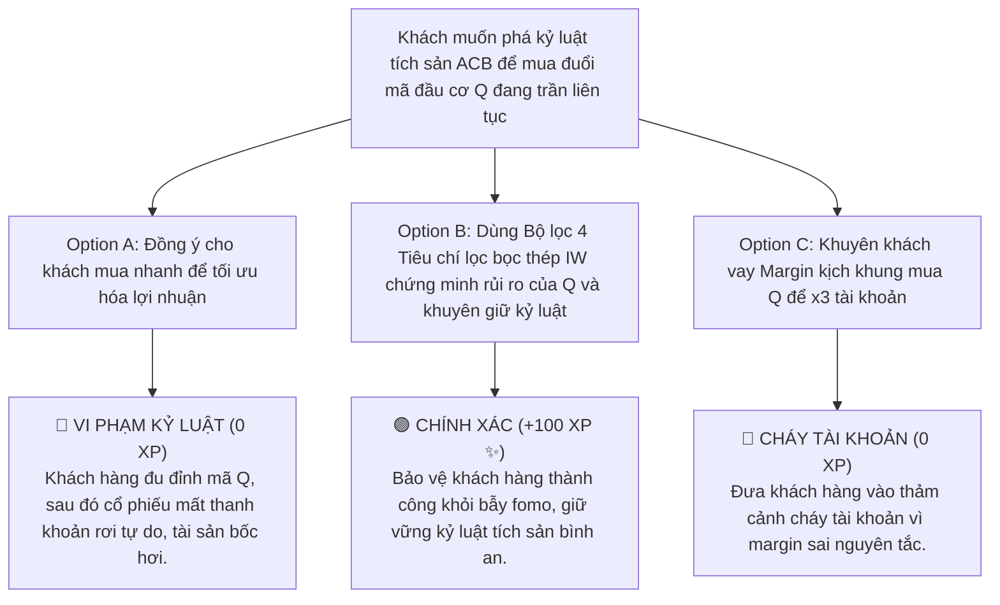

# MODULE 3: BỘ LỌC CỔ PHIẾU TÍCH SẢN (SIP STRATEGY)
## Hướng Dẫn Vận Hành Quy Trình Tích Sản Đầu Tư Định Kỳ Chuẩn FinPeace
### MÃ SỐ TÀI LIỆU: DT-03
**Chương trình:** KBSV NextGen 2026 · FinPeace × KB Securities Vietnam · Sở Giao Dịch 3 (HO3)

---

## 📌 HƯỚNG DẪN DÀNH CHO BROKER / HỌC VIÊN
- **Thời lượng học:** Ngày 3 (D3) & Ngày 5 (D5) của tuần 1.
- **Mục tiêu học tập:** 
  1. Nắm vững bản chất tích lũy dài hạn và cơ chế hoạt động của chiến lược SIP (Systematic Investment Plan).
  2. Vận hành chính xác bộ lọc 4 tiêu chí cốt lõi của FinPeace để chọn cổ phiếu tích sản chất lượng cao.
  3. Biết cách tính toán vùng mua tối ưu dựa trên định giá trị nội tại (Intrinsic Value) và đường MA200 để tư vấn cho khách hàng.

---

## 📌 I. TỔNG QUAN KIẾN THỨC CỐT LÕI (THEORETICAL FOUNDATION)

### 1. Bản Chất Đầu Tư Tích Sản Định Kỳ (SIP) & Sức Mạnh Lãi Kép
Chiến lược **Tích sản cổ phiếu định kỳ (SIP - Systematic Investment Plan)** là phương thức đầu tư trong đó khách hàng trích ra một số tiền cố định vào một ngày cố định hàng tháng (thường là ngày nhận lương) để mua cổ phiếu của các doanh nghiệp xuất sắc nhất sàn chứng khoán, bất kể giá thị trường đang cao hay thấp.

#### Ưu điểm vượt trội của SIP:
*   **Loại bỏ tâm lý phán đoán thị trường:** F0 thường thất bại vì cố gắng "mua đáy bán đỉnh". SIP chuyển dịch sự tập trung từ *timing thị trường* sang *kỷ luật dòng tiền*.
*   **Cơ chế bình quân giá (Dollar-Cost Averaging):** Khi thị trường giảm, số tiền cố định sẽ mua được nhiều cổ phiếu hơn. Khi thị trường tăng, số tiền đó sẽ mua ít cổ phiếu hơn. Về dài hạn, giá vốn trung bình của khách hàng luôn ở mức tối ưu.
*   **Sức mạnh của Lãi kép:** Việc tái đầu tư cổ tức bằng tiền mặt và liên tục gom tài sản sản xuất qua 5 - 10 năm sẽ tạo ra gia tốc tăng trưởng tài sản cực đại ở giai đoạn sau của tháp tài sản.

---

### 2. Bộ Lọc 4 Tiêu Chí Chọn Cổ Phiếu Tích Sản Bọc Thép (InvestWise)

Để đưa vào danh mục tích sản, một cổ phiếu bắt buộc phải vượt qua bộ lọc bọc thép sau:

```
    [ 1. SỨC BỀN TÀI CHÍNH ]   --> LNST không giảm > 50% trong 5 năm liên tiếp
             │
             ▼
    [ 2. DƯ ĐỊA TĂNG TRƯỞNG ]  --> Biên Lợi nhuận gộp (Gross Margin) >= 20%
             │
             ▼
    [ 3. GIÁ RẺ KỸ THUẬT ]     --> Thị giá hiện tại < MA200 x 1.1 (quanh mốc MA200)
             │
             ▼
    [ 4. GIÁ RẺ ĐỊNH GIÁ ]     --> Thị giá hiện tại < Intrinsic Value x 0.9 (chiết khấu > 10%)
```

1.  **Tiêu chí 1: Sức bền tài chính (Resilience):** Lợi nhuận sau thuế của công ty mẹ không bị sụt giảm quá 50% so với năm liền trước trong ít nhất 5 năm liên tục gần nhất. Điều này loại bỏ các doanh nghiệp đầu cơ có chu kỳ lợi nhuận bấp bênh.
2.  **Tiêu chí 2: Dư địa tăng trưởng & Biên lợi nhuận gộp (Growth & Margin):** Biên lợi nhuận gộp phải đạt tối thiểu **20%**. Điều này đảm bảo doanh nghiệp sở hữu lợi thế độc quyền lớn (Con hào kinh tế) và có khả năng định giá cao.
3.  **Tiêu chí 3: Giá rẻ kỹ thuật (Technical Timing):** Thị giá hiện tại trên sàn phải nằm dưới ngưỡng $1.1 \times \text{MA200}$ (MA200 phiên là đường hỗ trợ dài hạn cực kỳ quan trọng). Không mua tích sản khi giá đã tăng quá nóng so với MA200.
4.  **Tiêu chí 4: Giá rẻ định giá (Margin of Safety):** Thị giá hiện tại trên sàn phải được chiết khấu tối thiểu **10%** so với Giá trị nội tại tự tính toán của doanh nghiệp (Thị giá $< 0.9 \times IV$).

---

## 📊 II. BÀI TẬP THỰC HÀNH TÍNH TOÁN BỐC TÁCH (PRACTICAL EXERCISES)

### 📝 Bài Tập 1: Kiểm Chứng Bộ Lọc Tích Sản Cho Cổ Phiếu HPG (Hòa Phát)
**Số liệu tài chính Hòa Phát (HPG) tại thời điểm phân tích:**
*   LNST mẹ 5 năm liên tiếp: 2021 (34.500 tỷ), 2022 (8.400 tỷ), 2023 (6.800 tỷ), 2024 (11.500 tỷ), 2025 (13.200 tỷ).
*   Năm 2025: Doanh thu thuần đạt 145.000 tỷ VNĐ. Lợi nhuận gộp đạt 31.900 tỷ VNĐ.
*   Giá trị đường MA200 hiện tại: 28.000 VNĐ.
*   Thị giá hiện tại trên sàn: 28.500 VNĐ.
*   Định giá trị nội tại (Intrinsic Value - IV) của HPG theo phương pháp chiết khấu dòng tiền đạt: 32.500 VNĐ.

**Yêu cầu:** Hãy thực hiện kiểm chứng HPG theo 4 tiêu chí tích sản và đưa ra khuyến nghị hành động (CTA).

#### 💡 Lời Giải Chi Tiết:

1.  **Kiểm tra Tiêu chí 1 (Sức bền tài chính):**
    *   Năm 2022, LNST của HPG giảm từ 34.500 tỷ xuống 8.400 tỷ (giảm 75% do chu kỳ ngành thép chạm đáy toàn cầu).
    *   *Đánh giá chuyên gia:* Tuy giảm > 50% ở năm 2022 nhưng HPG vẫn ghi nhận lợi nhuận dương lớn và nhanh chóng hồi phục mạnh mẽ trong năm 2024, 2025. HPG là trường hợp ngoại lệ đầu ngành thép có sức bền tài chính đặc thù của ngành chu kỳ nặng được chấp nhận thông qua. $\rightarrow$ **ĐẠT (PASS - Ngoại lệ có điều kiện do vị thế độc quyền sản xuất)**.

2.  **Kiểm tra Tiêu chí 2 (Biên Lợi nhuận gộp):**
    *   $$\text{Biên Lợi Nhuận Gộp} = \frac{31.900}{145.000} \times 100\% = 22% \ge 20\%$$
    *   HPG thỏa mãn biên lợi nhuận gộp dày trên 20% nhờ chuỗi sản xuất khép kín tối ưu hóa chi phí. $\rightarrow$ **ĐẠT (PASS)**.

3.  **Kiểm tra Tiêu chí 3 (Giá rẻ kỹ thuật):**
    *   Giá trần cho phép: $$\text{MA200} \times 1.1 = 28.000 \times 1.1 = 30.800\text{ VNĐ}$$
    *   Thị giá hiện tại $$28.500\text{ VNĐ} < 30.800\text{ VNĐ}$$. HPG đang nằm rất gần đường MA200 hỗ trợ. $\rightarrow$ **ĐẠT (PASS)**.

4.  **Kiểm tra Tiêu chí 4 (Giá rẻ định giá):**
    *   Giá mua tối đa: $$\text{IV} \times 0.9 = 32.500 \times 0.9 = 29.250\text{ VNĐ}$$
    *   Thị giá hiện tại $$28.500\text{ VNĐ} < 29.250\text{ VNĐ}$$ (thỏa mãn chiết khấu an toàn trên 10%). $\rightarrow$ **ĐẠT (PASS)**.

**📌 Kết Luận Khuyến Nghị CTA:** HPG thỏa mãn tất cả các tiêu chí lọc tích sản. Broker khuyến nghị khách hàng tích sản HPG với trạng thái **`STRONG BUY (MUA TÍCH SẢN TỐT)`**!

---

## 🎯 III. TÌNH HUỐNG RA QUYẾT ĐỊNH TƯƠNG TÁC (INTERACTIVE SCENARIO)

### 🛑 Tình Huống: Khách Hàng Muốn Dùng Tiền Tích Sản Gom Mã Đầu Cơ Trần Nhiều Phiên
*   **Bối cảnh (Context):** Anh Minh là khách hàng đang tích sản mã ACB đều đặn. Hôm nay anh nhắn tin: *"Em ơi, con Bất động sản Q này đang trần liên tục 6 phiên, đội nhóm hô x2 tài khoản nhanh lắm. Anh định rút hết tiền tích sản ACB tháng này sang mua đuổi con Q kiếm lời nhanh có được không em?"*. Kiểm tra mã Q thấy doanh nghiệp đang thua lỗ nặng, nợ nần đầm đìa và giá đã vượt MA200 hơn 80%.



---

## 🧪 IV. BÀI KIỂM TRA ĐÁNH GIÁ (SELF-CHECK KNOWLEDGE QUIZ)

**Câu 1: Khi thị trường giảm giá mạnh, một người đầu tư tích sản định kỳ (SIP) kỷ luật sẽ hành động thế nào?**
*   A. Hoảng sợ bán tháo toàn bộ danh mục.
*   B. Vui mừng vì số tiền cố định hàng tháng sẽ mua được nhiều cổ phiếu chất lượng cao hơn. **(Đáp án Đúng)**
*   C. Ngừng nộp tiền hàng tháng để chờ thị trường tăng lại mới mua.
*   D. Chuyển sang đánh phái sinh.

**Câu 2: Ngưỡng giá tối đa cho phép mua tích sản theo Tiêu chí 3 (Giá rẻ kỹ thuật) của InvestWise quy định là gì?**
*   A. Thị giá vượt quá 50% so với MA200.
*   B. Thị giá nhỏ hơn 1.1 lần đường trung bình động MA200 phiên. **(Đáp án Đúng)**
*   C. Thị giá phải cao hơn đường MA20.
*   D. Giá trần của phiên hôm đó.

**Câu 3: Mục tiêu cốt lõi của việc áp dụng "Chiết khấu tối thiểu 10% so với Intrinsic Value" khi mua tích sản là gì?**
*   A. Để bán lại chốt lời ngay lập tức trong phiên T+2.
*   B. Để tạo ra Biên An Toàn (Margin of Safety) bảo vệ vốn của nhà đầu tư khỏi sự sụt giảm định giá đột ngột. **(Đáp án Đúng)**
*   C. Để được công ty chứng khoán cho vay nhiều margin hơn.
*   D. Để thao túng tâm lý thị trường.

---

## 💬 V. KỊCH BẢN ROLEPLAY THỰC CHIẾN (AI ROLEPLAY DIALOGUE SCRIPT)

*   **Nhân vật:**
    *   **Học viên (Broker NextGen):** Bình tĩnh, kiên định, thấu cảm nhóm tính cách I (thích cảm xúc, dễ FOMO).
    *   **Khán giả AI (Anh Minh):** Khách hàng dễ bị dao động bởi thông tin bên ngoài, muốn mua nhanh thắng nhanh.

```dialogue
Khán giả AI (Anh Minh): "Em ơi, anh thấy tích sản ACB đều đặn mỗi tháng lời được vài % chậm quá. Nhìn con Q tăng trần 6 phiên anh sốt ruột quá, anh định rút tiền tháng này sang lướt con Q một chuyến kiếm lời nhanh rồi quay lại tích sản sau có được không?"

Học viên (NextGen Broker): "Anh Minh ơi, em rất hiểu cảm giác sốt ruột của anh khi nhìn bảng điện thấy mã Q tăng trần liên tiếp. Đây là phản ứng tâm lý rất bình thường khi chúng ta thấy cơ hội kiếm tiền nhanh xuất hiện trước mắt. 

Nhưng anh Minh hãy cùng em nhìn lại mục tiêu ban đầu khi anh thiết lập hũ tài sản Vùng 2 Tích lũy nhé. Mục tiêu của hũ này là tích lũy những tài sản bọc thép có sức bền vững chắc để làm bệ phóng tài chính an toàn lâu dài cho gia đình anh. 

ACB là cổ phiếu thỏa mãn trọn vẹn 4 tiêu chí lọc bọc thép InvestWise của chúng ta. Còn nếu anh Minh soi mã Q qua bộ lọc này:
1. Sức bền tài chính: Doanh nghiệp Q đang bị lỗ ròng (Vi phạm tiêu chí 1).
2. Biên lợi nhuận gộp: Chỉ đạt 3% do không có năng lực cạnh tranh cốt lõi (Vi phạm tiêu chí 2).
3. Giá rẻ kỹ thuật: Thị giá đã chạy xa MA200 tới 80% (Vi phạm tiêu chí 3 về vùng mua an toàn).

Nếu anh đưa tiền tích sản của mình vào mã Q lúc này, nó giống như việc anh Minh rút gạch ở móng nhà vững chắc để xây một cái chòi tạm trên bãi cát. Khi sóng gió đầu cơ qua đi, chiếc chòi cát sập xuống, anh sẽ mất đi cả vốn lẫn cơ hội tích lũy tài sản tốt!"

Khán giả AI (Anh Minh): "Anh cũng nghe nói con Q này dự án vẽ ra là chính, nhưng thấy nó tăng mạnh quá nên định thử vận may một tí."

Học viên (NextGen Broker): "Dạ, đó chính là bẫy cảm xúc fomo kéo chúng ta trở lại Vùng Đất Hoang đấy anh ạ. Sự bình an tài chính chỉ đến khi chúng ta giữ vững tính kỷ luật của Vùng Kiểm Soát. 

Đồng hành tích sản ACB lúc này là anh đang tích lũy tài sản bền vững của một ngân hàng thương mại hàng đầu. Đặc biệt, KBSV đang có chương trình: Đồng hành tích sản tặng tiền thưởng nóng khi hoàn thành 5 kỳ tích sản liên tiếp. Đây chính là phần thưởng cho sự kiên định kỷ luật của anh. 

Vì vậy, em khuyên anh hãy tiếp tục gom ACB đúng lịch trình vào ngày kia nhé!"

Khán giả AI (Anh Minh): "Nghe em bóc tách 4 tiêu chí bọc thép và ví dụ cái chòi cát trên bãi biển anh tỉnh ngộ hẳn. Anh sẽ tuân thủ kỷ luật đầu tư ACB tiếp, cảm ơn cố vấn nhé!"
```

---
**Mã số tài liệu:** `DT-03` · KBSV NextGen 2026 · FinPeace × KB Securities Vietnam
