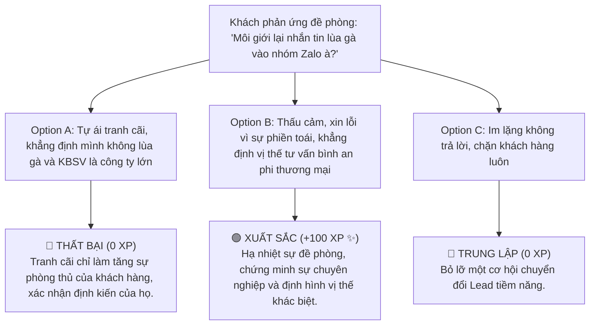

# MODULE 4: QUY TRÌNH THIẾT LẬP MỐI QUAN HỆ KHÁCH HÀNG (6 BƯỚC IW)
## Cẩm Nang Thực Chiến Phá Băng & Nuôi Dưỡng Niềm Tin Cho Broker 4.0
### MÃ SỐ TÀI LIỆU: DT-04
**Chương trình:** KBSV NextGen 2026 · FinPeace × KB Securities Vietnam · Sở Giao Dịch 3 (HO3)

---

## 📌 HƯỚNG DẪN DÀNH CHO BROKER / HỌC VIÊN
- **Thời lượng học:** Ngày 7 (D7) của tuần 2.
- **Mục tiêu học tập:** 
  1. Thấu hiểu triết lý bán hàng bắt nguồn từ mối quan hệ (Relationship-First Sales).
  2. Áp dụng chuẩn chỉnh quy trình 6 bước IW (Initiate - Warm up) để tiếp cận khách hàng tiềm năng.
  3. Thành thục kỹ thuật phá băng (Ice-breaking) cá nhân hóa cho từng nhóm tính cách DISC trên mạng xã hội.

---

## 📌 I. TỔNG QUAN KIẾN THỨC CỐT LÕI (THEORETICAL FOUNDATION)

### 1. Triết Lý Bán Hàng Bắt Nguồn Từ Mối Quan Hệ (Relationship-First Sales)
Một trong những nguyên nhân khiến 90% môi giới chứng khoán F0 thất bại ngay trong tháng đầu tiên đi làm là do tư duy **"Săn bắn" (Transaction-oriented)**: cố gắng bán sản phẩm ngay trong lần đầu tiên tiếp xúc. Khách hàng thời nay có sự đề phòng rất cao. Nếu bạn mở đầu bằng việc "phím mã" hay "mời mở tài khoản", khách hàng sẽ lập tức gắn nhãn bạn là "lùa gà" hoặc "chèo kéo bán hàng".

Quy trình **6 Bước IW (Initiate - Warm up)** của FinPeace xoay quanh triết lý **"Gieo trồng" (Relationship-first)**: thiết lập mối quan hệ tin cậy trước, giải quyết nỗi lo tài chính của khách hàng sau. Bạn tiếp cận với tư cách một người đồng hành giúp họ bọc thép tài sản, chứ không phải người bán hàng.

---

### 2. Chi Tiết Quy Trình 6 Bước IW (Initiate & Warm Up Framework)

```
  ┌─────────────────────────────────────────────────────────────┐
  │                 QUY TRÌNH 6 BƯỚC IW FRAMEWORK               │
  ├───────────────┬───────────────┬───────────────┬─────────────┤
  │    BƯỚC 1     │    BƯỚC 2     │    BƯỚC 3     │   BƯỚC 4    │
  │ Định vị chân  │ Phá băng tự   │ Khai vấn thấu │ Đồng hành   │
  │ dung & DISC   │ nhiên (Ice)   │ cảm (Empathy) │ phi tài     │
  └───────┬───────┴───────────────┴───────────────┴──────┬──────┘
          │                                              │
          ▼                                              ▼
  ┌─────────────────────────────────────────────────────────────┐
  │    BƯỚC 5: Thiết lập cuộc hẹn chính thức (Booking)          │
  ├─────────────────────────────────────────────────────────────┤
  │    BƯỚC 6: Ghi nhận thông tin & đồng bộ lên hệ thống CRM    │
  └─────────────────────────────────────────────────────────────┘
```

#### 👤 Bước 1: Sàng lọc & Định vị chân dung khách hàng
*   **Mục tiêu:** Thu thập thông tin ban đầu của Lead (từ mạng xã hội, sự kiện, CLB sinh viên) để phân loại chân dung (Freshers, Career Changer, Creators...) và dự đoán nhóm tính cách DISC.
*   **Yêu cầu:** Không nhắn tin vô định; phải nghiên cứu kỹ trang cá nhân của khách hàng để tìm điểm chung (sở thích, trường học, mối quan tâm).

#### ❄️ Bước 2: Phá băng tự nhiên (Initiate)
*   **Mục tiêu:** Mở đầu mối quan hệ một cách tự nhiên thông qua các tương tác phi thương mại (bình luận thông minh dưới bài viết của họ, chúc mừng sinh nhật, chia sẻ thông tin hữu ích mà họ quan tâm).
*   **Quy tắc vàng:** Tuyệt đối không đề cập đến chứng khoán hay dịch vụ môi giới ở bước này.

#### 💬 Bước 3: Khai vấn thấu cảm (Empathy Interviewing)
*   **Mục tiêu:** Chuyển từ tương tác xã giao sang trò chuyện riêng (Inbox) bằng các câu hỏi mở, khơi gợi chia sẻ về quan điểm cuộc sống, mục tiêu cá nhân và những khó khăn trong việc quản lý tài chính hiện tại.
*   **Ví dụ câu hỏi:** *"Dạo này thị trường biến động, việc quản lý dòng tiền chi tiêu của bạn có bị ảnh hưởng nhiều không?"*.

#### 🌱 Bước 4: Đồng hành phi tài chính (Warm up)
*   **Mục tiêu:** Trao đi giá trị miễn phí trước để xây dựng uy tín chuyên môn. Broker có thể gửi tặng khách hàng các tài liệu hữu ích như: File Excel quản lý chi tiêu cá nhân, Ebook cẩm nang tài chính cho Gen Z, hoặc tóm tắt vĩ mô dễ hiểu.
*   **Yêu cầu:** Thể hiện sự nhiệt tình, không đòi hỏi đáp lại.

#### 📅 Bước 5: Thiết lập cuộc gặp / Buổi tư vấn chính thức (Consultation Booking)
*   **Mục tiêu:** Khi niềm tin đã đủ lớn (khách hàng chủ động hỏi ý kiến của bạn về tiền bạc hoặc chứng khoán), đề xuất một buổi tư vấn chính thức 30 phút qua Zoom hoặc cà phê trực tiếp để vẽ bản đồ tài sản.
*   **CTA mẫu:** *"Nếu bạn muốn bọc thép dòng tiền thặng dư hàng tháng một cách bài bản, chiều thứ Năm này mình dành ra 30 phút Zoom để cùng vẽ thử Tháp tài sản nhé."*

#### 💻 Bước 6: Ghi nhận & Chuyển giao CRM
*   **Mục tiêu:** Lưu trữ đầy đủ lịch sử tương tác, hồ sơ DISC, nhu cầu và mốc hẹn tiếp theo lên hệ thống CRM của KBSV để quản trị phễu khách hàng chuyên nghiệp, tránh bỏ sót Lead.

---

## 📊 II. BÀI TẬP THỰC HÀNH KỊCH BẢN (PRACTICAL EXERCISES)

### 📝 Bài Tập 1: Thiết Kế Kịch Bản Phá Băng (Bước 2) Cho 4 Nhóm DISC Trên MXH
**Đề bài:** Khách hàng mục tiêu đăng một bài chia sẻ về việc *"Cuối năm vừa rồi làm lụng vất vả nhưng nhìn lại tài khoản tiết kiệm không dư dả được bao nhiêu"*. Hãy viết câu bình luận hoặc tin nhắn phá băng cho từng nhóm tính cách DISC:

#### 💡 Lời Giải Mẫu:

1.  **Tiếp cận Nhóm D (Kiến tạo - Thích nhanh, thẳng thắn):**
    *   *Kịch bản (Inbox):* *"Chào anh Hùng, em rất đồng cảm với bài viết của anh. Đối với những người bận rộn làm kinh doanh như anh, dòng tiền thường bị đọng ở hàng hóa hoặc khoản phải thu nên tiền mặt dư cuối năm ít là bình thường. Em có một file Excel bóc tách nhanh dòng tiền kinh doanh & gia đình tự động trong 5 phút. Em gửi anh tham khảo nhé!"*
2.  **Tiếp cận Nhóm I (Kết nối - Thích cảm xúc, tương tác):**
    *   *Kịch bản (Comment):* *"Đọc bài viết của chị Hà thấy bóng dáng của em trong đó quá! Đi làm cả năm cống hiến hết mình, đến Tết nhìn tài khoản cứ ngỡ 'vô ảnh kiếm' bay đi đâu mất chị ơi. Đầu năm nay chị em mình lập hội quyết tâm bọc thép ví tiền thôi chị!"*
3.  **Tiếp cận Nhóm S (Nuôi dưỡng - Thích an toàn, nhẹ nhàng):**
    *   *Kịch bản (Inbox):* *"Chào chị Mai, em đọc bài chia sẻ của chị thấy rất đồng cảm. Nhiều khi mình chi tiêu rất tiết kiệm nhưng các khoản nhỏ nhặt phát sinh không tên vẫn làm hao hụt ví tiền. Em trước đây cũng thế, sau khi dùng phương pháp chia 3 hũ tài sản của FinPeace thì dòng tiền sinh hoạt an tâm hẳn. Nếu chị cần, em xin phép chia sẻ file hướng dẫn ngắn cho chị nhé."*
4.  **Tiếp cận Nhóm C (Hoạch định - Thích con số, logic):**
    *   *Kịch bản (Inbox):* *"Chào anh Nam, bài viết của anh chỉ ra một vấn đề rất thực tế của đa số nhân sự văn phòng: Rò rỉ tài chính do thiếu công cụ kiểm toán chi phí cá nhân. Theo thống kê, việc thiếu ghi chép khiến chúng ta thất thoát trung bình 15-20% thu nhập hàng tháng vào các khoản vô hình. Em gửi anh bảng thống kê các nhóm chi phí rò rỉ phổ biến và công thức khắc phục để anh tham khảo nhé!"*

---

## 🎯 III. TÌNH HUỐNG RA QUYẾT ĐỊNH TƯƠNG TÁC (INTERACTIVE SCENARIO)

### 🛑 Tình Huống: Khách Hàng Đề Phòng "Môi Giới Lại Nhắn Tin Lùa Gà Vào Nhóm Zalo À?"
*   **Bối cảnh (Context):** Bạn gửi tin nhắn tặng file Excel quản lý tài chính cho một khách hàng mới quen trên Facebook. Khách hàng nhắn lại cộc lốc: *"Môi giới chứng khoán lại nhắn tin để lùa anh vào mấy cái nhóm Zalo phím hàng rác đúng không? Anh lạ gì trò này."*



*   **Lời giải thích của chuyên gia FinPeace:** 
    *"Trong tình huống này, hãy phản hồi: 'Em rất hiểu và cực kỳ đồng cảm với sự cẩn trọng của anh! Trên thị trường hiện tại thực sự có quá nhiều hội nhóm lừa đảo khiến nhà đầu tư mất lòng tin. Bản thân em tại KBSV NextGen hoạt động theo triết lý Môi giới Bình An: Em không lập nhóm phím hàng, không kéo khách lướt sóng. File Excel này chỉ là công cụ giúp anh tự quản lý dòng tiền gia đình. Anh cứ tự do sử dụng và nếu thấy hữu ích thì đó là niềm vui của em!'"*

---

## 🧪 IV. BÀI KIỂM TRA ĐÁNH GIÁ (SELF-CHECK KNOWLEDGE QUIZ)

**Câu 1: Nguyên tắc quan trọng nhất của Bước 2 (Phá băng - Initiate) là gì?**
*   A. Phím ngay 1 mã cổ phiếu tăng trần.
*   B. Hướng dẫn khách hàng nộp tiền margin.
*   C. Tuyệt đối không đề cập đến dịch vụ chứng khoán hay mua bán; chỉ tương tác tự nhiên, chia sẻ giá trị. **(Đáp án Đúng)**
*   D. Gọi điện thoại dồn dập.

**Câu 2: Bước 6 trong Quy trình IW yêu cầu Broker làm gì?**
*   A. Xóa số điện thoại khách hàng nếu họ chưa mở tài khoản.
*   B. Đồng bộ và lưu trữ lịch sử tương tác, hồ sơ DISC và nhu cầu của khách lên hệ thống CRM. **(Đáp án Đúng)**
*   C. Spam tin nhắn quảng cáo hàng ngày.
*   D. Ép khách hàng nộp thêm tiền.

**Câu 3: Đối với khách hàng thuộc nhóm S (Nuôi dưỡng - Thích an toàn), Broker nên dùng kịch bản tiếp cận như thế nào?**
*   A. Nói về cơ hội làm giàu nhanh x2, x3 tài khoản.
*   B. Đưa ra các báo cáo kỹ thuật phức tạp dài 50 trang.
*   C. Nhẹ nhàng, thấu cảm, nhấn mạnh vào sự an toàn, bảo vệ tài sản gia đình và đồng hành lâu dài. **(Đáp án Đúng)**
*   D. Bỏ qua không tư vấn.

---

## 💬 V. KỊCH BẢN ROLEPLAY THỰC CHIẾN (AI ROLEPLAY DIALOGUE SCRIPT)

*   **Nhân vật:**
    *   **Học viên (Broker NextGen):** Khéo léo, kiên nhẫn, đi từng bước theo quy trình IW.
    *   **Khán giả AI (Chị Hà - Nhóm tính cách I):** Thích giao lưu nhưng bận rộn, không thích bị chèo kéo.

```dialogue
Học viên (NextGen Broker): "Chị Hà ơi, em thấy chị vừa chia sẻ ảnh gia đình đi cắm trại cuối tuần trên Đà Lạt đẹp quá! Không gian bình yên thật đấy chị ạ."

Khán giả AI (Chị Hà): "Ừ em, cuối tuần chị tranh thủ đưa mấy bé đi trốn khói bụi thành phố một tí, chứ đi làm cả tuần stress quá em ạ."

Học viên (NextGen Broker): "Dạ đi cắm trại thế này vừa giúp các bé gần gũi thiên nhiên, vừa là dịp để mình reset lại năng lượng tốt nhất chị ạ. Nhưng đi du lịch về là đầu tuần lại ngập đầu trong công việc đúng không chị?"

Khán giả AI (Chị Hà): "Đúng thế em, bận tối mắt tối mũi. Mà em bên công ty chứng khoán KBSV hả? Có mã nào ngon phím chị lướt lát kiếm tiền đi Đà Lạt chuyến tới không?"

Học viên (NextGen Broker): (Áp dụng Bước 4 - Trao giá trị phi thương mại) "Dạ, em làm cố vấn tài chính tại KBSV NextGen ạ. Về mã cổ phiếu thì em luôn có danh mục chuẩn bị sẵn, nhưng trước khi lướt sóng, em thường hỗ trợ các anh chị xây dựng một 'tấm lá chắn bảo vệ ví tiền' trước đã chị ạ. 

Chị Hà bận rộn công việc văn phòng và gia đình, em đoán là chị không có nhiều thời gian canh bảng điện hàng ngày đúng không chị? Em gửi tặng chị một cẩm nang ngắn 3 trang về phương pháp 'Đầu tư thảnh thơi bằng SIP' của FinPeace. Phương pháp này thiết lập mua tự động đều đặn hàng tháng, giúp tiền của chị tự sinh lời mà chị vẫn có trọn vẹn thời gian chăm sóc gia đình và đi du lịch thảnh thơi. Chị đọc thử xem có phù hợp với phong cách của mình không nhé!"

Khán giả AI (Chị Hà): "Ôi, cẩm nang trình bày đẹp và dễ hiểu quá em. Chị cũng sợ nhất cảnh vừa làm việc vừa lo ngay ngáy nhìn bảng điện xanh đỏ. Đầu tư kiểu thảnh thơi này có vẻ hợp với chị đấy."

Học viên (NextGen Broker): (Áp dụng Bước 5 - Booking cuộc hẹn Zoom) "Dạ chị Hà! Nếu chị muốn thiết lập thử một kế hoạch tích sản tự động bọc thép theo đúng dòng tiền của chị, tối mai em cháu mình dành ra 15 phút Zoom ngắn em hướng dẫn chị vẽ Tháp tài sản cá nhân nhé. Em sẽ giúp chị thiết lập công cụ tự động hoàn toàn luôn ạ."

Khán giả AI (Chị Hà): "Ok em, tối mai 8h Zoom nhé. Cảm ơn em cố vấn rất nhiệt tình!"
```

---
**Mã số tài liệu:** `DT-04` · KBSV NextGen 2026 · FinPeace × KB Securities Vietnam
