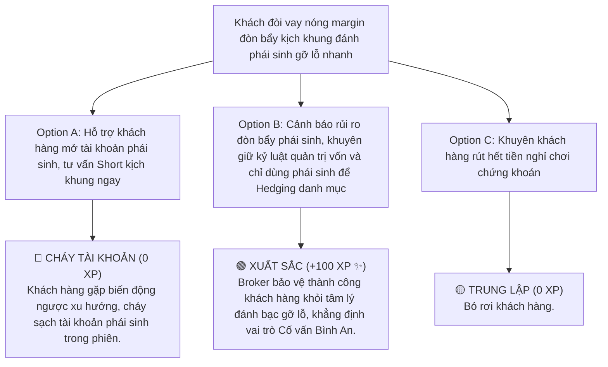

# MODULE 8: SẢN PHẨM CHỨNG KHOÁN NÂNG CAO (PHÁI SINH & ETF)
## Hướng Dẫn Tư Vấn Phòng Ngừa Rủi Ro Phái Sinh & Thiết Kế Danh Mục Tích Sản Thảnh Thơi ETF
### MÃ SỐ TÀI LIỆU: DT-08
**Chương trình:** KBSV NextGen 2026 · FinPeace × KB Securities Vietnam · Sở Giao Dịch 3 (HO3)

---

## 📌 HƯỚNG DẪN DÀNH CHO BROKER / HỌC VIÊN
- **Thời lượng học:** Ngày 13 (D13) của tuần 3.
- **Mục tiêu học tập:** 
  1. Thấu hiểu bản chất và cơ chế giao dịch Hợp đồng tương lai VN30 (Phái sinh) để phòng ngừa rủi ro (Hedging).
  2. Nắm rõ quy định ký quỹ phái sinh tại VSD và cách tư vấn khách hàng giao dịch phái sinh an toàn.
  3. Làm chủ kiến thức về Chứng chỉ quỹ ETF tại Việt Nam để tư vấn cho khách hàng thụ động, bận rộn.

---

## 📌 I. TỔNG QUAN KIẾN THỨC CỐT LÕI (THEORETICAL FOUNDATION)

### 1. Hợp Đồng Tương Lai VN30 (Chứng Khoán Phái Sinh)
Chứng khoán phái sinh (Futures Contract) là một công cụ tài chính cho phép nhà đầu tư đặt cược vào xu hướng tăng (Long) hoặc giảm (Short) của chỉ số VN30. 

#### Vai trò hai mặt của Phái sinh:
*   **Công cụ đầu cơ ngắn hạn (Speculation):** Giao dịch T+0, tỷ lệ đòn bẩy rất cao (chỉ cần ký quỹ khoảng 17-20% giá trị hợp đồng). Cho phép kiếm lợi nhuận ngay cả khi thị trường cơ sở sụt giảm mạnh (bằng vị thế Short).
*   **Công cụ phòng ngừa rủi ro (Hedging):** Bảo vệ danh mục cơ sở. Khi thị trường giảm mạnh, nhà đầu tư Short phái sinh để lấy phần lãi phái sinh bù đắp cho phần sụt giảm giá trị của cổ phiếu cơ sở, tránh phải bán tháo cổ phiếu tốt.
*   **Ký quỹ VSD:** Tỷ lệ ký quỹ ban đầu do Trung tâm Lưu ký Chứng khoán (VSD) quy định (ví dụ: 17% giá trị hợp đồng). Tài khoản phái sinh cũng được định giá lại hàng ngày (Mark-to-market). Nếu số dư ký quỹ giảm dưới mức tối thiểu (Maintenance Margin), khách hàng sẽ bị gọi ký quỹ (Margin Call).

---

### 2. Chứng Chỉ Quỹ ETF - Đầu Tư Thảnh Thơi Cho Khách Hàng Thụ Động
Đối với nhóm khách hàng bận rộn (như chị em văn phòng, nhóm tính cách S/C) không có thời gian theo dõi thị trường hoặc chọn lọc từng cổ phiếu đơn lẻ, **Chứng chỉ quỹ ETF (Exchange Traded Fund)** là giải pháp hoàn hảo nhất.

#### Các quỹ ETF hàng đầu tại Việt Nam:
*   **E1VFVN30 (ETF VN30):** Mô phỏng rổ chỉ số VN30 gồm 30 doanh nghiệp vốn hóa lớn nhất thị trường.
*   **FUEVFVND (VFMVN Diamond ETF):** Mô phỏng rổ chỉ số các cổ phiếu "kim cương" hết room khối ngoại. Quỹ này thường có hiệu suất tăng trưởng vượt trội so với VNINDEX nhờ tập trung các doanh nghiệp xuất sắc (FPT, PNJ, REE, MWG...).
*   **FUESSVFL (SSIAM VNFin Lead ETF):** Mô phỏng rổ chỉ số các doanh nghiệp dẫn đầu ngành tài chính (ngân hàng, chứng khoán).
*   **Ưu điểm tư vấn:** Đầu tư ETF giúp đa dạng hóa danh mục lập tức, loại bỏ rủi ro phi hệ thống của từng cổ phiếu đơn lẻ, phí quản lý cực thấp.

---

## 📊 II. BÀI TẬP THỰC HÀNH TÍNH TOÁN BỐC TÁCH (PRACTICAL EXERCISES)

### 📝 Bài Tập 1: Thực Hành Tính Toán Vị Thế Phòng Ngừa Rủi Ro (Hedging)
**Bối cảnh:**
*   Anh Tiến sở hữu danh mục cổ phiếu cơ sở Vùng 2 trị giá 1 tỷ VNĐ, mô phỏng khá sát rổ VN30.
*   Chỉ số VN30-Index hiện tại đang ở mốc 1.200 điểm. Giá trị một hợp đồng tương lai VN30F là:
    $$1.200 \text{ điểm} \times 100.000\text{ VNĐ/điểm} = 120.000.000\text{ VNĐ/hợp đồng}$$
*   Nhận thấy thị trường sắp bước vào nhịp điều chỉnh giảm mạnh 10%, anh Tiến không muốn bán cổ phiếu tốt đi vì tiếc thuế phí và giá vốn rẻ.

**Yêu cầu:**
1. Tính số lượng hợp đồng phái sinh cần **Short** để phòng ngừa rủi ro cho danh mục 1 tỷ.
2. Tính số tiền ký quỹ tối thiểu cần nộp tại KBSV (với tỷ lệ ký quỹ ban đầu 18%).
3. Giả sử thị trường giảm 10% đúng dự kiến (VN30 giảm về 1.080 điểm). Chứng minh hiệu quả phòng ngừa rủi ro của anh Tiến.

#### 💡 Lời Giải Chi Tiết:

1.  **Tính số lượng hợp đồng cần Short ($N$):**
    $$N = \frac{\text{Giá trị danh mục cơ sở}}{\text{Giá trị 1 hợp đồng phái sinh}} = \frac{1.000.000.000}{120.000.000} \approx 8.33\text{ hợp đồng}$$
    *Khuyến nghị:* Anh Tiến thực hiện mở vị thế **Short 8 hợp đồng** VN30F.

2.  **Tính số tiền ký quỹ ban đầu tối thiểu:**
    $$\text{Giá trị 8 hợp đồng} = 8 \times 120.000.000 = 960.000.000\text{ VNĐ}$$
    $$\text{Tiền ký quỹ yêu cầu} = 960.000.000\text{ VNĐ} \times 18\% = 172.800.000\text{ VNĐ}$$

3.  **Xác minh hiệu quả sau khi VN30 giảm 10% (về 1.080 điểm):**
    *   *Tổn thất trên danh mục cơ sở:* $$1.000.000.000\text{ VNĐ} \times (-10\%) = -100.000.000\text{ VNĐ}$$.
    *   *Lợi nhuận từ vị thế Short phái sinh:*
        $$\text{Số điểm lãi} = 1.200 - 1.080 = 120\text{ điểm}$$
        $$\text{Lợi nhuận phái sinh} = 120\text{ điểm} \times 100.000\text{ VNĐ/điểm} \times 8\text{ hợp đồng} = +96.000.000\text{ VNĐ}$$
    *   *Kết quả ròng:*
        $$\text{Tổng biến động tài sản} = -100.000.000 + 96.000.000 = -4.000.000\text{ VNĐ}$$
    *   *Kết luận:* Nhờ mở vị thế Short phái sinh đối ứng, tài sản của anh Tiến chỉ bị sụt giảm nhẹ 4 triệu VNĐ (tương đương 0.4%) thay vì mất trắng 100 triệu VNĐ (10%). Đây là giải pháp bọc thép danh mục cơ sở hoàn hảo trong giông bão!

---

## 🎯 III. TÌNH HUỐNG RA QUYẾT ĐỊNH TƯƠNG TÁC (INTERACTIVE SCENARIO)

### 🛑 Tình Huống: Khách Hàng Muốn Vay Tiền Nóng Đánh Phái Sinh Với Đòn Bẩy Kịch Khung
*   **Bối cảnh (Context):** Anh Hùng, một khách hàng có tính cách nhóm D (Kiến tạo) nóng nảy, vừa thua lỗ 50 triệu bên cơ sở. Anh nhắn tin quyết liệt: *"Em ơi, bên cơ sở chạy chậm quá. Cho anh rút hết tiền sang phái sinh, vay thêm đòn bẩy kịch khung để Short gỡ gạc lại vốn ngay trong ngày mai!"*



---

## 🧪 IV. BÀI KIỂM TRA ĐÁNH GIÁ (SELF-CHECK KNOWLEDGE QUIZ)

**Câu 1: Bản chất của vị thế "Short" trên thị trường chứng khoán phái sinh Việt Nam là gì?**
*   A. Mua cổ phiếu tích sản dài hạn.
*   B. Kỳ vọng chỉ số VN30 sẽ giảm điểm để kiếm lợi nhuận hoặc phòng ngừa rủi ro danh mục cơ sở. **(Đáp án Đúng)**
*   C. Rút tiền mặt ra khỏi tài khoản.
*   D. Mua chứng chỉ quỹ ETF.

**Câu 2: Quỹ ETF nào mô phỏng rổ chỉ số các cổ phiếu "kim cương" xuất sắc hàng đầu thị trường Việt Nam thường được ưu tiên tích sản?**
*   A. E1VFVN30
*   B. FUEVFVND (VFMVN Diamond ETF) **(Đáp án Đúng)**
*   C. FUESSVFL
*   D. ETF Techcombank

**Câu 3: Tại sao việc sử dụng phái sinh để Hedging (phòng ngừa rủi ro) giúp bọc thép danh mục cơ sở khi thị trường sụt giảm?**
*   A. Vì phái sinh giúp tăng giá trị cổ phiếu cơ sở lên.
*   B. Vì khoản lợi nhuận từ vị thế Short phái sinh sẽ bù đắp phần sụt giảm giá trị của danh mục cổ phiếu cơ sở. **(Đáp án Đúng)**
*   C. Vì phái sinh được miễn thuế hoàn toàn.
*   D. Vì phái sinh không có rủi ro.

---

## 💬 V. KỊCH BẢN ROLEPLAY THỰC CHIẾN (AI ROLEPLAY DIALOGUE SCRIPT)

*   **Nhân vật:**
    *   **Học viên (Broker NextGen):** Điềm tĩnh, chuyên nghiệp, thấu cảm, hướng khách hàng đến sự thảnh thơi.
    *   **Khán giả AI (Chị Linh - Nhóm tính cách S):** Khách hàng bận rộn, ưu tiên sự an toàn tuyệt đối.

```dialogue
Khán giả AI (Chị Linh): "Em ơi, chị bận làm việc ở cơ quan cả ngày, không có thời gian theo dõi doanh nghiệp hay đọc BCTC đâu. Nhưng gửi tiết kiệm ngân hàng giờ lãi thấp quá. Có cách nào đầu tư chứng khoán an tâm thảnh thơi, không cần lo chọn mã không em?"

Học viên (NextGen Broker): "Dạ chị Linh, em rất hiểu nhu cầu của chị. Với một người bận rộn công việc và ưu tiên sự an tâm tuyệt đối như chị, việc tự đi tìm hiểu từng mã cổ phiếu hay xem biểu đồ hàng ngày quả thực rất mệt mỏi. 

Để giúp chị tối ưu hóa dòng tiền thặng dư thảnh thơi, em đề xuất giải pháp tích sản vào **Chứng chỉ quỹ ETF Diamond (FUEVFVND)**. 

Thay vì chị mua một vài cổ phiếu riêng lẻ và lo sợ doanh nghiệp đó gặp sự cố, chứng chỉ quỹ ETF Diamond là một 'rổ cổ phiếu' tập hợp gần 20 doanh nghiệp xuất sắc hàng đầu Việt Nam như FPT, PNJ, MWG, REE... Khi chị mua ETF Diamond, chị đang sở hữu một phần của tất cả các doanh nghiệp kim cương này."

Khán giả AI (Chị Linh): "Mua cái này có an toàn hơn tự mua cổ phiếu không em? Và hiệu suất có tốt không?"

Học viên (NextGen Broker): "An toàn hơn rất nhiều chị Linh ạ! Vì tài sản được đa dạng hóa tự động, loại bỏ hoàn toàn rủi ro một doanh nghiệp đơn lẻ bị sụt giảm. 

Về hiệu suất, trong 3 năm gần nhất, tốc độ tăng trưởng của quỹ ETF Diamond đạt trung bình trên 18%/năm, vượt trội hơn hẳn chỉ số chung VNINDEX và gấp 3 lần lãi suất gửi tiết kiệm ngân hàng. Chị chỉ cần cài lịch mua tích sản tự động hàng tháng vào ngày nhận lương trên App của KBSV, hệ thống tự động gom mà chị không cần canh bảng điện dù chỉ 1 giây. 

Cuối tuần chị vẫn thảnh thơi chăm sóc gia đình, tiền của chị vẫn tự động sinh sôi bền vững."

Khán giả AI (Chị Linh): "Nghe giải pháp ETF Diamond thảnh thơi này phù hợp với chị quá. Em hướng dẫn chị mở tài khoản và cài lịch gom định kỳ luôn nhé!"
```

---
**Mã số tài liệu:** `DT-08` · KBSV NextGen 2026 · FinPeace × KB Securities Vietnam
