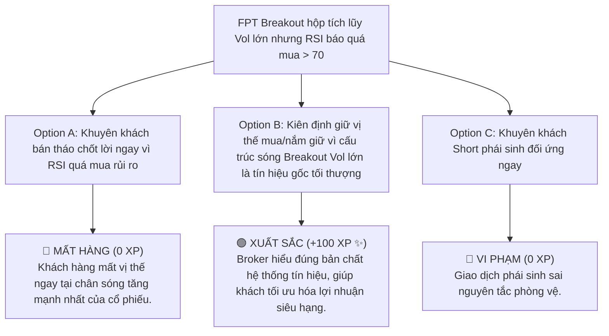

# MODULE 9: PHÂN TÍCH KỸ THUẬT (TA) & CẤU TRÚC SÓNG
## Cẩm Nang Thực Chiến Đọc Biểu Đồ, Chu Kỳ Wyckoff & Quy Luật Đối Xứng Sóng
### MÃ SỐ TÀI LIỆU: DT-09
**Chương trình:** KBSV NextGen 2026 · FinPeace × KB Securities Vietnam · Sở Giao Dịch 3 (HO3)

---

## 📌 HƯỚNG DẪN DÀNH CHO BROKER / HỌC VIÊN
- **Thời lượng học:** Ngày 6 (D6) của tuần 2.
- **Mục tiêu học tập:** 
  1. Đọc vị biểu đồ kỹ thuật chuyên sâu bằng sự kết hợp giữa Giá (Price Action) và Khối lượng (Volume).
  2. Nhận diện chuẩn xác 4 pha của Chu kỳ thị trường theo Lý thuyết Wyckoff.
  3. Áp dụng Quy luật Đối Xứng (Symmetry) trong không gian và thời gian để tính toán điểm đảo chiều sóng.
  4. Hiểu đúng vai trò của chỉ báo kỹ thuật (Indicators) chỉ là công cụ xác nhận phụ, không thay thế cấu trúc giá.

---

## 📌 I. TỔNG QUAN KIẾN THỨC CỐT LÕI (THEORETICAL FOUNDATION)

### 1. Cấu Trúc Sóng & Lý Thuyết Chu Kỳ Wyckoff
Đối với hoạt động giao dịch ngắn/trung hạn ở Vùng 3 Bứt Tốc, việc hiểu rõ vị thế của cổ phiếu đang nằm ở đâu trong chu kỳ lớn là điều kiện quyết định thắng thua. Lý thuyết Wyckoff chia chu kỳ chuyển động của giá cổ phiếu thành 4 pha rõ rệt:

```
                      [ PHA C: ĐẨY GIÁ (Markup) ]
                             /           \
                            /             \
    [ PHA A: TÍCH LŨY (Accumulation) ]   [ PHA D: PHÂN PHỐI (Distribution) ]
                                                 \
                                                  \
                                            [ PHA B: ĐÈ GIÁ (Markdown) ]
```

*   **Pha A: Tích lũy (Accumulation):** Giá dao động đi ngang (Sideway) trong một biên độ hẹp (Darvas Box). Dòng tiền thông minh (Smart Money) âm thầm thu gom cổ phiếu. Khối lượng giao dịch cạn kiệt ở vùng đáy hộp.
*   **Pha B: Đẩy giá (Markup):** Giá bứt phá (Breakout) khỏi cạnh trên của hộp tích lũy với khối lượng lớn đột biến (Vol nổ). Giá tạo các đỉnh sau cao hơn đỉnh trước, nằm hoàn toàn trên cụm MA ngắn/dài.
*   **Pha C: Phân phối (Distribution):** Giá đi ngang ở vùng đỉnh sau một nhịp tăng dài. Khối lượng giao dịch lớn nhưng giá không thể tăng thêm, xuất hiện các phiên phân phối (Vol lớn giá giảm).
*   **Pha D: Đè giá (Markdown):** Giá thủng hỗ trợ dưới của vùng phân phối, bước vào xu hướng giảm giá dài hạn.

---

### 2. Quy Luật Đối Xứng Sóng (Symmetry Principle)
Quy luật Đối Xứng của FinPeace chỉ ra rằng: **Thị trường có tính trí nhớ và đối xứng rất mạnh.** Nhịp tăng/giảm hiện tại của cổ phiếu thường có xu hướng đối xứng với nhịp tăng/giảm liền trước đó về cả hai chiều:
*   **Đối xứng về Biên độ (Price Symmetry):** Đo chiều dài nhịp tăng trước (ví dụ: tăng 5 giá từ nền), nhịp tăng tiếp theo sau khi tích lũy lại cũng có xu hướng đạt mục tiêu tăng tương tự (5 giá).
*   **Đối xứng về Thời gian (Time Symmetry):** Nếu nhịp giảm trước kéo dài trong 15 phiên giao dịch trước khi tạo đáy, thì nhịp tích lũy hoặc nhịp phục hồi hiện tại cũng thường cần khoảng 12 - 15 phiên để hoàn thành cấu trúc đảo chiều.

---

### 3. Hệ Thống Tín Hiệu: Gốc Rễ vs Xác Nhận Phụ
Broker NextGen phải tuân thủ nguyên tắc phân cấp tín hiệu khi phân tích kỹ thuật:
*   **Tín hiệu Gốc (Primary Signal):** Cấu trúc giá (Price Action) và Khối lượng giao dịch (Volume). Đây là dòng chảy trực tiếp của tiền mặt trên thị trường.
*   **Xác nhận Phụ (Secondary Confirmation):** Các chỉ báo toán học (Indicators như MACD, RSI, Bollinger Bands, Stochastic). 
*   **Quy tắc:** Chỉ báo chỉ dùng để xác nhận chéo (Cross-validate), không bao giờ dùng để thay thế cấu trúc giá. Nếu chỉ báo mâu thuẫn với cấu trúc giá $\rightarrow$ Giảm conviction (độ tin cậy) của Deal.

---

## 📊 II. BÀI TẬP THỰC HÀNH TÍNH TOÁN BỐC TÁCH (PRACTICAL EXERCISES)

### 📝 Bài Tập 1: Áp Dụng Quy Luật Đối Xứng Tính Mục Tiêu Chốt Lời Cho Cổ Phiếu HPG
**Dữ liệu lịch sử bước sóng HPG trên biểu đồ Daily:**
*   *Nhịp tăng số 1:* HPG bứt phá từ giá $24.000\text{ VNĐ}$ lên đến đỉnh $28.000\text{ VNĐ}$ (Biên độ tăng 4.000 VNĐ, kéo dài trong 12 phiên giao dịch).
*   *Nhịp điều chỉnh tích lũy:* HPG giảm từ $28.000\text{ VNĐ}$ về tạo đáy tích lũy ở giá $26.000\text{ VNĐ}$ (Kéo dài 8 phiên).
*   *Nhịp tăng số 2:* HPG xuất hiện phiên Breakout khỏi nền tích lũy $26.000\text{ VNĐ}$ với Vol nổ vượt trung bình 20 phiên 150%.

**Yêu cầu:**
1. Áp dụng quy luật đối xứng biên độ để tính toán mức giá mục tiêu (Take Profit) cho nhịp tăng số 2.
2. Áp dụng quy luật đối xứng thời gian để dự báo phiên giao dịch thứ mấy nhịp tăng số 2 có xu hướng đạt đỉnh.

#### 💡 Lời Giải Chi Tiết:

1.  **Tính giá mục tiêu đối xứng biên độ (TP):**
    *   Biên độ nhịp tăng 1:
        $$\Delta P_1 = 28.000 - 24.000 = 4.000\text{ VNĐ}$$
    *   Mức giá mục tiêu đối xứng cho nhịp tăng 2 bắt đầu từ đáy điều chỉnh $26.000\text{ VNĐ}$:
        $$\text{Target Price (TP)} = 26.000\text{ VNĐ} + \Delta P_1 = 26.000 + 4.000 = 30.000\text{ VNĐ}$$

2.  **Tính thời gian đạt mục tiêu chốt lời:**
    *   Thời gian nhịp tăng 1: $T_1 = 12\text{ phiên}$.
    *   Thời gian dự kiến cho nhịp tăng 2:
        $$\text{Thời gian đạt đỉnh dự kiến} \approx 12\text{ phiên (tính từ ngày Breakout)}$$

**📌 Kết Luận:** Deal Trading HPG có mức giá mục tiêu **30.000 VNĐ** và thời gian nắm giữ dự kiến là **12 phiên giao dịch** kể từ điểm mua Breakout.

---

## 🎯 III. TÌNH HUỐNG RA QUYẾT ĐỊNH TƯƠNG TÁC (INTERACTIVE SCENARIO)

### 🛑 Tình Huống: Chỉ Báo RSI Báo Quá Mua Nhưng Cấu Trúc Sóng Vừa Mới Breakout Nền
*   **Bối cảnh (Context):** Cổ phiếu FPT tích lũy chặt chẽ trong hộp Darvas suốt 3 tháng. Hôm nay giá bứt phá vượt cạnh trên của hộp với Volume khổng lồ tăng gấp 3 lần bình thường (xác nhận vào Pha B Đẩy giá). Tuy nhiên, do tăng trần mạnh, chỉ báo RSI chạm mốc 72 (vùng quá mua). Khách hàng hỏi: *"FPT quá mua RSI > 70 rồi em ơi, có nên bán cắt lãi/ngừng mua không?"*



---

## 🧪 IV. BÀI KIỂM TRA ĐÁNH GIÁ (SELF-CHECK KNOWLEDGE QUIZ)

**Câu 1: Theo chu kỳ Wyckoff, pha nào là giai đoạn dòng tiền lớn (Smart Money) âm thầm gom cổ phiếu khi giá đi ngang cạn Vol?**
*   A. Pha B: Đẩy giá (Markup)
*   B. Pha A: Tích lũy (Accumulation) **(Đáp án Đúng)**
*   C. Pha D: Đè giá
*   D. Pha C: Phân phối

**Câu 2: Nguyên tắc phân cấp tín hiệu giữa Cấu trúc Giá + Vol và Chỉ báo kỹ thuật (Indicators) là gì?**
*   A. Chỉ báo kỹ thuật quan trọng hơn cấu trúc giá.
*   B. Cấu trúc giá và Khối lượng là Tín hiệu Gốc (Primary); Chỉ báo kỹ thuật chỉ là Xác nhận phụ (Secondary). **(Đáp án Đúng)**
*   C. Chỉ báo kỹ thuật và Giá có vai trò ngang nhau.
*   D. Bỏ qua hoàn toàn giá, chỉ mua bán theo chỉ báo.

**Câu 3: Quy luật Đối xứng về biên độ giá (Price Symmetry) giúp Broker xác định biến số nào trong Kế hoạch giao dịch?**
*   A. Vùng cắt lỗ (Stop Loss)
*   B. Điểm chốt lời mục tiêu (Take Profit) **(Đáp án Đúng)**
*   C. Khối lượng đặt lệnh
*   D. Lãi suất Margin

---

## 💬 V. KỊCH BẢN ROLEPLAY THỰC CHIẾN (AI ROLEPLAY DIALOGUE SCRIPT)

*   **Nhân vật:**
    *   **Học viên (Broker NextGen):** Điềm tĩnh, phân tích biểu đồ dựa trên Cấu trúc giá & Vol, giải thích dễ hiểu.
    *   **Khán giả AI (Anh Dũng - Nhóm tính cách C):** Nhà đầu tư ưa kỹ thuật, hay băn khoăn về các chỉ báo mâu thuẫn.

```dialogue
Khán giả AI (Anh Dũng): "Em ơi, anh xem biểu đồ thấy mã SSI hôm nay nổ Vol vượt đỉnh, giá tăng 4%. Nhưng anh thấy chỉ báo Stochastic đang cắt xuống ở vùng quá mua. Liệu có phải là Breakout xịt không em? Có nên mua lúc này không?"

Học viên (NextGen Broker): "Anh Dũng ơi, em rất trân trọng sự quan sát kỹ lưỡng của anh trên biểu đồ kỹ thuật! Việc check các chỉ báo dao động như Stochastic là rất tốt để cảnh báo biến động ngắn hạn. 

Tuy nhiên, trong phương pháp VTA của tụi em, **Giá và Khối lượng** luôn là tín hiệu gốc tối thượng (Primary Signal), còn các chỉ báo toán học như Stochastic hay RSI chỉ là tín hiệu xác nhận phụ (Secondary Confirmation). 

Phiên hôm nay của SSI thỏa mãn:
1. Giá vượt đỉnh cũ dứt khoát với một cây nến xanh thân dài.
2. Khối lượng giao dịch (Volume) đạt gấp 2.5 lần trung bình 20 phiên. Điều này chứng tỏ dòng tiền lớn của tổ chức đã quyết định đánh bứt phá dòng tiền đeo bám, đưa cổ phiếu từ Pha A Tích lũy sang Pha B Đẩy giá. 

Khi dòng tiền lớn đã nhập cuộc dứt khoát, các chỉ báo dao động như Stochastic sẽ bị 'nhiễu' và duy trì ở vùng quá mua rất lâu mà giá vẫn tiếp tục tăng."

Khán giả AI (Anh Dũng): "À, tức là cấu trúc dòng tiền lớn (Giá + Vol) đè bẹp các công thức toán học ngắn hạn của chỉ báo?"

Học viên (NextGen Broker): "Chính xác anh Dũng ạ! Chỉ báo Stochastic cắt xuống chỉ dự báo có thể có nhịp kiểm định (retest) lại đỉnh cũ trong 1-2 phiên tới, chứ không làm thay đổi xu hướng tăng vừa được xác lập. 

Vì vậy, thay vì lo ngại chỉ báo, kế hoạch giao dịch (Deal Strategy) bọc thép của chúng ta là:
- Mua gom 50% vị thế ngay tại vùng giá hiện tại 35.2.
- 50% vị thế còn lại, chúng ta chờ mua khi SSI kiểm định lại đỉnh cũ quanh giá 34.5.
- Cắt lỗ nghiêm ngặt nếu giá quay đầu thủng hộp tích lũy dưới 33.0.

Anh Dũng thấy kế hoạch phân bổ lệnh này đã giúp anh tối ưu hóa giá mua mà vẫn an toàn chưa ạ?"

Khán giả AI (Anh Dũng): "Cách phân tích gốc rễ Giá - Vol kết hợp chia lệnh mua của em rất khoa học. Anh đồng ý với deal SSI này!"
```

---
**Mã số tài liệu:** `DT-09` · KBSV NextGen 2026 · FinPeace × KB Securities Vietnam
