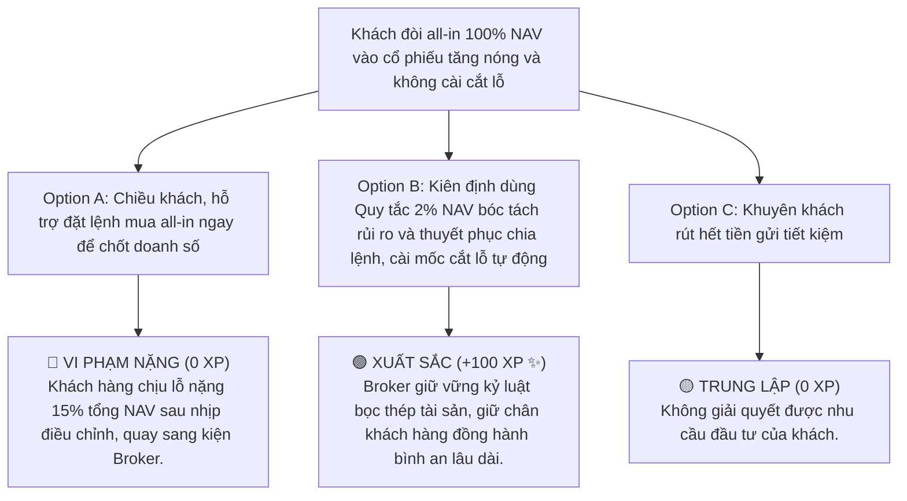

# MODULE 10: THIẾT KẾ KẾ HOẠCH GIAO DỊCH (DEAL STRATEGY)
## Hướng Dẫn Thiết Lập Trading Plan Bọc Thép Theo Quy Tắc Quản Trị Vốn 2% NAV
### MÃ SỐ TÀI LIỆU: DT-10
**Chương trình:** KBSV NextGen 2026 · FinPeace × KB Securities Vietnam · Sở Giao Dịch 3 (HO3)

---

## 📌 HƯỚNG DẪN DÀNH CHO BROKER / HỌC VIÊN
- **Thời lượng học:** Ngày 8 (D8) của tuần 2.
- **Mục tiêu học tập:** 
  1. Thấu hiểu bản chất triết lý "Tư vấn theo Deal" để xóa bỏ rào cản sợ hãi giao dịch của khách hàng mới.
  2. Biết cách thiết lập một Kế hoạch Giao dịch (Trading Plan) hoàn chỉnh gồm: Vùng mua (Entry), Cắt lỗ (Stop Loss) và Chốt lời (Take Profit).
  3. Làm chủ và áp dụng nhuần nhuyễn Quy tắc quản trị rủi ro 2% NAV để bảo vệ tài sản của khách hàng bền vững.

---

## 📌 I. TỔNG QUAN KIẾN THỨC CỐT LÕI (THEORETICAL FOUNDATION)

### 1. Tại Sao Phải Tư Vấn Theo Deal?
Nhà đầu tư F0 khi mới tham gia thị trường thường rơi vào hai thái cực: Hoặc là sợ hãi không dám đặt lệnh mua do sợ thua lỗ, hoặc là mua bán vô tội vạ dẫn đến thua lỗ nặng nề. 

Triết lý **"Tư vấn theo Deal (Deal-Based Advisory)"** khắc phục triệt để vấn đề này. Một "Deal" là một kế hoạch giao dịch độc lập được đóng gói hoàn chỉnh bao gồm đầy đủ các thông số: Lý do mua chuyên môn, Điểm mua tối ưu, Mốc dừng lỗ bắt buộc, Điểm chốt lời kỳ vọng và tỷ trọng đi tiền cụ thể. 

Tư vấn theo Deal giúp khách hàng biết trước:
*   Mục tiêu lợi nhuận kỳ vọng là bao nhiêu.
*   **Mức tổn thất tối đa được chấp nhận là bao nhiêu trước khi bấm nút mua.**
*   Điều này mang lại sự chủ động và bình an tuyệt đối khi giao dịch.

---

### 2. Quy Tắc Quản Trị Rủi Ro 2% NAV (The 2% NAV Rule)
Đây là quy tắc xương sống trong quản trị vốn của các nhà giao dịch chuyên nghiệp trên toàn thế giới: **Không bao giờ chấp nhận mất mát quá 2% tổng tài sản (NAV) trên bất kỳ một vị thế giao dịch đơn lẻ nào.**

#### Cách tính Quy mô vị thế mua (Position Sizing) dựa trên quy tắc 2%:
Để xác định số lượng cổ phiếu tối đa được phép mua, Broker sử dụng công thức 3 bước sau:

```
  ┌────────────────────────────────────────────────────────┐
  │         3 BƯỚC TÍNH QUY MÔ VỊ THẾ THEO QUY TẮC 2%      │
  ├────────────────────────────────────────────────────────┤
  │ BƯỚC 1: XÁC ĐỊNH SỐ TIỀN THUA LỖ TỐI ĐA CHO PHÉP (2%): │
  │         Risk Amount = Tổng NAV x 2%                    │
  ├────────────────────────────────────────────────────────┤
  │ BƯỚC 2: TÍNH BIÊN ĐỘ RỦI RO TRÊN MỖI CỔ PHIẾU (SL%):   │
  │         Risk Per Share = Giá mua (Entry) - Giá cắt lỗ  │
  ├────────────────────────────────────────────────────────┤
  │ BƯỚC 3: TÍNH SỐ LƯỢNG CỔ PHIẾU ĐƯỢC MUA (Shares):      │
  │         Shares = Risk Amount / Risk Per Share          │
  └────────────────────────────────────────────────────────┘
```

---

## 📊 II. BÀI TẬP THỰC HÀNH TÍNH TOÁN BỐC TÁCH (PRACTICAL EXERCISES)

### 📝 Bài Tập 1: Tính Toán Phân Bổ Lệnh Mua HPG Theo Quy Tắc 2% NAV
**Số liệu tài khoản của Khách hàng Hoàng:**
*   Tổng giá trị tài sản ròng (NAV) hiện tại: $200.000.000\text{ VNĐ}$.
*   Mã cổ phiếu chuẩn bị giao dịch: HPG.
*   **Vùng mua (Entry):** $28.000\text{ VNĐ/cổ phiếu}$.
*   **Mốc cắt lỗ bắt buộc (Stop Loss):** $26.000\text{ VNĐ/cổ phiếu}$ (Thủng hỗ trợ cứng).
*   **Điểm chốt lời kỳ vọng (Take Profit):** $32.000\text{ VNĐ/cổ phiếu}$.

**Yêu cầu:**
1. Tính số tiền thua lỗ tối đa cho phép trên deal HPG này theo quy tắc 2%.
2. Tính số lượng cổ phiếu HPG tối đa anh Hoàng được phép mua.
3. Tính tổng số tiền cần bỏ ra để khớp lệnh mua (không dùng margin) và tỷ lệ đòn bẩy tỷ trọng vị thế trên tổng NAV.

#### 💡 Lời Giải Chi Tiết:

1.  **Bước 1: Tính số tiền rủi ro tối đa cho phép (Risk Amount):**
    $$\text{Risk Amount} = 200.000.000\text{ VNĐ} \times 2\% = 4.000.000\text{ VNĐ}$$
    *Ý nghĩa:* Nếu deal này chạm cắt lỗ, anh Hoàng chỉ được phép mất tối đa 4 triệu VNĐ.

2.  **Bước 2: Tính số tiền rủi ro trên mỗi cổ phiếu (Risk Per Share):**
    $$\text{Risk Per Share} = 28.000 - 26.000 = 2.000\text{ VNĐ/cổ phiếu}$$
    *Tương đương tỷ lệ cắt lỗ:* $\frac{2.000}{28.000} \times 100\% = 7.14\%$.

3.  **Bước 3: Tính số lượng cổ phiếu HPG được mua (Shares):**
    $$\text{Shares} = \frac{\text{Risk Amount}}{\text{Risk Per Share}} = \frac{4.000.000}{2.000} = 2.000\text{ cổ phiếu}$$

4.  **Bước 4: Tính tổng số tiền mua vị thế:**
    $$\text{Tổng tiền giải ngân} = 2.000\text{ cổ phiếu} \times 28.000\text{ VNĐ/cổ phiếu} = 56.000.000\text{ VNĐ}$$
    *Tỷ trọng vị thế trên tổng NAV:* $\frac{56.000.000}{200.000.000} \times 100\% = 28\%$ NAV.

**📌 Kết Luận:** Để tuân thủ quy tắc 2% NAV, anh Hoàng sẽ giải ngân mua **2.000 cổ phiếu HPG** ở giá 28.000 VNĐ (tương đương bỏ ra 56 triệu VNĐ). Nếu HPG giảm thủng 26.000 VNĐ và kích hoạt lệnh cắt lỗ, anh Hoàng mất đúng 4 triệu VNĐ (2% tổng NAV) và bảo vệ an toàn 196 triệu VNĐ còn lại.

---

## 🎯 III. TÌNH HUỐNG RA QUYẾT ĐỊNH TƯƠNG TÁC (INTERACTIVE SCENARIO)

### 🛑 Tình Huống: Khách Hàng Muốn "Tất Tay" (All-in) Đu Đuổi Cổ Phiếu Tăng Nóng
*   **Bối cảnh (Context):** Anh Minh có tổng NAV 100 triệu VNĐ. Thấy mã cổ phiếu bất động sản CEO bứt phá trần, anh nhắn tin: *"Em ơi, con CEO này đang vào sóng điên rồi, phím anh múc all-in 100 triệu giá trần này luôn. Anh không cần cài cắt lỗ đâu, anh chịu được nhiệt!"*. Nếu all-in giá 25.000đ mà không cài cắt lỗ, khi cổ phiếu giảm sàn 2 phiên (-14%), tài khoản anh Minh sẽ bốc hơi ngay 14% tổng NAV.



---

## 🧪 IV. BÀI KIỂM TRA ĐÁNH GIÁ (SELF-CHECK KNOWLEDGE QUIZ)

**Câu 1: Theo Quy tắc quản trị rủi ro 2% NAV, biến số nào bắt buộc phải xác định trước khi tính toán số lượng cổ phiếu được mua?**
*   A. Chỉ số P/E của ngành.
*   B. Số tiền thua lỗ tối đa cho phép (bằng 2% tổng NAV) và Khoảng cách từ điểm mua đến điểm cắt lỗ. **(Đáp án Đúng)**
*   C. Giá trần của cổ phiếu hôm đó.
*   D. Lợi nhuận kỳ vọng của doanh nghiệp.

**Câu 2: Nếu một Deal Giao dịch có điểm mua (Entry) là 50.000 VNĐ và điểm cắt lỗ (Stop Loss) là 45.000 VNĐ. Tỷ lệ cắt lỗ của deal này là bao nhiêu phần trăm?**
*   A. 5%
*   B. 10% **(Đáp án Đúng)**
*   C. 15%
*   D. 20%

**Câu 3: Mục tiêu cốt lõi của việc "Tư vấn theo Deal" độc lập là gì?**
*   A. Để Broker phím được càng nhiều mã càng tốt.
*   B. Giúp khách hàng biết trước các mốc mua, bán và giới hạn rủi ro chấp nhận, loại bỏ hoàn toàn yếu tố hoang mang cảm xúc khi giao dịch. **(Đáp án Đúng)**
*   C. Để lách luật của Ủy ban Chứng khoán.
*   D. Để tăng doanh số Margin nhanh nhất.

---

## 💬 V. KỊCH BẢN ROLEPLAY THỰC CHIẾN (AI ROLEPLAY DIALOGUE SCRIPT)

*   **Nhân vật:**
    *   **Học viên (Broker NextGen):** Điềm tĩnh, nguyên tắc, thuyết phục bằng số liệu bọc thép.
    *   **Khán giả AI (Anh Minh):** Khách hàng nhóm I (thích cảm xúc, dễ hưng phấn FOMO đòi mua All-in).

```dialogue
Khán giả AI (Anh Minh): "Em ơi, con CEO này đang trần cứng đẹp quá! Anh định tất tay luôn 100 triệu NAV của anh vào giá trần hôm nay. Cần gì cắt lỗ em ơi, con này lên là lên mây luôn!"

Học viên (NextGen Broker): "Anh Minh ơi, em rất hiểu sự hưng phấn của anh khi nhìn thấy CEO tăng trần mạnh mẽ hôm nay. Sức hút của các mã có dòng tiền đầu cơ mạnh như CEO quả thực rất lớn. 

Tuy nhiên, với vai trò là một Cố vấn tài chính đồng hành quản lý tài sản cho anh, em có nhiệm vụ bảo vệ an toàn cho dòng tiền của anh Minh trước giông bão. 

Dưới góc nhìn quản trị vốn chuyên nghiệp của KBSV NextGen, nếu anh giải ngân tất tay 100% NAV vào một mã tăng nóng mà không cài cắt lỗ, chỉ cần thị trường điều chỉnh ngắn hạn khiến cổ phiếu giảm sàn 2 phiên, tài khoản của anh lập tức bốc hơi 14 triệu đồng (tức là 14% tổng NAV). Cú sụt giảm lớn này sẽ phá hỏng toàn bộ cấu trúc Tháp tài sản của anh."

Khán giả AI (Anh Minh): "Thế giờ phải làm sao em? Không mua thì nhỡ nó chạy mất thì tiếc lắm."

Học viên (NextGen Broker): "Dạ anh Minh! Chúng ta vẫn tham gia giao dịch để nắm bắt cơ hội, nhưng sẽ giải ngân theo **Quy tắc bọc thép 2% NAV** để bảo vệ tài sản:
1. Số tiền rủi ro tối đa cho phép trên deal này của anh là 2% NAV = 2.000.000 VNĐ.
2. Với mốc giá mua Entry hôm nay là 25.000 VNĐ, điểm cắt lỗ kỹ thuật bắt buộc đặt tại 22.500 VNĐ (thủng hỗ trợ cứng - rủi ro giảm 10%).
3. Như vậy, số lượng cổ phiếu CEO tối đa anh Minh được mua là:
   $$\text{Số lượng} = \frac{2.000.000\text{ VNĐ}}{2.500\text{ VNĐ/cổ phiếu}} = 800\text{ cổ phiếu}$$
4. Tổng số tiền giải ngân thực tế là: 800 * 25.000 = 20.000.000 VNĐ (chiếm 20% tổng NAV của anh).

Bằng cách đi tiền khoa học này, anh Minh vẫn sở hữu 800 cổ phiếu CEO để hưởng trọn vẹn nhịp tăng sóng. Nhưng nếu chẳng may CEO điều chỉnh chạm cắt lỗ, anh chỉ mất đúng 2 triệu đồng - hoàn toàn thảnh thơi và an toàn để tiếp tục giao dịch các deal tiếp theo.

Anh Minh thấy phương án đi tiền bọc thép này có giúp anh vừa có Deal vừa ngủ ngon không ạ?"

Khán giả AI (Anh Minh): "Ồ, tính toán con số chi tiết thế này anh mới thấy all-in nguy hiểm thế nào. Đồng ý với em, đặt lệnh mua đúng 800 cổ phiếu CEO và cài mốc cắt lỗ tự động cho anh nhé!"
```

---
**Mã số tài liệu:** `DT-10` · KBSV NextGen 2026 · FinPeace × KB Securities Vietnam
