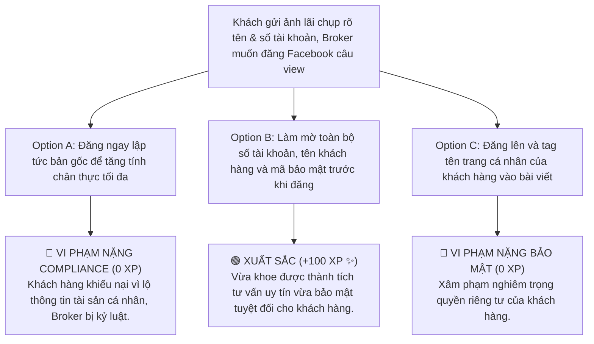

# MODULE 11: XÂY DỰNG THƯƠNG HIỆU CÁ NHÂN (SOCIAL PROFILE)
## Hướng Dẫn Định Vị Hình Mẫu Financial KOC & Thiết Lập Social Profile Chuẩn Compliance
### MÃ SỐ TÀI LIỆU: DT-11
**Chương trình:** KBSV NextGen 2026 · FinPeace × KB Securities Vietnam · Sở Giao Dịch 3 (HO3)

---

## 📌 HƯỚNG DẪN DÀNH CHO BROKER / HỌC VIÊN
- **Thời lượng học:** Ngày 10 (D10) của tuần 2.
- **Mục tiêu học tập:** 
  1. Thấu hiểu lý do tại sao thương hiệu cá nhân là phễu hút Lead bền vững nhất của Broker 4.0.
  2. Xác định hình mẫu thương hiệu phù hợp với cá tính bản thân để định vị lâu dài.
  3. Chuẩn hóa hồ sơ Social Profile chuyên nghiệp trên TikTok, Facebook và LinkedIn.
  4. Nắm vững và tuân thủ các nguyên tắc Compliance (quy chuẩn tuân thủ) phát ngôn tài chính trên không gian mạng.

---

## 📌 I. TỔNG QUAN KIẾN THỨC CỐT LÕI (THEORETICAL FOUNDATION)

### 1. Tại Sao Môi Giới 4.0 Phải Xây Dựng Thương Hiệu Cá Nhân?
Trong quá khứ, khách hàng mở tài khoản chứng khoán vì danh tiếng của công ty. Ngày nay, trong thời đại thông tin bão hòa, khách hàng mở tài khoản vì **tin tưởng cá nhân người tư vấn (We buy people, not products)**. 

Thương hiệu cá nhân chính là "bảo chứng lòng tin" giúp Broker:
*   **Thu hút Lead tự động (Inbound Lead):** Thay vì đi xin số gọi lạnh (Cold Call) đầy mệt mỏi, khách hàng tự tìm đến bạn qua các chia sẻ giá trị trên mạng xã hội.
*   **Gia tăng tỷ lệ chuyển đổi:** Khách hàng đã quen thuộc với gương mặt và giọng nói của bạn qua video/livestream sẽ cởi mở chia sẻ thông tin tài sản ròng hơn (bỏ qua bước phòng thủ).
*   **Tạo giá trị thặng dư lâu dài:** Thương hiệu cá nhân giúp bạn định vị là một Cố vấn tài chính độc lập, nâng tầm vị thế thành một **Financial KOC (Key Opinion Consumer)** có tiếng nói trong cộng đồng.

---

### 2. Bảng Định Vị 4 Hình Mẫu Financial KOC Thành Công
Học viên NextGen được định hướng lựa chọn một trong bốn hình mẫu sau để phát triển thương hiệu:

| Hình mẫu | Đặc điểm cá tính | Kênh truyền thông chính | Tệp khách hàng mục tiêu |
| :--- | :--- | :--- | :--- |
| **1. Chuyên Gia Phân Tích** *(The Analyst)* | Sâu sắc vĩ mô, logic, yêu thích các con số, BCTC. | LinkedIn, Facebook Articles. | Nhà đầu tư có kinh nghiệm, NAV lớn, nhóm C. |
| **2. Người Đồng Hành** *(The Financial Coach)* | Ấm áp, biết lắng nghe, thấu cảm tâm lý, hướng thiện. | Zalo Group, Facebook Page. | Khách hàng F0, dân văn phòng bận rộn, nhóm S/I. |
| **3. Bạn Học Đội Bạn** *(The Peer Investor)* | Trẻ trung, năng động, đang học hỏi và chia sẻ hành trình. | TikTok, Threads, YouTube Shorts.| Sinh viên, Freshers mới đi làm, Gen Z. |
| **4. Kẻ Kể Chuyện** *(The Storyteller)* | Sáng tạo, hài hước, biến tài chính thành nghệ thuật kể chuyện. | TikTok Videos, Facebook Reels. | Khán giả đại chúng thích giải trí lồng ghép kiến thức. |

---

### 3. Quy Tắc Tuân Thủ Phát Ngôn Tài Chính (Compliance Guidelines)
Hoạt động tư vấn tài chính chịu sự quản lý chặt chẽ của pháp luật. Broker NextGen khi sản xuất nội dung trên mạng xã hội bắt buộc phải tuân thủ 3 nguyên tắc Compliance cốt lõi của KBSV:
1.  **Tuyệt đối không cam kết lợi nhuận (No Guaranteed Returns):** Không bao giờ sử dụng các từ ngữ như *"chắc chắn lãi"*, *"cam kết x2 tài khoản"*, *"không thể lỗ"*. Mọi khuyến nghị đầu tư phải đi kèm tuyên bố miễn trừ trách nhiệm: *"Đầu tư chứng khoán luôn có rủi ro, khuyến nghị chỉ mang tính chất tham khảo."*
2.  **Bảo mật thông tin khách hàng (Confidentiality):** Khi đăng ảnh chụp màn hình tin nhắn cảm ơn hoặc danh mục lãi của khách để làm tư liệu truyền thông, bắt buộc phải che/làm mờ toàn bộ tên khách hàng, số tài khoản và thông tin cá nhân.
3.  **Trung thực về dữ liệu (Data Integrity):** Mọi biểu đồ, số liệu tài chính sử dụng trong bài viết/video phải trích dẫn nguồn rõ ràng (nguồn: KBSV Research, FireAnt, Tổng cục Thống kê...). Không xào nấu, bịa đặt số liệu để câu view.

---

## 📊 II. BÀI TẬP THỰC HÀNH THIẾT LẬP PROFILE (PRACTICAL EXERCISES)

### 📝 Bài Tập 1: Viết Câu Mô Tả Bản Thân (Bio/Tagline) Cho 3 Nền Tảng Mạng Xã Hội
**Tình huống:** Bạn lựa chọn hình mẫu **Người Đồng Hành (The Financial Coach)**, mục tiêu là tư vấn tích sản thảnh thơi cho dân văn phòng bận rộn. Hãy viết câu Bio/Tagline giới thiệu bản thân tối ưu cho:
1.  Bio TikTok (Giới hạn dưới 80 ký tự, cần giật tít, gần gũi Gen Z).
2.  Headline LinkedIn (Chuyên nghiệp, định vị chuyên môn và công ty).
3.  Intro Facebook cá nhân (Thân thiện, thể hiện sứ mệnh hỗ trợ).

#### 💡 Lời Giải Mẫu:

1.  **Bio TikTok:**
    *   *Kịch bản:* `"Tích sản thảnh thơi cùng Nam NextGen ☕ | Bọc thép dòng tiền cho Gen Z bận rộn | Cố vấn tài chính KBSV HO3 👇"`
2.  **Headline LinkedIn:**
    *   *Kịch bản:* `"Digital Wealth Advisor tại Sở Giao Dịch 3 - KB Securities Vietnam | Chuyên gia hoạch định tài chính cá nhân & Thiết kế danh mục tích sản thảnh thơi cho nhân sự văn phòng."`
3.  **Intro Facebook:**
    *   *Kịch bản:* `"Mình đồng hành cùng bạn bọc thép dòng tiền thặng dư, thoát khỏi Vùng Đất Hoang tài chính để đầu tư chứng khoán an tâm, ngủ ngon mỗi tối."`

---

## 🎯 III. TÌNH HUỐNG RA QUYẾT ĐỊNH TƯƠNG TÁC (INTERACTIVE SCENARIO)

### 🛑 Tình Huống: Đăng Ảnh Danh Mục Lãi Của Khách Hàng Lên Facebook Để Câu View
*   **Bối cảnh (Context):** Một khách hàng vừa nhắn tin cảm ơn bạn vì deal mua HPG lãi 25% kèm ảnh chụp màn hình tài khoản hiển thị đầy đủ số tài khoản và tên khách hàng. Để tăng tương tác uy tín cho trang cá nhân, bạn muốn đăng ảnh này lên Facebook ngay.



---

## 🧪 IV. BÀI KIỂM TRA ĐÁNH GIÁ (SELF-CHECK KNOWLEDGE QUIZ)

**Câu 1: Việc tự ý đăng ảnh chụp màn hình chứa tên, số tài khoản và giá trị tài sản cụ thể của khách hàng lên mạng xã hội vi phạm nguyên tắc gì?**
*   A. Nguyên tắc bản quyền hình ảnh.
*   B. Nguyên tắc bảo mật thông tin khách hàng (Compliance) **(Đáp án Đúng)**
*   C. Quy luật đối xứng sóng.
*   D. Không vi phạm gì cả.

**Câu 2: Hình mẫu Financial KOC nào phù hợp nhất với một Broker thích nghiên cứu số liệu kinh tế vĩ mô, đọc hiểu BCTC doanh nghiệp và tư vấn cho nhóm khách hàng lớn?**
*   A. Bạn Học Đội Bạn
*   B. Kẻ Kể Chuyện
*   C. Chuyên Gia Phân Tích (The Analyst) **(Đáp án Đúng)**
*   D. Người Đồng Hành

**Câu 3: Phát ngôn nào sau đây trên mạng xã hội được coi là ĐẠT CHUẨN tuân thủ (Compliance)?**
*   A. *"Mua HPG ngay vùng này, em cam kết 100% ăn bằng lần cho các anh chị!"*
*   B. *"FPT là cổ phiếu có cơ bản xuất sắc thỏa mãn bộ lọc InvestWise. Vùng giá 120.000đ hiện tại đang chiết khấu hợp lý, anh chị có thể cân nhắc giải ngân tích sản dài hạn. Bài phân tích mang tính chất tham khảo."* **(Đáp án Đúng)**
*   C. *"Vào room Zalo VIP của em đi, bao lỗ luôn ạ."*
*   D. *"Thị trường ngày mai chắc chắn sập 30 điểm, bán sạch đi các bác."*

---

## 💬 V. KỊCH BẢN ROLEPLAY THỰC CHIẾN (AI ROLEPLAY DIALOGUE SCRIPT)

*   **Nhân vật:**
    *   **Học viên (Broker NextGen):** Định vị thương hiệu chuyên nghiệp, thấu cảm, khéo léo xử lý tình huống nhạy cảm.
    *   **Khán giả AI (Chị Vy):** Khách hàng tiềm năng nhắn tin hỏi thăm sau khi thấy bài đăng chia sẻ kiến thức của bạn.

```dialogue
Khán giả AI (Chị Vy): "Chào em, chị thấy bài chia sẻ của em về cách bọc thép quỹ khẩn cấp Vùng 1 trên Facebook rất hay. Cho chị hỏi em có mở lớp dạy học hay nhận ủy thác đầu tư cam kết bao lãi không?"

Học viên (NextGen Broker): "Dạ em chào chị Vy! Em rất cảm ơn chị đã dành thời gian quan tâm và yêu thích bài viết chia sẻ về Vùng 1 Bảo vệ của em ạ. 

Về câu hỏi của chị, em xin phép làm rõ là: Em hoạt động với vai trò là Cố vấn Tài chính chính thức tại Sở Giao Dịch 3 KBSV. Theo quy định tuân thủ của ngành tài chính và đạo đức nghề nghiệp, tụi em tuyệt đối không nhận ủy thác đầu tư cá nhân và không bao giờ đưa ra cam kết bao lãi/bao lỗ cho khách hàng. Mọi quyết định đặt lệnh mua bán cuối cùng trên tài khoản luôn thuộc về chính chị Vy."

Khán giả AI (Chị Vy): "À thế hả em. Chị thấy nhiều người trên mạng hay cam kết lời 20-30% mỗi tháng nên chị hỏi thử."

Học viên (NextGen Broker): "Dạ chị Vy, chính những lời cam kết lợi nhuận phi thực tế đó là cái bẫy nguy hiểm nhất kéo nhà đầu tư vào Vùng Đất Hoang đấy chị ạ. Đầu tư thực tế luôn đi kèm với rủi ro biến động. 

Nhiệm vụ của em ở đây không phải là vẽ ra bức tranh làm giàu nhanh ảo tưởng, mà là đồng hành giúp chị thiết kế một Tháp tài sản cân bằng: Trích quỹ khẩn cấp an toàn, và tích lũy các cổ phiếu xuất chúng giá chiết khấu theo đúng kỷ luật dòng tiền của chị. 

Em xin phép kết bạn Zalo với chị Vy để gửi tặng chị bản PDF mẫu hoạch định tài sản bình an để chị tự quản lý trước nhé!"

Khán giả AI (Chị Vy): "Em tư vấn trung thực và giữ nguyên tắc tuân thủ như vậy làm chị rất tin tưởng. Chị đồng ý kết bạn, hướng dẫn chị mở tài khoản bên em luôn nhé!"
```

---
**Mã số tài liệu:** `DT-11` · KBSV NextGen 2026 · FinPeace × KB Securities Vietnam
