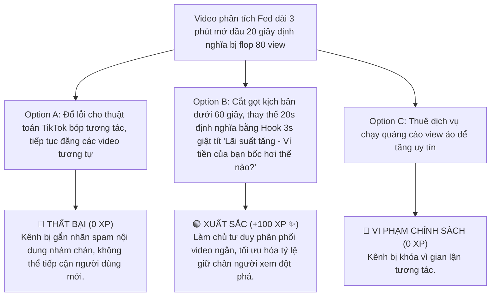

# MODULE 12: CONTENT LAB - VIẾT SCRIPT & SẢN XUẤT VIDEO NGẮN
## Cẩm Nang Sáng Tạo Video Ngắn Thu Hút Triệu View Dành Cho Cố Vấn Tài Chính Thế Hệ Mới
### MÃ SỐ TÀI LIỆU: DT-12
**Chương trình:** KBSV NextGen 2026 · FinPeace × KB Securities Vietnam · Sở Giao Dịch 3 (HO3)

---

## 📌 HƯỚNG DẪN DÀNH CHO BROKER / HỌC VIÊN
- **Thời lượng học:** Ngày 14 (D14) của tuần 2.
- **Mục tiêu học tập:** 
  1. Nắm vững công thức viết kịch bản video ngắn Hook - Body - CTA để giữ chân người xem trong 3 giây đầu tiên.
  2. Áp dụng triết lý thiết kế "Finance Manga & Modern Infographic" để trực quan hóa số liệu tài chính khô khan.
  3. Làm chủ kỹ thuật quay dựng video ngắn chuẩn kích thước 9:16 trên điện thoại và tối ưu safe-zone trên TikTok/Reels/Shorts.

---

## 📌 I. TỔNG QUAN KIẾN THỨC CỐT LÕI (THEORETICAL FOUNDATION)

### 1. Công Thức Viết Kịch Bản Video Ngắn Vàng (Hook - Body - CTA)
Thuật toán của các nền tảng video ngắn (TikTok, Facebook Reels, YouTube Shorts) đánh giá cực kỳ cao chỉ số **Retention Rate (Tỷ lệ giữ chân người xem)** và **Watch Time (Thời gian xem)**. 

Để giữ chân khán giả lướt qua màn hình, kịch bản của bạn bắt buộc phải tuân theo cấu trúc 3 phần chặt chẽ:

```
  ┌────────────────────────────────────────────────────────┐
  │                 CẤU TRÚC KỊCH BẢN VIDEO NGẮN            │
  ├────────────────────────────────────────────────────────┤
  │ 3 GIÂY ĐẦU: HOOK (Mồi câu giật tít)                    │
  │ - Nêu trực tiếp nỗi đau, câu hỏi gây tò mò, phá vỡ lối │
  │   suy nghĩ thông thường.                               │
  ├────────────────────────────────────────────────────────┤
  │ 45 GIÂY TIẾP: BODY (Giá trị cốt lõi)                   │
  │ - Cung cấp đúng 1 giải pháp bọc thép, trực quan bằng số│
  │   liệu, lược bỏ thuật ngữ rườm rà.                     │
  ├────────────────────────────────────────────────────────┤
  │ 12 GIÂY CUỐI: CTA (Kêu gọi hành động)                  │
  │ - Chỉ hướng rõ ràng: Click link bio mở tài khoản eKYC,  │
  │   nhận tài liệu Excel quản lý tài sản miễn phí.        │
  └────────────────────────────────────────────────────────┘
```

---

### 2. Triết Lý Thiết Kế Trực Quan: "Finance Manga & Modern Infographic"
Tài chính thường gắn liền với sự khô khan, đáng sợ của những bảng biểu phức tạp. Để tiếp cận Gen Z và khán giả đại chúng, FinPeace định hướng chuyển tải kiến thức dưới triết lý **"Finance Manga & Modern Infographic"**:
*   *Hình ảnh minh họa phẳng (Flat illustration):* Thay vì dùng hình ảnh sàn chứng khoán xám xịt, hãy sử dụng các nhân vật manga sinh động, màu sắc tươi sáng, trẻ trung.
*   *Đồ họa thông tin động (Animated Infographic):* Sử dụng các chuyển động số liệu chạy (number counter), biểu đồ thanh cuộn trượt tự động tăng trưởng để tăng tính kích thích thị giác.
*   *Nhịp dựng nhanh (Pacing):* Chuyển cảnh cứ mỗi 2.5 - 3 giây để người xem không bị nhàm chán mắt.

---

### 3. Nguyên Tắc An Toàn Màn Hình Dọc (UX Safe Zones)
Khi sản xuất video dọc (tỷ lệ 9:16, 1080x1920 pixels), bạn bắt buộc phải tuân thủ thiết kế Safe Zones để tránh việc text bị che bởi giao diện của ứng dụng (nút like, comment, mô tả video):

```
  +-----------------------+ -> 0% Top (Khu vực thông báo)
  |                       |
  |    Khu vực An Toàn    | -> Trình bày tiêu đề chính (giá trị cốt lõi)
  |   (Safe Central Area) |
  |                       |
  | - - - - - - - - - - - | -> 60% (Vùng bắt đầu hiển thị Subtitles)
  |                       |
  |     PHỤ ĐỀ (SUBS)     | -> Giữ text nằm trong khoảng 60% - 85% chiều dọc
  |                       |
  | - - - - - - - - - - - | -> 85% (Bắt đầu thanh mô tả & thanh nhạc của ứng dụng)
  |                       |
  +-----------------------+ -> 100% Bottom (Bị che khuất nhiều nhất)
```

*   **Vị trí hiển thị text/phụ đề tối ưu:** Nằm ở khoảng **60% - 85%** chiều dọc màn hình. Tuyệt đối không đặt text sát viền trên, viền dưới hoặc viền bên phải.
*   **Font chữ khuyến nghị:** Sử dụng font chữ dễ đọc trên di động, hiển thị tiếng Việt không bị lỗi dấu (ví dụ: *Be Vietnam Pro* hoặc *Inter*).

---

## 📊 II. BÀI TẬP THỰC HÀNH VIẾT SCRIPT (PRACTICAL EXERCISES)

### 📝 Bài Tập 1: Viết Script Video Ngắn 60 Giây Giới Thiệu Deal Tích Sản HPG
**Yêu cầu:** Viết một kịch bản hoàn chỉnh (chia cột mô tả hình ảnh & lời thoại) dựa trên sản phẩm "Tích sản tặng tiền" của KBSV NextGen, đối tượng mục tiêu là người đi làm bận rộn.

#### 💡 Lời Giải Mẫu:

| Thời lượng | Hình ảnh hiển thị (Visual) | Lời thoại (Voice-over) |
| :--- | :--- | :--- |
| **00:00 - 00:03** (3s Hook) | Cảnh quay cận cảnh khuôn mặt Broker ngơ ngác, cầm ví tiền trống không. Trên màn hình hiện text to, bold: **"TẠI SAO ĐI LÀM 5 NĂM VẪN KHÔNG DƯ NỔI 10 TRIỆU?"** | *"Tại sao đi làm 5 năm, lương 15 triệu mà trong ví vẫn không dư nổi 10 triệu đồng?"* |
| **00:03 - 00:20** (Body Part 1) | Biểu đồ chuyển động infographic trực quan hóa dòng tiền rò rỉ: Cà phê, mua sắm shopee, trà sữa... Số liệu sụt giảm về 0. | *"Lý do không phải vì bạn lười làm việc, mà do dòng tiền thặng dư của bạn đang bị rò rỉ vô hình qua các khoản chi tiêu nhỏ nhặt hàng ngày mà không được bảo vệ."* |
| **00:20 - 00:45** (Body Part 2) | Broker tươi cười chỉ tay vào điện thoại hiển thị App KB-Valuable. Màn hình mô phỏng chuyển tiền tự động mua tích sản HPG giá rẻ. | *"Giải pháp bọc thép ví tiền cực kỳ đơn giản: Thiết lập lệnh tích sản tự động hàng tháng tại KBSV NextGen. Chỉ từ 1 triệu đồng trích thẳng từ lương ngày nhận thu nhập mua tích sản các cổ phiếu dẫn đầu như HPG. Tiền của bạn sẽ tự sinh lời thảnh thơi."* |
| **00:45 - 00:55** (Body Part 3) | Text hiệu ứng vàng neon hiện lên: **TẶNG TIỀN NÓNG KHI HOÀN THÀNH 5 KỲ LIÊN TIẾP!** | *"Đặc biệt, KBSV NextGen đang tặng ngay phần thưởng tiền mặt hấp dẫn khi bạn hoàn thành liên tiếp 5 kỳ tích sản."* |
| **00:55 - 01:00** (CTA) | Broker chỉ tay xuống dưới góc màn hình, hiện mũi tên động hướng về Link Bio. | *"Click ngay vào đường link dưới bio để nhận file Excel quản lý dòng tiền tự động miễn phí và mở tài khoản eKYC tích sản cùng mình nhé!"* |

---

## 🎯 III. TÌNH HUỐNG RA QUYẾT ĐỊNH TƯƠNG TÁC (INTERACTIVE SCENARIO)

### 🛑 Tình Huống: Làm Video Ngắn Quá Dài Và Lan Man Toàn Lý Thuyết Khô Khan
*   **Bối cảnh (Context):** Bạn làm một video ngắn phân tích vĩ mô của Fed nâng lãi suất dài 3 phút, mở đầu bằng việc đọc định nghĩa Fed là gì trong 20 giây đầu. Sau khi đăng lên TikTok 3 ngày, video chỉ đạt lẹt đẹt 80 view và tỷ lệ giữ chân người xem trung bình là 2 giây.



---

## 🧪 IV. BÀI KIỂM TRA ĐÁNH GIÁ (SELF-CHECK KNOWLEDGE QUIZ)

**Câu 1: Khu vực nào trên màn hình dọc (9:16) bắt buộc phải tránh khi đặt text/phụ đề tiêu đề chính để không bị che bởi giao diện TikTok/Reels?**
*   A. Khu vực trung tâm màn hình.
*   B. Khu vực sát mép dưới (dưới 85% chiều dọc) và mép trên cùng. **(Đáp án Đúng)**
*   C. Vùng 60-80% màn hình.
*   D. Không cần tránh vùng nào.

**Câu 2: Công thức 3 phần của kịch bản video ngắn giữ chân khán giả có tên gọi là gì?**
*   A. InvestWise - VTA - RTT
*   B. Hook - Body - CTA **(Đáp án Đúng)**
*   C. D - I - S - C
*   D. Cầu nối - Thác nước - Lâu đài

**Câu 3: Mục tiêu quan trọng nhất của 3 giây đầu tiên (Hook) trong video ngắn là gì?**
*   A. Giới thiệu đầy đủ họ tên, chức danh và công ty của Broker.
*   B. Đọc hết định nghĩa chứng khoán.
*   C. Thu hút sự chú ý, giật tít đánh trúng nỗi đau hoặc gây tò mò để người xem dừng tay không lướt qua video. **(Đáp án Đúng)**
*   D. Kêu gọi khách hàng nộp 1 tỷ đồng.

---

## 💬 V. KỊCH BẢN ROLEPLAY THỰC CHIẾN (AI ROLEPLAY DIALOGUE SCRIPT)

*   **Nhân vật:**
    *   **Trainer Content Lab (Anh Quang):** Nghiêm khắc, sắc sảo về tư duy phân phối video ngắn.
    *   **Học viên (Broker NextGen):** Cởi mở tiếp thu, sửa kịch bản nhanh nhạy.

```dialogue
Trainer (Anh Quang): "Nam ơi, anh vừa xem bản nháp kịch bản video giới thiệu deal margin mới của em. Mở đầu video em nói: 'Chào các bạn, tôi là Nam đến từ công ty chứng khoán KB Securities Việt Nam, hôm nay tôi xin giới thiệu gói ưu đãi...'. Đoạn mở đầu này dài tới 8 giây rồi em! Trực giác của người dùng lướt qua video chỉ mất 1.5 giây để quyết định ở lại hay đi. Đoạn này 99% khán giả sẽ lướt qua ngay."

Học viên (NextGen Broker): "Dạ anh Quang, em hiểu rồi ạ. Tại em quen thói giới thiệu bản thân trước cho lịch sự. Vậy em nên sửa đoạn 3 giây đầu (Hook) này thế nào để giữ chân mọi người lại ạ?"

Trainer (Anh Quang): "Em phải đánh thẳng vào ví tiền và lợi ích sát sườn của họ bằng số liệu bọc thép ngay giây đầu tiên. Thay vì giới thiệu tên tuổi công ty, em hãy cầm trực tiếp một tập tiền polymer hoặc mở tài khoản app lên và nói một câu giật tít đánh trúng nỗi đau."

Học viên (NextGen Broker): "Dạ, em hiểu rồi! Em xin sửa lại kịch bản 3 giây đầu như thế này anh xem được chưa nhé:
(Visual: Cầm một cốc cà phê Highlands chỉ tay vào đó) 
(Lời thoại): 'Đừng vay Margin với lãi suất cắt cổ 14% nữa! Nếu bạn giao dịch năng động, gói ưu đãi Margin lãi suất chỉ 7.5% này của KBSV sẽ giúp bạn giữ lại nguyên 1 chuyến du lịch Đà Lạt mỗi tháng từ tiền phí tiết kiệm được!'

Đoạn này đã đủ mồi câu chưa anh Quang?"

Trainer (Anh Quang): "Xuất sắc! Mồi câu này đánh thẳng vào nỗi đau mất phí cao, đưa ra con số cụ thể 7.5% so với 14% và so sánh trực quan bằng '1 chuyến du lịch Đà Lạt'. Tiếp tục triển khai phần Body và CTA đúng theo mạch này là video sẵn sàng lên xu hướng rồi đấy!"
```

---
**Mã số tài liệu:** `DT-12` · KBSV NextGen 2026 · FinPeace × KB Securities Vietnam
