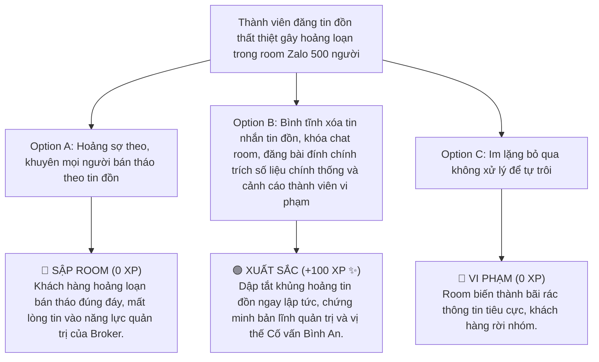

# MODULE 14: XÂY DỰNG CỘNG ĐỒNG & TỐI ƯU PHỄU CHUYỂN ĐỔI
## Cẩm Nang Quản Trị Cộng Đồng Tài Chính, Nuôi Dưỡng Lead & Chuyển Đổi eKYC Tự Nhiên
### MÃ SỐ TÀI LIỆU: DT-14
**Chương trình:** KBSV NextGen 2026 · FinPeace × KB Securities Vietnam · Sở Giao Dịch 3 (HO3)

---

## 📌 HƯỚNG DẪN DÀNH CHO BROKER / HỌC VIÊN
- **Thời lượng học:** Ngày 17 (D17) & Ngày 18 (D18) của tuần 3.
- **Mục tiêu học tập:** 
  1. Thấu hiểu tầm quan trọng của kênh cộng đồng (Zalo, Telegram, Facebook) trong việc duy trì điểm chạm liên tục với khách hàng.
  2. Áp dụng kỷ luật chia sẻ nội dung hàng ngày (Daily Routine) để nuôi dưỡng lòng tin của Lead.
  3. Thành thạo quy trình thiết lập phễu chuyển đổi từ thành viên tự do thành khách hàng mở tài khoản eKYC giao dịch thực tế.
  4. Nắm vững phương pháp quản trị khủng hoảng, dập tắt tin đồn tiêu cực hoặc xung đột trong room cộng đồng.

---

## 📌 I. TỔNG QUAN KIẾN THỨC CỐT LÕI (THEORETICAL FOUNDATION)

### 1. Cộng Đồng - "Căn Cứ Địa" Của Broker 4.0
Nếu mạng xã hội rộng lớn (TikTok, Facebook cá nhân) là nơi bạn đi đánh bắt cá (phát video câu Lead), thì **Room Cộng đồng (Zalo/Telegram Group)** chính là chiếc ao do bạn sở hữu để thả cá và nuôi dưỡng lâu dài. 

Một room cộng đồng hoạt động năng động giúp Broker:
*   **Duy trì tần suất xuất hiện (Top of Mind):** Khách hàng liên tục nhìn thấy bài nhận định sáng, nhận định chiều và thảo luận của bạn mỗi ngày.
*   **Tận dụng hiệu ứng đám đông (Social Proof):** Khi một thành viên trong nhóm khoe eKYC thành công hoặc chốt lời Deal hiệu quả, các thành viên thụ động khác sẽ bị kích thích và chủ động hành động theo.
*   **Giải đáp thắc mắc quy mô lớn:** Cùng một câu hỏi về thủ tục nộp tiền hay lỗi đăng nhập App, bạn giải thích một lần trong nhóm là hỗ trợ được cho 500 thành viên.

---

### 2. Kỷ Luật Chia Sẻ Nội Dung Chăm Sóc Hàng Ngày (The Daily Nurturing Routine)
Để tránh room cộng đồng bị "chết lâm sàng" hoặc biến thành bãi rác quảng cáo, Broker phải thực thi nghiêm ngặt lịch trình nội dung hàng ngày:

```
  ┌────────────────────────────────────────────────────────┐
  │                 LỊCH TRÌNH CHĂM SÓC CỘNG ĐỒNG          │
  ├────────────────────────────────────────────────────────┤
  │ 08:00 - 08:30: NHẬN ĐỊNH SÁNG (Morning Briefing)       │
  │ - Tóm tắt vĩ mô, diễn biến DJ đêm qua, khuyến nghị     │
  │   hành động ngắn gọn, dễ hiểu.                         │
  ├────────────────────────────────────────────────────────┤
  │ 11:30 - 12:00: CONTENT LAB (Cập nhật giữa phiên)       │
  │ - Điểm nhấn kỹ thuật các mã đang vào trend, giải đáp   │
  │   nhanh thắc mắc của nhà đầu tư.                       │
  ├────────────────────────────────────────────────────────┤
  │ 15:30 - 16:30: NHẬN ĐỊNH CHIỀU & BÀI HỌC CUỐI NGÀY      │
  │ - Bóc tách nguyên nhân thị trường tăng/giảm, chia sẻ 1 │
  │   tư duy đầu tư hoặc cẩm nang bọc thép.                │
  └────────────────────────────────────────────────────────┘
```

---

### 3. Thiết Lập Phễu Chuyển Đổi Hướng Tới eKYC & Active Tài Khoản
Mọi hoạt động chia sẻ giá trị trong cộng đồng cuối cùng phải hướng tới mục tiêu gia tăng số lượng tài khoản (MTK) eKYC và kích hoạt hoạt động giao dịch thực tế (Active). 

#### Quy trình chuyển đổi 3 bước (eKYC Funnel):
1.  **Trao tặng công cụ giới hạn (Lead Magnet):** Định kỳ mỗi tuần, Broker thông báo tặng một tài liệu đặc biệt (ví dụ: *Bảng định giá dòng tiền forward 20 doanh nghiệp* hoặc *File lọc cổ phiếu Breakout*).
2.  **Ràng buộc điều kiện (Gatekeeper):** Thành viên đăng ký nhận tài liệu bằng cách quét mã QR mở tài khoản eKYC miễn phí tại KBSV (được Broker hỗ trợ cài ID quản lý).
3.  **Kích hoạt giao dịch (Active Reward):** Khi khách hàng đã eKYC, Broker đưa họ vào Room Hướng dẫn thực chiến, hỗ trợ nộp thử 1 triệu đồng tích sản để được nhận gói tiền thưởng nóng 50k - 200k và miễn phí giao dịch 3 tháng.

---

## 📊 II. BÀI TẬP THỰC HÀNH VIẾT NỘI DUNG (PRACTICAL EXERCISES)

### 📝 Bài Tập 1: Viết Bài Nhận Định Sáng (Morning Briefing) Cho Room Zalo Cộng Đồng
**Bối cảnh:** Phiên giao dịch hôm nay, thị trường thế giới Dow Jones đêm qua sụt giảm mạnh 1.5% do lo ngại chỉ số lạm phát Mỹ CPI tăng. Tuy nhiên, chỉ số VN30 trong nước vẫn đang giữ vững hỗ trợ MA20. Hãy viết bài nhận định sáng gửi vào Zalo lúc 08:15 sáng cho các nhà đầu tư trong nhóm.

#### 💡 Lời Giải Mẫu:
> *"Chào buổi sáng cả nhà mình! Chúc anh chị một ngày mới giao dịch bình an và hiệu quả.
> 
> **Điểm tin vĩ mô đầu ngày (24/08/2026):**
> 1. Thị trường thế giới: Chỉ số Dow Jones đêm qua sụt giảm 1.5% trước áp lực lạm phát CPI của Mỹ có dấu hiệu nhích nhẹ. Đây là phản ứng điều chỉnh tâm lý ngắn hạn bình thường.
> 2. Thị trường trong nước: Chỉ số VN30-Index của chúng ta phiên hôm qua thể hiện sức đề kháng rất tốt, rút chân giữ vững mốc hỗ trợ cứng MA20 tại 1.250 điểm với Vol thấp, chứng tỏ không có áp lực bán tháo.
>
> **Khuyến nghị hành động bọc thép:**
> - **Đối với nhà đầu tư tích sản (Vùng 2):** Tiếp tục duy trì kế hoạch gom mua đều đặn. Nhịp điều chỉnh nhẹ của thị trường (nếu có) vào phiên sáng theo đà Dow Jones chính là cơ hội tốt để nhặt HPG, FPT ở giá chiết khấu.
> - **Đối với nhà giao dịch ngắn hạn (Vùng 3):** Tạm dừng giải ngân mua đuổi các mã bất động sản đã tăng nóng. Tập trung quan sát hỗ trợ 1.250 của VN30.
> - **Nguyên tắc cốt lõi:** Luôn kiểm soát tỷ lệ RTT trên 45% an toàn, không say đòn bẩy ngắn hạn.
>
> Chúc cả nhà mình một phiên giao dịch thảnh thơi! Cần check chart mã nào anh chị cứ nhắn dưới thread này nhé!"*

---

## 🎯 III. TÌNH HUỐNG RA QUYẾT ĐỊNH TƯƠNG TÁC (INTERACTIVE SCENARIO)

### 🛑 Tình Huống: Room Zalo Xuất Hiện Tin Đồn Thất Thiệt Làm Nhà Đầu Tư Hoảng Loạn
*   **Bối cảnh (Context):** Lúc 10:30 sáng, một thành viên ẩn danh trong room Zalo 500 người của bạn đột ngột đăng một liên kết bài báo lá cải kèm dòng tin nhắn giật gân: *"Tin khẩn: Chủ tịch tập đoàn lớn X vừa bị bắt vì thao túng giá cổ phiếu! Thị trường sắp sập mạnh về 1000 điểm rồi, anh em bán sạch cổ phiếu chạy ngay kẻo cháy tài khoản!"*. Các thành viên khác bắt đầu hoang mang hỏi dồn dập, tạo không khí hỗn loạn trong room.



---

## 🧪 IV. BÀI KIỂM TRA ĐÁNH GIÁ (SELF-CHECK KNOWLEDGE QUIZ)

**Câu 1: Chiến lược "Lead Magnet" hiệu quả nhất để thu hút thành viên cộng đồng quét mã QR mở tài khoản eKYC là gì?**
*   A. Ép buộc mọi người nộp phí tham gia nhóm hàng tháng.
*   B. Tặng miễn phí các công cụ, tài liệu có giá trị cao (như File Excel quản lý tài sản, Báo cáo định giá) với điều kiện đăng ký mở tài khoản trải nghiệm. **(Đáp án Đúng)**
*   C. Chia sẻ hình ảnh cuộc sống cá nhân xa hoa.
*   D. Hứa hẹn lợi nhuận cam kết x5 tài khoản.

**Câu 2: Khi room cộng đồng xuất hiện thông tin tiêu cực hoặc tin đồn thất thiệt chưa kiểm chứng, hành động đầu tiên của Broker quản trị room nên làm gì?**
*   A. Gửi thêm nhiều tin đồn tương tự để tăng tương tác.
*   B. Bình tĩnh xóa thông tin sai lệch, khóa chức năng chat của nhóm tạm thời để ổn định tâm lý, và đăng bài phân tích đính chính dựa trên số liệu chính thống. **(Đáp án Đúng)**
*   C. Bỏ mặc room tự tranh cãi.
*   D. Bán sạch cổ phiếu của mình trước.

**Câu 3: Mục tiêu cốt lõi của hoạt động chia sẻ "Nhận định sáng (Morning Briefing)" hàng ngày trong room Zalo là gì?**
*   A. Để khoe kiến thức vĩ mô cao siêu.
*   B. Định hình định hướng hành động rõ ràng, trấn an tâm lý và cung cấp thông tin chất lượng đầu ngày giúp nhà đầu tư giao dịch bình an, thảnh thơi. **(Đáp án Đúng)**
*   C. Để chửi bới thị trường.
*   D. Để ép khách đặt lệnh margin ngay đầu phiên.

---

## 💬 V. KỊCH BẢN ROLEPLAY THỰC CHIẾN (AI ROLEPLAY DIALOGUE SCRIPT)

*   **Nhân vật:**
    *   **Học viên (Broker NextGen):** Điềm tĩnh, kiểm soát cảm xúc tốt, dẫn dắt câu chuyện bằng số liệu thực tế.
    *   **Khán giả AI (Anh Hùng):** Thành viên trong room Zalo đang hoang mang vì cổ phiếu điều chỉnh giảm 3%.

```dialogue
Khán giả AI (Anh Hùng): "Nam ơi, thị trường phiên chiều sụt giảm mạnh quá, danh mục HPG của anh đỏ lòm rồi. Anh thấy trong mấy nhóm khác người ta bảo thị trường phân phối đỉnh, sắp sập về 900 điểm. Em xem có nên cắt lỗ hết nghỉ chơi không em? Hoang mang quá!"

Học viên (NextGen Broker): "Anh Hùng ơi, em rất hiểu cảm giác lo lắng của anh khi nhìn thấy bảng điện bao phủ sắc đỏ và đọc được những thông tin tiêu cực từ các hội nhóm bên ngoài. Việc hoang mang là phản ứng rất bình thường của nhà đầu tư khi đối diện với biến động ngắn hạn. 

Tuy nhiên, với tư cách là người đồng hành quản lý tài sản cho anh, em xin phép mời anh lùi lại một bước để cùng nhìn vào **số liệu bọc thép thực tế** thay vì cảm xúc đám đông:

1. Phiên giảm điểm hôm nay có khối lượng giao dịch (Volume) cực kỳ thấp, chỉ đạt 60% trung bình 20 phiên. Điều này chứng tỏ dòng tiền lớn của tổ chức không hề bán tháo tháo chạy, mà chỉ là nhịp điều chỉnh kỹ thuật của nhà đầu tư nhỏ lẻ hoảng sợ.
2. Về mặt kỹ thuật, HPG vẫn đang giữ vững trên vùng hỗ trợ cứng 26.5. Cấu trúc sóng tăng trung hạn hoàn toàn chưa bị phá vỡ.
3. Tài khoản của anh Hùng hiện tại không sử dụng Margin, tỷ lệ RTT đạt 100% an toàn tuyệt đối. Chúng ta đang đầu tư bằng tiền thặng dư nhàn rỗi."

Khán giả AI (Anh Hùng): "Hóa ra Vol thấp nghĩa là dòng tiền lớn chưa thoát hàng hả em? Thế mà bên các room khác họ hô hào kinh quá làm anh suýt đặt lệnh bán tháo."

Học viên (NextGen Broker): "Dạ đúng rồi anh Hùng! Tiếng ồn trên thị trường thì rất nhiều, nhưng số liệu thực tế thì không biết nói dối. Việc bán tháo hoảng sợ theo đám đông chính là nguyên nhân lớn nhất khiến 90% nhà đầu tư thua lỗ. 

Kế hoạch của chúng ta là kiên định giữ vững vị thế. Nhịp chỉnh này chính là cơ hội để phiên mai em hướng dẫn anh gom thêm kỳ tích sản tiếp theo với giá chiết khấu tốt hơn 3% đấy ạ. Anh cứ thảnh thơi tắt bảng điện và yên tâm làm việc chiều nay nhé!"

Khán giả AI (Anh Hùng): "Nghe em phân tích số liệu rõ ràng trong nhóm anh thấy nhẹ lòng hẳn. Cảm ơn em cố vấn rất bản lĩnh và có tâm nhé!"
```

---
**Mã số tài liệu:** `DT-14` · KBSV NextGen 2026 · FinPeace × KB Securities Vietnam
