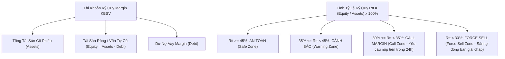
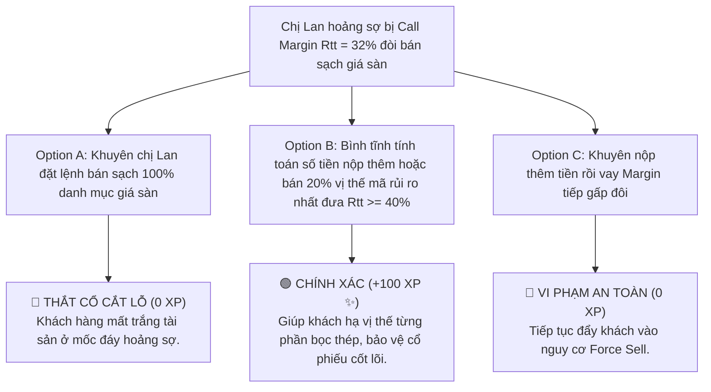

# MODULE 11: QUẢN TRỊ ĐÒN BẨY MARGIN & PHÒNG TRÁNH CALL MARGIN RTT
## Cẩm Nang Thực Chiến Quản Trị Rủi Ro Ký Quỹ & Xử Lý Khủng Hoảng Cho Broker

---

## 📌 I. TỔNG QUAN KIẾN THỨC CỐT LÕI (THEORETICAL FOUNDATION)

### 1. Bản Chất Của Giao Dịch Ký Quỹ Margin (Margin Trading)
Giao dịch ký quỹ (Margin Trading) là việc nhà đầu tư sử dụng một phần tài sản tiền mặt/cổ phiếu làm tài sản thế chấp để **vay thêm vốn từ Công ty Chứng khoán (KBSV)** nhằm gia tăng sức mua cổ phiếu. Đòn bẩy Margin là một con dao 2 lưỡi:
* Khi thị trường tăng xu hướng: Lợi nhuận của nhà đầu tư được khuếch đại gấp 2 đến 3 lần.
* Khi thị trường giảm điểm: Tổn thất tài sản ròng bị khuếch đại tương ứng, và tài khoản có nguy cơ rơi vào trạng thái **Call Margin (Yêu cầu bổ sung ký quỹ)** hoặc **Force Sell (Giải chấp cưỡng bức)**.



---

### 2. Chi Tiết Công Thức & Ngưỡng Quản Trị Tỷ Lệ Ký Quỹ Rtt

#### 📐 Công Thức Tính Tỷ Lệ Ký Quỹ Thực Tế Rtt (Maintenance Ratio)
$$Rtt = \frac{\text{Tài Sản Ròng}}{\text{Tổng Giá Trị Tài Sản}} \times 100\% = \frac{\text{Tổng Tài Sản Cổ Phiếu} - \text{Dư Nợ Vay Margin}}{\text{Tổng Giá Trị Tài Sản Cổ Phiếu}} \times 100\%$$

#### 🚨 4 Phân Vùng Quản Trị Rtt Tại KBSV:

1. **Phân Vùng An Toàn ($Rtt \ge 45\%$):**
   * Tài khoản có sức mua dồi dào, chịu đựng được biến động giảm điểm 15-20% của thị trường mà không bị đe dọa Call Margin.
2. **Phân Vùng Cảnh Báo ($35\% \le Rtt < 45\%$):**
   * Hệ thống tự động gửi thông báo SMS/App warning. Chuyên viên Môi giới khuyến nghị khách hàng tạm dừng gia tăng đòn bẩy.
3. **Phân Vùng Call Margin ($30\% \le Rtt < 35\%$):**
   * **Trạng thái vi phạm Call Margin.** Khách hàng có 24 giờ (trước 14:30 ngày làm việc tiếp theo) để nộp thêm tiền mặt hoặc chủ động bán một phần cổ phiếu rủi ro để đưa $Rtt \ge 40\%$.
4. **Phân Vùng Force Sell ($Rtt < 30\%$):**
   * **Trạng thái giải chấp cưỡng bức.** Hệ thống Quản trị Rủi ro KBSV tự động đặt lệnh bán giải chấp ở giá ATO/Sàn để đưa $Rtt$ về ngưỡng an toàn tối thiểu.

---

## 📊 II. BÀI TẬP THỰC HÀNH TÍNH TOÁN BÓC TÁCH (PRACTICAL EXERCISES)

### 📝 Bài Tập 1: Tính Toán Ngưỡng Call Margin & Số Tiền Cần Nộp Thêm
**Số liệu Tài khoản Khách hàng Nam (tại sàn KBSV):**
* Khách hàng Nam mua $10.000$ cổ phiếu HPG ở mốc giá $30.000\text{ VNĐ/cổ phiếu}$.
* Tổng giá trị tài sản cổ phiếu ban đầu: $300.000.000\text{ VNĐ}$.
* Vốn tự có tiền mặt: $150.000.000\text{ VNĐ}$. Dư nợ vay Margin KBSV: $150.000.000\text{ VNĐ}$ (Tỷ lệ đòn bẩy 50:50).
* Phiên hôm nay, giá HPG giảm mạnh xuống $22.000\text{ VNĐ/cổ phiếu}$.

**Yêu cầu:** 
1. Tính Tỷ lệ ký quỹ $Rtt$ hiện tại của Nam.
2. Kiểm tra xem tài khoản có bị Call Margin không?
3. Nếu muốn đưa $Rtt$ về mốc an toàn $40\%$, Nam cần nộp thêm bao nhiêu tiền mặt?

#### 💡 Lời Giải Chi Tiết:

1. **Bước 1: Tính Tổng Giá Trị Tài Sản Cổ Phiếu Hiện Tại**
   $$\text{Assets}_{\text{mới}} = 10.000 \times 22.000 = 220.000.000\text{ VNĐ}$$

2. **Bước 2: Tính Tài Sản Ròng Hiện Tại**
   $$\text{Equity}_{\text{mới}} = \text{Assets}_{\text{mới}} - \text{Debt} = 220.000.000 - 150.000.000 = 70.000.000\text{ VNĐ}$$

3. **Bước 3: Tính Tỷ Lệ Ký Quỹ $Rtt$**
   $$Rtt = \frac{70.000.000}{220.000.000} \times 100\% = 31.8\%$$

4. **Bước 4: Đánh Giá Trạng Thái & Tính Tiền Nộp Thêm**
   * Tỷ lệ $Rtt = 31.8\% < 35\% \rightarrow$ **Tài khoản bị CALL MARGIN!**
   * Mục tiêu đưa $Rtt \ge 40\%$ ($0.4$). Gọi $X$ là số tiền mặt nộp thêm:
     $$\frac{\text{Equity} + X}{\text{Assets} + X} = 0.4 \implies \frac{70.000.000 + X}{220.000.000 + X} = 0.4$$
     $$70.000.000 + X = 88.000.000 + 0.4X \implies 0.6X = 18.000.000 \implies X = 30.000.000\text{ VNĐ}$$

**📌 Kết Luận:** Khách hàng Nam bị Call Margin và cần **nộp thêm $30.000.000\text{ VNĐ}$ tiền mặt** hoặc **bán bớt $2.500$ cổ phiếu HPG** để đưa tài khoản về $Rtt = 40\%$ an toàn!

---

## 🎯 III. TÌNH HUỐNG RA QUYẾT ĐỊNH TƯƠNG TÁC (INTERACTIVE SCENARIO)

### 🛑 Tình Huống: Khách Hàng Hoảng Sợ Gọi Điện Lúc 14:15 Phiên Chiều Bị Call Margin
* **Bối cảnh (Context):** Lúc 14:15 phiên chiều, tài khoản của chị Lan vi phạm Call Margin với $Rtt = 32\%$. Chị Lan khóc lóc hoảng sợ gọi điện cho bạn: *"Em ơi, bên quản trị rủi ro nhắn tin bảo tài khoản chị sắp bị bán giải chấp! Giờ chị phải làm sao? Có nên bán hết sạch danh mục ở giá sàn không em?"*



---

## 🧪 IV. BÀI KIỂM TRA ĐÁNH GIÁ (SELF-CHECK KNOWLEDGE QUIZ)

**Câu 1: Ngưỡng Tỷ lệ ký quỹ $Rtt$ tự động vi phạm Call Margin tại KBSV là bao nhiêu?**
* A. $Rtt < 50\%$
* B. $Rtt < 45\%$
* C. $Rtt < 35\%$ **(Đáp án Đúng)**
* D. $Rtt < 20\%$

**Câu 2: Công thức tính Tỷ lệ ký quỹ $Rtt$ là gì?**
* A. $Rtt = \frac{\text{Dư nợ}}{\text{Tài sản}} \times 100\%$
* B. $Rtt = \frac{\text{Tài sản ròng}}{\text{Tổng tài sản cổ phiếu}} \times 100\%$ **(Đáp án Đúng)**
* C. $Rtt = \frac{\text{Lợi nhuận}}{\text{Vốn vay}} \times 100\%$
* D. $Rtt = \text{Tài sản} \times 2$

---

## 💬 V. KỊCH BẢN ROLEPLAY THỰC CHUYÊN (AI ROLEPLAY DIALOGUE SCRIPT)

```dialogue
Khách hàng AI (Chị Lan): "Em ơi, hệ thống KBSV báo tài khoản chị bị Call Margin Rtt = 32% rồi! Chị hoảng quá, có nên đặt lệnh bán sạch hết cổ phiếu giá sàn bây giờ không em?"

Học viên (Broker NextGen): "Chị Lan ơi, em hiểu chị đang rất hoảng sợ, nhưng chị hãy hít thở sâu và tuyệt đối KHÔNG đặt lệnh bán tháo giá sàn lúc này! Bán tháo giá sàn hoảng sợ ở 15 phút cuối phiên chính là việc cắt lỗ đúng đáy bất lợi nhất.

Hệ thống cho chị thời hạn đến 14:30 chiều ngày mai mới xử lý. Em vừa tính toán số liệu bọc thép cho tài khoản của chị:
Tài khoản chị hiện có $Rtt = 32\%$. Để đưa $Rtt$ về mốc an toàn $40\%$, chị chỉ cần:
- Lựa chọn 1: Nộp thêm $20$ triệu VNĐ tiền mặt vào tài khoản chứng khoán.
- Lựa chọn 2: Nếu chưa có sẵn tiền mặt, chị chỉ cần bán hạ chủ động $15\%$ vị thế của mã cổ phiếu có kỹ thuật yếu nhất, hoàn toàn giữ lại mã FPT/HPG chiến lược.

Chị thấy phương án 1 hay 2 thuận tiện hơn cho chị lúc này?"

Khách hàng AI (Chị Lan): "Ôi nghe em phân tích rõ ràng và đưa giải pháp bọc thép chị yên tâm hẳn! Chị sẽ chọn phương án 1 nộp ngay 20 triệu tiền mặt vào tài khoản. Cảm ơn em nhiều lắm!"
```
