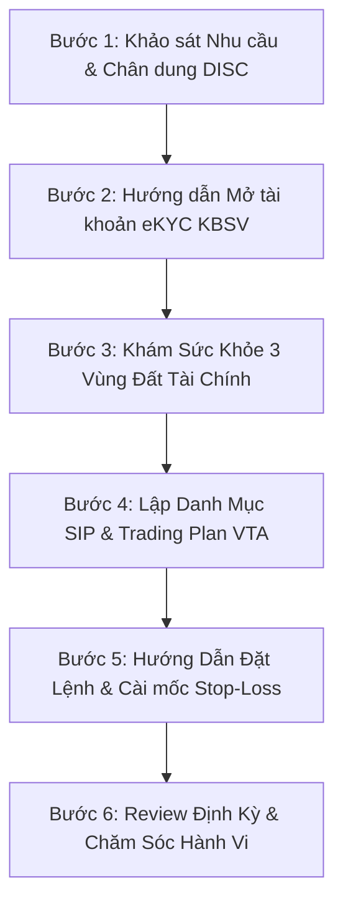
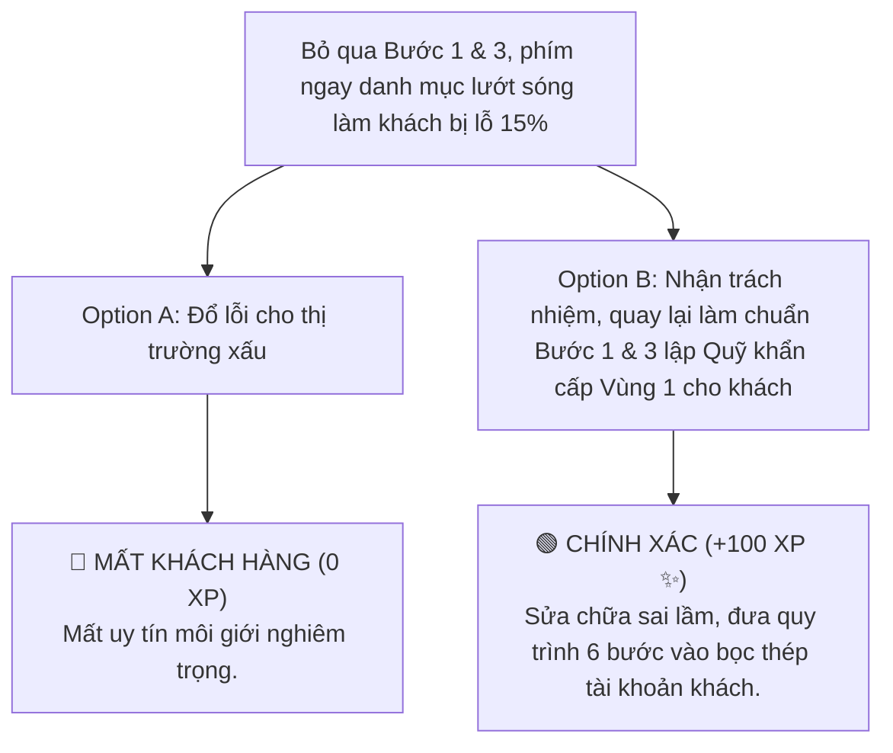

# MODULE 12: QUY TRÌNH 6 BƯỚC TƯ VẤN MÔI GIỚI CHUẨN FINPEACE
## Cẩm Nang Thực Chiến Xây Dựng Uy Tín & Chăm Sóc Khách Hàng Dài Hạn

---

## 📌 I. TỔNG QUAN KIẾN THỨC CỐT LÕI (THEORETICAL FOUNDATION)

### 1. Tại Sao Broker Thời Đại Mới Phải Tuân Thủ Quy Trình 6 Bước?
Trong mô hình tư vấn truyền thống, phần lớn môi giới chứng khoán tiếp cận khách hàng theo kiểu "phím hàng lướt sóng", gửi 3-4 mã cổ phiếu qua Zalo mà không hề tìm hiểu về thu nhập, Quỹ khẩn cấp hay khẩu vị rủi ro của khách hàng. Hậu quả là khi thị trường sập, khách hàng chịu lỗ nặng và rời bỏ môi giới.

Chương trình **KBSV NextGen 2026** thiết lập **Quy Trình 6 Bước Tư Vấn Môi Giới Chuẩn FinPeace** giúp Chuyên viên Tư vấn nâng tầm vị thế thành một **Financial Advisor (Cố Vấn Tài Chính)** chuyên nghiệp, tạo dựng niềm tin và sự đồng hành dài hạn với khách hàng.



---

### 2. Chi Tiết Nội Dung & Yêu Cầu 6 Bước Tư Vấn

#### 👤 Bước 1: Khảo Sát Nhu Cầu & Phân Loại Hồ Sơ DISC
* **Thực thi:** Đặt câu hỏi tìm hiểu mục tiêu đầu tư (mua nhà, hưu trí, gia tăng tài sản), thời gian đầu tư và phân loại nhóm tâm lý DISC (D - Quyết đoán, I - Cảm hứng, S - An toàn, C - Cẩn trọng con số).

#### 📱 Bước 2: Hướng Dẫn Mở Tài Khoản eKYC KBSV
* **Thực thi:** Hướng dẫn khách hàng thực hiện xác thực khuôn mặt eKYC trên App KB Securities Việt Nam (KB-Valuable), nộp tiền vào tài khoản và kích hoạt gói phí tư vấn cố vấn.

#### 🛡️ Bước 3: Khám Sức Khỏe 3 Vùng Đất Tài Chính
* **Thực thi:** Bóc tách thu nhập & chi phí, giúp khách hàng trích Quỹ khẩn cấp Vùng 1 Bảo Vệ (3-6 tháng chi phí) trước khi chuyển tiền vào đầu tư.

#### 📊 Bước 4: Lập Danh Mục Tích Sản SIP & Trading Plan VTA
* **Thực thi:** Chọn lọc 2-3 mã cổ phiếu VN30 thỏa mãn Bộ lọc 4 tiêu chí IW cho Vùng 2 Tích Lũy, đồng thời lập Trading Plan bọc thép cho Vùng 3 Bứt Tốc.

#### ⚡ Bước 5: Hướng Dẫn Đặt Lệnh & Cài Mốc Cắt Lỗ Tự Động
* **Thực thi:** Hướng dẫn khách thao tác đặt lệnh LO, ATO, ATC và cài đặt ngay **Lệnh điều kiện Stop-Loss** tự động bọc thép tài khoản.

#### 🗓️ Bước 6: Review Định Kỳ Hàng Quý & Chăm Sóc Hành Vi
* **Thực thi:** Cùng khách hàng review hiệu quả đầu tư sau mỗi quý (tháng 1, 4, 7, 10), theo dõi Chỉ số Tuân thủ Kế hoạch (Plan Adherence Score) và trấn an tâm lý khi thị trường điều chỉnh.

---

## 📊 II. BÀI TẬP THỰC HÀNH KỊCH BẢN (PRACTICAL EXERCISES)

### 📝 Bài Tập 1: Thực Hành 6 Bước Tư Vấn Với Khách Hàng Nhóm C
**Tình huống:** Khách hàng Chú Minh (55 tuổi, sắp nghỉ hưu), tìm đến bạn muốn đầu tư 300 triệu tiền tiết kiệm. Hãy viết kịch bản triển khai 6 bước tư vấn cho Chú Minh.

#### 💡 Lời Giải Kịch Bản Chi Tiết:
1. **Bước 1 (DISC):** Chú Minh thuộc nhóm Cẩn trọng (C) & An toàn (S). Cần cung cấp số liệu bọc thép, tuyệt đối không tư vấn mã lướt sóng mạo hiểm.
2. **Bước 2 (eKYC):** Hướng dẫn Chú Minh mở tài khoản KB-Valuable tại chỗ trong 3 phút.
3. **Bước 3 (3 Vùng Đất):** Khám sức khỏe: Trích 100 triệu gửi tiết kiệm làm Quỹ khẩn cấp Vùng 1. Còn 200 triệu đưa vào Vùng 2 Tích Lũy.
4. **Bước 4 (Danh mục SIP):** Lập danh mục Tích sản 200 triệu vào FPT và Quỹ ETF Diamond (VFMVN Diamond) với chiết khấu định giá tốt.
5. **Bước 5 (Đặt lệnh):** Hướng dẫn Chú Minh đặt lệnh mua và cài lịch mua định kỳ hàng tháng ngày 10.
6. **Bước 6 (Review):** Hẹn lịch Chú Minh review danh mục vào cuối tháng 10 sau BCTC Quý 3.

---

## 🎯 III. TÌNH HUỐNG RA QUYẾT ĐỊNH TƯƠNG TÁC (INTERACTIVE SCENARIO)

### 🛑 Tình Huống: Bỏ Qua Bước 3 Khám Sức Khỏe Đưa Ngay Danh Mục Lướt Sóng
* **Bối cảnh (Context):** Bạn gặp một khách hàng mới. Bạn bỏ qua Bước 1 và 3, phím ngay cho khách mua 100% tài sản vào cổ phiếu lướt sóng nóng. 2 tuần sau thị trường giảm điểm 15%, khách hàng hoảng sợ đòi kiện công ty!



---

## 🧪 IV. BÀI KIỂM TRA ĐÁNH GIÁ (SELF-CHECK KNOWLEDGE QUIZ)

**Câu 1: Bước 1 trong Quy trình 6 bước tư vấn môi giới FinPeace là gì?**
* A. Khảo sát Nhu cầu & Phân loại Hồ sơ DISC **(Đáp án Đúng)**
* B. Hướng dẫn nộp tiền ký quỹ Margin
* C. Phím ngay 3 mã cổ phiếu lướt sóng
* D. Chốt hợp đồng tư vấn

**Câu 2: Bước 3 trong quy trình yêu cầu làm gì trước khi đầu tư?**
* A. Vay Margin 50:50
* B. Trích Quỹ Khẩn Cấp Vùng 1 Bảo Vệ **(Đáp án Đúng)**
* C. Bán sạch bất động sản
* D. Đặt lệnh ATC

---

## 💬 V. KỊCH BẢN ROLEPLAY THỰC CHUYÊN (AI ROLEPLAY DIALOGUE SCRIPT)

```dialogue
Khách hàng AI (Chú Minh): "Cháu ơi, chú có 300 triệu tiết kiệm dưỡng già, chú thấy người ta bảo chứng khoán ăn nhiều lắm, cháu phím cho chú mã nào nhân đôi tài khoản nhanh nhất nhé!"

Học viên (Broker NextGen): "Dạ cháu cảm ơn niềm tin của Chú Minh dành cho KBSV! Tuy nhiên, là một Cố vấn Tài chính chuyên nghiệp, cháu tuyệt đối không phím mã lướt sóng rủi ro cho tiền dưỡng già của chú.

Cháu xin phép hỗ trợ chú qua Quy trình 6 Bước Tư vấn Bọc thép của FinPeace:
Đầu tiên, ở Bước 3 Khám sức khỏe tài chính, chú cháu mình sẽ trích 100 triệu làm Quỹ Khẩn Cấp Vùng 1 gửi tiết kiệm để chú luôn an tâm sinh hoạt. 
200 triệu còn lại cháu sẽ lập danh mục Tích sản Vùng 2 vào các doanh nghiệp xuất chúng như FPT và Quỹ ETF Diamond. Danh mục này sẽ giúp tiền dưỡng già của chú tăng trưởng bền vững 15-18%/năm mà chú vẫn ngủ ngon mỗi đêm!

Chú thấy quy trình bọc thép an toàn này thế nào ạ?"

Khách hàng AI (Chú Minh): "Ôi cháu tư vấn có tâm và bài bản quá! Chú rất yên tâm khi giao tài sản cho cháu đồng hành."
```
