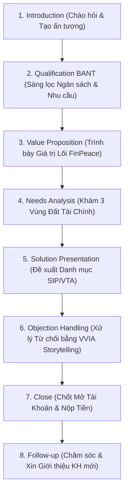
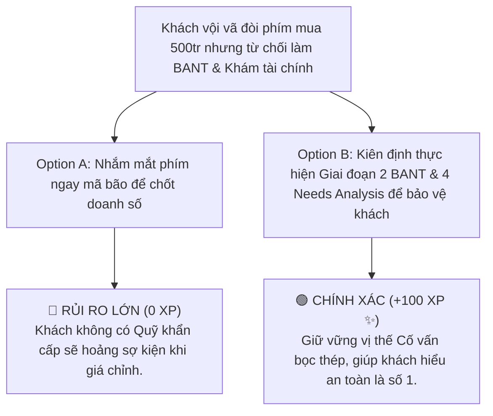

# MODULE 18: 8 GIAI ĐOẠN QUY TRÌNH SALESGPT CHO TƯ VẤN MÔI GIỚI
## Cẩm Nang Ứng Dụng Khung SalesGPT Đột Phá Doanh Số & Chốt Deal Cố Vẫn

---

## 📌 I. TỔNG QUAN KIẾN THỨC CỐT LÕI (THEORETICAL FOUNDATION)

### 1. Giới Thiệu Khung Quy Trình Bán Hàng 8 Giai Đoạn SalesGPT
Dự án **SalesGPT** (Filip Michalsky) là mô hình bán hàng tự động ứng dụng Trí tuệ Nhân tạo đỉnh cao. Khi chuyển hóa vào mảng Môi giới & Cố vấn Đầu tư Chứng khoán tại **KBSV NextGen**, SalesGPT định hình **8 Giai đoạn Bán hàng Chuẩn hóa** giúp Chuyên viên Tư vấn làm chủ mọi cuộc hội thoại từ tiếp cận ban đầu đến chốt hợp đồng cố vấn dài hạn.



---

### 2. Chi Tiết Nội Dung & Mục Tiêu 8 Giai Đoạn SalesGPT

#### 1. Giai Đoạn 1: Introduction (Chào Hỏi & Thiết Lập Vị Thế Cố Vấn)
* **Mục tiêu:** Tạo ấn tượng chuyên nghiệp trong 30 giây đầu tiên. Định vị bản thân là Cố vấn Tài chính (Financial Advisor) đồng hành chứ không phải người phím hàng lướt sóng.

#### 2. Giai Đoạn 2: Qualification BANT (Sàng Lọc Khách Hàng Nòng Cốt)
* **Khung BANT:**
  * **B (Budget):** Quy mô tài sản Ròng / Tiền tiết kiệm đầu tư ($>50$ triệu VNĐ).
  * **A (Authority):** Quyết định tài chính cá nhân hay gia đình.
  * **N (Need):** Nhu cầu Tích sản dài hạn hay Trading sóng VTA.
  * **T (Timeline):** Thời gian đồng hành ($>1$ năm).

#### 3. Giai Đoạn 3: Value Proposition (Tuyên Bố Giá Trị Cốt Lõi)
* **Mục tiêu:** Nhấn mạnh giá trị độc quyền của KBSV NextGen x FinPeace: *"Chúng tôi giúp bạn xây dựng 3 Vùng đất tài chính bọc thép và tích sản cổ phiếu xuất chúng an toàn bền vững."*

#### 4. Giai Đoạn 4: Needs Analysis (Phân Tích Nhu Cầu & Khám Sức Khỏe Tài Chính)
* **Mục tiêu:** Đặt câu hỏi khai vấn sâu về thu nhập, chi phí, Quỹ khẩn cấp và hồ sơ DISC.

#### 5. Giai Đoạn 5: Solution Presentation (Trình Bày Giải Pháp Danh Mục)
* **Mục tiêu:** Đề xuất danh mục Tích sản SIP 4 tiêu chí IW hoặc kế hoạch Trading VTA bọc thép.

#### 6. Giai Đoạn 6: Objection Handling (Xử Lý Từ Chối Bằng VVIA Storytelling)
* **Mục tiêu:** Xử lý triệt để các phản biện (*Sợ thị trường sập, Chê phí đắt, P/E cao*) bằng **Bộ 3 Câu Chuyện Storytelling VVIA** (Kỹ sư cầu, See's Candy, Say đòn bẩy LTCM).

#### 7. Giai Đoạn 7: Close (Chốt Mở Tài Khoản & Nộp Tiền)
* **Mục tiêu:** Đưa ra lời đề nghị chốt hợp đồng tự nhiên: *"Em hỗ trợ anh mở tài khoản eKYC KBSV trong 3 phút ngay bây giờ nhé!"*

#### 8. Giai Đoạn 8: Follow-up & Referral (Chăm Sóc & Mở Rộng Mạng Lưới)
* **Mục tiêu:** Duy trì chăm sóc hàng tuần và xin lời giới thiệu (Referral) từ khách hàng hài lòng.

---

## 📊 II. BÀI TẬP THỰC HÀNH KỊCH BẢN (PRACTICAL EXERCISES)

### 📝 Bài Tập 1: Thực Hành Giai Đoạn 6 Xử Lý Từ Chối "Phí Dịch Vụ Đắt"
**Tình huống:** Khách hàng phản hồi: *"Thị trường sideway mấy tháng nay không có lời nhiều, phí dịch vụ tư vấn đồng hành của bên em cao quá!"*

#### 💡 Lời Giải Kịch Bản Storytelling 3 (Say Đòn Bẩy LTCM):
*"Em rất cảm ơn chia sẻ chân thành của anh! Em hoàn toàn hiểu cảm giác muốn tiết kiệm chi phí của anh trong giai đoạn thị trường sideway.*

*Tuy nhiên, em xin chia sẻ với anh câu chuyện về Quỹ đầu tư LTCM nổi tiếng thế giới. Họ hội tụ các nhà kinh tế đoạt giải Nobel nhưng vì tham rẻ và chủ quan không quản trị rủi ro Margin trong giai đoạn sideway, quỹ đã bị sụp đổ hoàn toàn.*

*Phí dịch vụ cố vấn đồng hành của FinPeace x KBSV không đơn thuần là chi phí, mà là **'Khoản Bảo Hiểm An Toàn'** giúp anh giữ được tiền, không rơi vào bẫy hoảng sợ hay cắt lỗ đúng đáy trong những đợt thị trường biến động mạnh. Nhờ có cố vấn bọc thép, tài sản 1 tỷ của anh được bảo vệ an toàn so với việc tự lướt sóng mất hàng trăm triệu!"*

---

## 🎯 III. TÌNH HUỐNG RA QUYẾT ĐỊNH TƯƠNG TÁC (INTERACTIVE SCENARIO)

### 🛑 Tình Huống: Khách Hàng Muốn Chốt Ngay Nhưng Chưa Qua Bước Qualification BANT
* **Bối cảnh (Context):** Khách hàng vội vã đòi phím mã mua ngay 500 triệu nhưng từ chối chia sẻ thông tin thu nhập và Quỹ khẩn cấp.



---

## 🧪 IV. BÀI KIỂM TRA ĐÁNH GIÁ (SELF-CHECK KNOWLEDGE QUIZ)

**Câu 1: Khung BANT trong Giai đoạn 2 SalesGPT gồm 4 yếu tố nào?**
* A. Buy, Action, Nominal, Time
* B. Budget (Ngân sách), Authority (Quyền quyết định), Need (Nhu cầu), Timeline (Thời gian) **(Đáp án Đúng)**
* C. Bank, Account, Net, Trade
* D. Broker, Advisor, Network, Target

**Câu 2: Giai đoạn 6 Objection Handling khuyên sử dụng công cụ gì để thuyết phục khách hàng?**
* A. Tranh cãi gắt gao với khách
* B. Giảm giá phí 90%
* C. Bộ 3 Câu chuyện Storytelling VVIA **(Đáp án Đúng)**
* D. Bỏ qua câu hỏi của khách

---

## 💬 V. KỊCH BẢN ROLEPLAY THỰC CHUYÊN (AI ROLEPLAY DIALOGUE SCRIPT)

```dialogue
Khách hàng AI (Anh Đức): "Em ơi, anh thấy tự lướt sóng trên App không tốn phí cố vấn, tại sao anh phải dùng gói dịch vụ đồng hành của KBSV làm gì?"

Học viên (Broker NextGen): "Em rất hiểu góc nhìn tối ưu chi phí của anh Đức! Tuy nhiên, khi tự giao dịch một mình trên thị trường, 95% nhà đầu tư cá nhân rơi vào bẫy cảm xúc FEAR & GREED (Sợ hãi & Tham lam), dẫn đến việc mua đu đỉnh và bán tháo đúng đáy.

Khi dùng dịch vụ Cố vấn Đồng hành của KBSV NextGen:
1. Anh sở hữu Bản đồ 3 Vùng Đất bọc thép tài sản gia đình.
2. Danh mục Tích sản SIP của anh được lọc qua 4 Tiêu chí bọc thép InvestWise.
3. Anh luôn có một Cố vấn chuyên nghiệp bên cạnh trấn an tâm lý và cài mốc Stop-Loss tự động khi thị trường giông bão.

Chi phí cố vấn nhỏ này chính là khoản đầu tư tốt nhất để bảo vệ hàng tỷ đồng tài sản của anh bền vững!"

Khách hàng AI (Anh Đức): "Giải thích bằng quy trình SalesGPT rất thuyết phục! Anh đăng ký gói Cố vấn Đồng hành ngay hôm nay."
```
