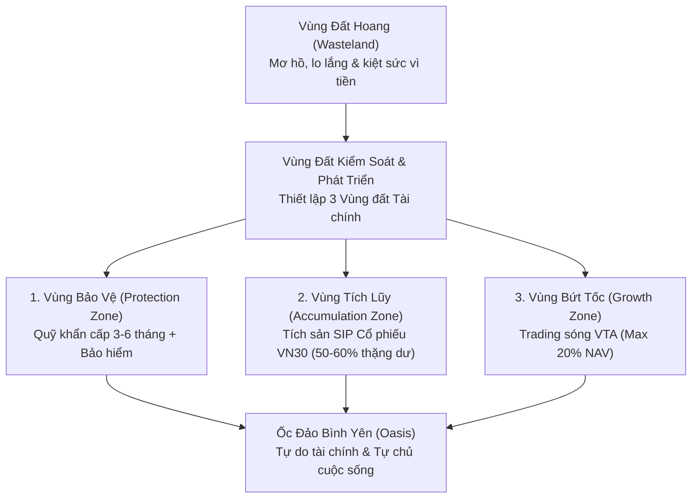
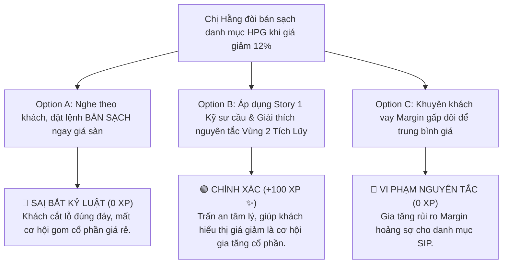

# MODULE 1: BẢN ĐỒ 3 VÙNG ĐẤT TÀI CHÍNH FINPEACE
## Cẩm Nang Thực Chiến & Quy Trình Hoạch Định Tài Chính Cá Nhân Cho Tư Vấn Môi Giới

---

## 📌 I. TỔNG QUAN KIẾN THỨC CỐT LÕI (THEORETICAL FOUNDATION)

### 1. Triết Lý "Chiếc Chìa Khóa Vàng" & Bản Đồ 3 Vùng Đất Tài Chính
Trong hành trình tư vấn tài chính cá nhân cho khách hàng tại thị trường Việt Nam, sai lầm phổ biến nhất của 90% nhà đầu tư cá nhân (đặc biệt là nhà đầu tư F0) là **đưa toàn bộ số tiền tiết kiệm tích góp được vào thị trường chứng khoán khi chưa thiết lập nền móng bảo vệ rủi ro**. Khi thị trường biến động mạnh hoặc giảm điểm sụt giảm 20-30%, những nhà đầu tư này ngay lập tức rơi vào trạng thái hoảng sợ, lo âu và phải cắt lỗ đúng đáy do áp lực dòng tiền sinh hoạt ngắn hạn.

Triết lý lõi của FinPeace trong tác phẩm *"Bình An Tài Chính"* giới thiệu bản đồ **3 Vùng Đất Tài Chính** nhằm giúp Chuyên viên Tư vấn Môi giới KBSV NextGen thiết lập cấu trúc tài sản bọc thép cho khách hàng trước khi bắt đầu hành trình đầu tư:



---

### 2. Chi Tiết Cấu Trúc & Quy Tắc Phân Bổ 3 Vùng Đất

#### 🛡️ Vùng 1: Vùng Bảo Vệ (Protection Zone - Đáy Tháp Tài Sản)
* **Mục tiêu:** Đảm bảo sự sống còn và duy trì mức sống cơ bản của gia đình khách hàng trong mọi tình huống khủng hoảng bất ngờ (mất việc làm, bệnh tật, suy thoái kinh tế).
* **Cấu phần cốt lõi:**
  1. **Quỹ Khẩn Cấp (Emergency Fund):** Tối thiểu 3 đến 6 tháng chi phí thiết yếu hàng tháng của gia đình. Tiền quỹ khẩn cấp **bắt buộc gửi vào các tài sản có thanh khoản tức thì** (Tiết kiệm kỳ hạn 1 tháng tự động quay vòng, Tiền gửi linh hoạt Flexi-saving trên App ngân hàng hoặc Hợp đồng tiền gửi ngắn hạn). Tuyệt đối **KHÔNG** đưa Quỹ khẩn cấp vào cổ phiếu hoặc bất động sản.
  2. **Hệ Thống Bảo Hiểm Tài Chính:** Bảo hiểm y tế, bảo hiểm sức khỏe cá nhân và bảo hiểm nhân thọ đóng vai trò lá chắn chuyển giao rủi ro lớn khi biến cố y tế xảy ra, tránh việc khách hàng phải bán tháo danh mục cổ phiếu SIP đang tích lũy ở mốc giá đáy.

#### 🔺 Vùng 2: Vùng Tích Lũy (Accumulation Zone - Thân Tháp Tài Sản)
* **Mục tiêu:** Kiến tạo sự tự do tài chính dài hạn thông qua sức mạnh của Lãi suất kép (Compound Interest) và sự tăng trưởng nội tại của nền kinh tế Việt Nam.
* **Cấu phần cốt lõi:**
  1. **Danh Mục Tích Sản SIP (Systematic Investment Plan):** Trích từ **50% đến 60% dòng tiền thặng dư hàng tháng** (Thu nhập trừ đi Chi phí thiết yếu) để mua tích sản định kỳ các cổ phiếu doanh nghiệp xuất chúng thuộc VN30 hoặc Quỹ ETF mô phỏng chỉ số (VFMVN Diamond ETF, VNFinLead ETF).
  2. **Tiền Gửi Tiết Kiệm Kỳ Hạn Dài (12-24 tháng):** Đảm bảo nguồn tiền chuẩn bị cho các mục tiêu trung hạn (Mua nhà, mua ô tô, quỹ du học cho con).

#### 🚀 Vùng 3: Vùng Bứt Tốc (Growth Zone - Đỉnh Tháp Tài Sản)
* **Mục tiêu:** Tìm kiếm cơ hội alpha, gia tăng lợi nhuận đột biến khi xuất hiện các sóng xu hướng rõ ràng trên thị trường.
* **Cấu phần cốt lõi:**
  1. **Danh Mục Trading Theo Sóng VTA (Vietnam Trend Analyzer):** Giới hạn **tối đa 20% tổng giá trị tài sản ròng (NAV)**. Sử dụng phân tích kỹ thuật, ma trận sóng Trend/Sideway để thực hiện các chiến lược lướt sóng ngắn/trung hạn.
  2. **Bất Động Sản Dòng Tiền / Đầu Tư Khởi Nghiệp:** Dành cho nhà đầu tư ở phân khúc quy mô tài sản lớn.

---

## 📊 II. BÀI TẬP THỰC HÀNH TÍNH TOÁN (PRACTICAL EXERCISES)

### 📝 Bài Tập 1: Thiết Lập 3 Vùng Đất Cho Khách Hàng Thực Tế
**Đề bài:** Khách hàng Anh Tuấn (32 tuổi, Trưởng phòng Kinh doanh), tổng thu nhập 40 triệu VNĐ/tháng. Chi phí sinh hoạt thiết yếu cho gia đình 4 người là 22 triệu VNĐ/tháng. Anh Tuấn đang có sẵn 150 triệu VNĐ tiền tiết kiệm. Anh Tuấn tìm đến bạn (Chuyên viên Môi giới KBSV) và muốn dùng toàn bộ 150 triệu VNĐ này cộng thêm vay Margin 50:50 để đánh lướt sóng cổ phiếu Penny bất động sản.

**Yêu cầu:** Hãy lập bảng phân bổ 3 Vùng đất Tài chính chuẩn FinPeace cho Anh Tuấn và đưa ra lời khuyên tư vấn phù hợp.

#### 💡 Lời Giải Chi Tiết:
1. **Bước 1: Tính Dòng Tiền Thặng Dư Hàng Tháng**
   $$\text{Dòng tiền thặng dư} = \text{Thu nhập} - \text{Chi phí thiết yếu} = 40.000.000 - 22.000.000 = 18.000.000\text{ VNĐ/tháng}$$

2. **Bước 2: Xây Dựng Vùng 1 - Vùng Bảo Vệ**
   * **Quỹ Khẩn Cấp 6 tháng:** $22.000.000 \times 6 = 132.000.000\text{ VNĐ}$.
   * **Trích từ nguồn vốn hiện có (150 triệu):** Trích ngay $132.000.000\text{ VNĐ}$ gửi tiết kiệm kỳ hạn 1 tháng tự động quay vòng trên App Ngân hàng làm Quỹ Khẩn Cấp.
   * **Số vốn còn lại để đầu tư:** $150.000.000 - 132.000.000 = 18.000.000\text{ VNĐ}$.

3. **Bước 3: Phân Bổ Vùng 2 (Tích Lũy SIP) & Vùng 3 (Bứt Tốc Trading)**
   * **Vùng 2 - Tích Sản SIP Hàng Tháng (60% Thặng Dư):** Trích $18.000.000 \times 60\% = 10.800.000\text{ VNĐ/tháng}$ mua tích sản định kỳ cổ phiếu FPT/HPG ngày 5 hàng tháng.
   * **Vùng 3 - Trading VTA (40% Thặng Dư):** Trích $18.000.000 \times 40\% = 7.200.000\text{ VNĐ/tháng}$ cộng số vốn ban đầu 18 triệu để giao dịch sóng VTA có cài sẵn lệnh Cắt lỗ tự động.

4. **Lời khuyên tư vấn gửi Anh Tuấn:** *"Anh Tuấn ơi, việc dùng 100% 150 triệu vốn tích góp cộng vay Margin đánh Penny là cực kỳ nguy hiểm. Nếu thị trường sập 20%, anh sẽ bị Call Margin và mất sạch tiền sinh hoạt gia đình. Bằng cách trích 132 triệu làm Quỹ khẩn cấp bọc thép, gia đình anh hoàn toàn an toàn trước biến cố. Đồng thời mỗi tháng anh trích 10.8 triệu tích sản FPT/HPG, sau 5 năm anh sẽ sở hữu danh mục tích sản bền vững hàng tỷ đồng!"*

---

## 🎯 III. TÌNH HUỐNG RA QUYẾT ĐỊNH TƯƠNG TÁC (INTERACTIVE SCENARIO)

### 🛑 Tình Huống: Xử Lý Khách Hàng Đòi Bán Tháo Danh Mục Tích Sản Vì Sợ Thị Trường Sập
* **Bối cảnh (Context):** Phiên giao dịch ngày 15/08/2026, chỉ số VNINDEX bất ngờ lao dốc 35 điểm do tin đồn vĩ mô quốc tế. Chị Hằng (Khách hàng tích sản SIP của bạn) đang tích lũy cổ phiếu HPG được 8 tháng. Giá HPG giảm 12% theo nhịp điều chỉnh chung. Chị Hằng nhắn tin vô cùng hoảng loạn: *"Em ơi, báo đài đưa tin thị trường sập rủi ro quá! Em bán sạch danh mục HPG của chị ngay lập tức để gửi tiết kiệm cho an tâm!"*



* **Giải thích chuyên gia FinPeace:** *"Đối với danh mục Vùng 2 Tích Lũy SIP, thị giá cổ phiếu giảm 12-15% trong khi yếu tố cơ bản của doanh nghiệp HPG không đổi chính là cơ hội Vàng để gia tăng số lượng cổ phần với chiết khấu tốt nhất. Việc khuyên khách bán tháo ở giá sàn hoảng sợ là vi phạm nghiêm trọng bản chất của Tích sản SIP!"*

---

## 🧪 IV. BÀI KIỂM TRA ĐÁNH GIÁ (SELF-CHECK KNOWLEDGE QUIZ)

**Câu 1: Tỷ lệ phân bổ dòng tiền thặng dư hàng tháng vào Vùng Tích Lũy (SIP) theo chuẩn FinPeace là bao nhiêu?**
* A. 10% đến 20%
* B. 30% đến 40%
* C. 50% đến 60% **(Đáp án Đúng)**
* D. 100%

**Câu 2: Quỹ Khẩn Cấp thuộc Vùng 1 Bảo Vệ nên được lưu trữ ở kênh tài sản nào?**
* A. Cổ phiếu Midcap bất động sản
* B. Tiết kiệm ngắn hạn linh hoạt / Hợp đồng tiền gửi 1 tháng **(Đáp án Đúng)**
* C. Tiền kỹ thuật số Bitcoin
* D. Vay Margin đánh lướt sóng

**Câu 3: Quy tắc quản trị rủi ro cho Vùng 3 Bứt Tốc (Trading VTA) giới hạn tối đa bao nhiêu % NAV?**
* A. Tối đa 20% NAV **(Đáp án Đúng)**
* B. Tối đa 50% NAV
* C. Tối đa 80% NAV
* D. Không giới hạn

---

## 💬 V. KỊCH BẢN ROLEPLAY THỰC CHUYÊN (AI ROLEPLAY DIALOGUE SCRIPT)

* **Nhân vật:**
  * **Học viên (Mentor Intern KBSV):** Nhã nhặn, chuyên nghiệp, giữ vững triết lý FinPeace.
  * **Khách hàng AI (Anh Hùng - Nhóm Cẩn Trọng C):** Khắt khe, yêu cầu con số bọc thép.

```dialogue
Khách hàng AI (Anh Hùng): "Chào em, anh thấy các Broker khác toàn tư vấn anh bỏ 500 triệu vào lướt sóng mã cổ phiếu Penny ăn 20-30% một tuần. Tại sao em lại bảo anh phải chia tiền làm 3 Vùng Đất rồi bắt gửi tiết kiệm với mua tích sản làm gì cho mất thời gian?"

Học viên (Broker NextGen): "Em rất hiểu mong muốn tối ưu hóa lợi nhuận của anh Hùng. Tuy nhiên, trong 10 năm tư vấn thị trường, em nhận thấy 90% nhà đầu tư lướt sóng toàn bộ tài sản đều phải trả giá đắt khi thị trường đảo chiều bất ngờ. 

Việc chia 3 Vùng Đất Tài Chính không hề làm giảm cơ hội kiếm tiền của anh, mà giúp anh xây dựng một 'Lá chắn Bọc thép'. Khi Quỹ Khẩn Cấp Vùng 1 được gửi linh hoạt 6 tháng chi phí, anh hoàn toàn an tâm làm việc. Vùng 2 Tích Lũy 60% thặng dư vào cổ phiếu xuất chúng như FPT/HPG sẽ giúp tài sản của anh tăng trưởng bền vững theo Lãi suất kép. Và 20% NAV Vùng 3 sẽ giúp anh trải nghiệm cảm giác lướt sóng VTA mà không lo lắng về sinh hoạt gia đình. 

Một ngôi nhà muốn xây cao hàng chục tầng thì móng phải cực kỳ vững chắc, đúng không anh?"

Khách hàng AI (Anh Hùng): "Nghe em giải thích logic và bọc thép con số rất hợp lý! Anh đồng ý mở tài khoản KBSV và nhờ em lập bản phân bổ 3 Vùng Đất cho gia đình anh ngay hôm nay."
```
