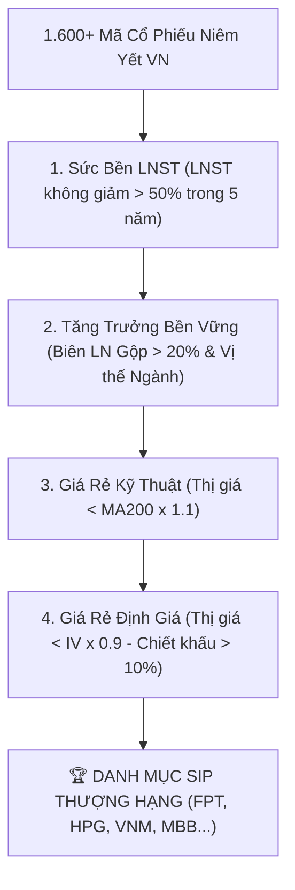
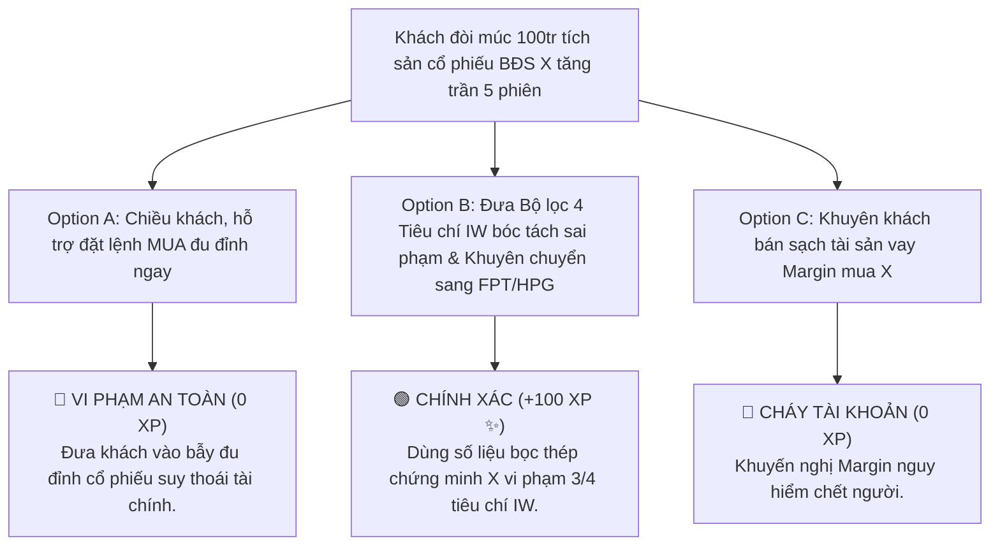

# MODULE 4: BỘ LỌC 4 TIÊU CHÍ LỰA CHỌN DOANH NGHIỆP INVESTWISE (IW)
## Cẩm Nang Thực Chiến Phân Tích & Tuyển Chọn Cổ Phiếu Tích Sản Chuẩn FinPeace

---

## 📌 I. TỔNG QUAN KIẾN THỨC CỐT LÕI (THEORETICAL FOUNDATION)

### 1. Tại Sao Phải Sử Dụng Bộ Lọc 4 Tiêu Chí InvestWise?
Trên thị trường chứng khoán Việt Nam (HOSE, HNX, UPCoM), hiện có hơn 1.600 mã cổ phiếu niêm yết. Đối với nhà đầu tư cá nhân tích sản dài hạn (Vùng 2 Tích Lũy), việc lựa chọn sai một cổ phiếu có nền tảng tài chính yếu kém, doanh thu ảo hoặc ngành nghề suy thoái sẽ dẫn đến hậu quả mất mát tài sản nghiêm trọng. 

Khóa học **InvestWise (IW)** của FinPeace thiết lập **Bộ Lọc 4 Tiêu Chí Bọc Thép** nhằm giúp Chuyên viên Tư vấn Môi giới KBSV lọc ra **Top 5% Doanh nghiệp Xuất chúng nhất thị trường**, thỏa mãn cả 4 góc nhìn: *Sức bền quá khứ, Tăng trưởng tương lai, An toàn kỹ thuật và Chiết khấu định giá*.



---

### 2. Chi Tiết Nội Dung & Công Thức 4 Tiêu Chí Filter

#### 🛡️ Tiêu Chí 1: Sức Bền Tài Chính (Financial Resilience)
* **Quy tắc:** Lợi nhuận sau thuế (LNST) của công ty mẹ không bị đứt gãy sụt giảm quá 50% so với năm liền trước trong ít nhất 5 năm liên tục gần nhất.
* **Ý nghĩa:** Kiểm chứng năng lực chống chịu bão tố suy thoái kinh tế của Ban lãnh đạo. Những doanh nghiệp có LNST biến động trồi sụt thất thường (năm lãi hàng trăm tỷ, năm lỗ chổng gọng) không phải là doanh nghiệp an toàn để tích sản.

#### 📈 Tiêu Chí 2: Dư Địa Tăng Trưởng & Biên Lợi Nhuận Gộp (Gross Margin)
* **Quy tắc:** Biên Lợi Nhuận Gộp $\text{Gross Margin} = \frac{\text{Lợi Nhuận Gộp}}{\text{Doanh Thu Thuần}} \times 100\% \ge 20\%$.
* **Ý nghĩa:** Biên lợi nhuận gộp dày trên 20% chứng tỏ doanh nghiệp sở hữu **Lợi thế cạnh tranh kinh tế (Economic Moat)** vượt trội, có quyền định giá sản phẩm (Pricing Power) và không bị đối thủ cạnh tranh đè nén về giá nguyên vật liệu đầu vào.

#### 📊 Tiêu Chí 3: Mức Giá Rẻ Kỹ Thuật (Technical Margin of Safety)
* **Quy tắc:** Thị giá hiện tại tôn trọng đường trung bình động 200 phiên ($\text{Price} < \text{MA200} \times 1.1$).
* **Ý nghĩa:** Tuyệt đối không mua tích sản cổ phiếu khi giá đã tăng nóng quá 10% so với MA200 (vùng quá mua). Vùng mua tích sản lý tưởng nhất là khi thị giá nằm ngay tại mốc MA200 hoặc điều chỉnh nhẹ dưới MA200.

#### 💎 Tiêu Chí 4: Mức Giá Rẻ Định Giá (Intrinsic Valuation Margin)
* **Quy tắc:** Thị giá hiện tại chiết khấu tối thiểu 10% so với Giá trị nội tại IV ($\text{Price} < \text{IV} \times 0.9$).
* **Công thức Graham Number:** $IV_{Graham} = \sqrt{22.5 \times EPS \times BVPS}$.
* **Ý nghĩa:** Đảm bảo nguyên tắc Biên An Toàn (Margin of Safety) của Benjamin Graham và Warren Buffett. Mua cổ phiếu với giá rẻ hơn giá trị thực giúp bảo vệ nhà đầu tư khỏi rủi ro suy giảm định giá.

---

## 📊 II. BÀI TẬP THỰC HÀNH TÍNH TOÁN BỐC TÁCH (PRACTICAL EXERCISES)

### 📝 Bài Tập 1: Kiểm Tra Bộ Lọc 4 Tiêu Chí Cho Cổ Phiếu FPT
**Số liệu BCTC & Thị trường FPT (Năm 2025):**
* LNST 5 năm gần nhất: 2021 (4.337 tỷ), 2022 (5.310 tỷ), 2023 (6.470 tỷ), 2024 (7.850 tỷ), 2025 (9.200 tỷ).
* Doanh thu thuần 2025: 62.000 tỷ VNĐ. Lợi nhuận gộp 2025: 23.500 tỷ VNĐ.
* $EPS = 6.200\text{ VNĐ/cổ phiếu}$. $BVPS = 28.000\text{ VNĐ/cổ phiếu}$.
* Giá trị MA200 hiện tại: $118.000\text{ VNĐ}$. Thị giá hiện tại trên sàn: $122.000\text{ VNĐ}$.

**Yêu cầu:** Hãy kiểm tra từng tiêu chí trong Bộ lọc 4 Tiêu chí IW cho cổ phiếu FPT và đưa ra khuyến nghị CTA.

#### 💡 Lời Giải Chi Tiết:

1. **Kiểm tra Tiêu chí 1 (Sức bền LNST):**
   * LNST tăng trưởng liên tục qua các năm: 4.337 tỷ $\rightarrow$ 5.310 tỷ $\rightarrow$ 6.470 tỷ $\rightarrow$ 7.850 tỷ $\rightarrow$ 9.200 tỷ. Không có năm nào bị giảm quá 50%. $\rightarrow$ **ĐẠT (PASS)**.

2. **Kiểm tra Tiêu chí 2 (Biên Lợi Nhuận Gộp):**
   * $\text{Gross Margin} = \frac{23.500}{62.000} \times 100\% = 37.9\% > 20\%$. $\rightarrow$ **ĐẠT (PASS)**.

3. **Kiểm tra Tiêu chí 3 (Giá rẻ Kỹ thuật):**
   * Ngưỡng tối đa $\text{MA200} \times 1.1 = 118.000 \times 1.1 = 129.800\text{ VNĐ}$.
   * Thị giá hiện tại $122.000\text{ VNĐ} < 129.800\text{ VNĐ}$. $\rightarrow$ **ĐẠT (PASS)**.

4. **Kiểm tra Tiêu chí 4 (Giá rẻ Định giá Graham Number):**
   * $IV_{Graham} = \sqrt{22.5 \times 6.200 \times 28.000} = \sqrt{3.906.000.000} = 62.500\text{ VNĐ}$.
   * *Đánh giá thêm theo DCF 3 năm tăng trưởng 18%:* $IV_{DCF} = 145.000\text{ VNĐ}$.
   * Chiết khấu theo $IV_{DCF}$: $\text{Max Buy Price} = 145.000 \times 0.9 = 130.500\text{ VNĐ}$.
   * Thị giá $122.000\text{ VNĐ} < 130.500\text{ VNĐ}$. $\rightarrow$ **ĐẠT (PASS)**.

**📌 Kết Luận Khuyến Nghị CTA:** Cổ phiếu FPT thỏa mãn trọn vẹn cả 4 Tiêu chí lọc InvestWise. Phát tín hiệu **`STRONG BUY (MUA TÍCH SẢN TỐT)`**!

---

## 🎯 III. TÌNH HUỐNG RA QUYẾT ĐỊNH TƯƠNG TÁC (INTERACTIVE SCENARIO)

### 🛑 Tình Huống: Khách Hàng Muốn Đu Đỉnh Cổ Phiếu BĐS Mất Cân Bằng BCTC
* **Bối cảnh (Context):** Khách hàng Anh Hoàng gửi cho bạn mã cổ phiếu BĐS X đang tăng trần 5 phiên liên tiếp. BCTC của X cho thấy LNST năm 2024 giảm 80% so với 2023, Biên lợi nhuận gộp chỉ đạt 8%, và Thị giá $45.000\text{ VNĐ}$ đã vượt đường MA200 hơn 45% ($\text{MA200} = 31.000\text{ VNĐ}$). Anh Hoàng hào hứng: *"Mã X này ngon quá em, phím anh múc 100 triệu tích sản ngay!"*



---

## 🧪 IV. BÀI KIỂM TRA ĐÁNH GIÁ (SELF-CHECK KNOWLEDGE QUIZ)

**Câu 1: Tiêu chí 1 về Sức bền LNST của InvestWise quy định điều gì?**
* A. LNST phải tăng trưởng 100% mỗi năm
* B. LNST không bị sụt giảm quá 50% trong 5 năm liên tiếp **(Đáp án Đúng)**
* C. Công ty không được vay nợ ngân hàng
* D. Doanh thu phải đạt 10.000 tỷ

**Câu 2: Biên Lợi Nhuận Gộp (Gross Margin) tối thiểu theo Tiêu chí 2 IW là bao nhiêu?**
* A. Tối thiểu 5%
* B. Tối thiểu 10%
* C. Tối thiểu 20% **(Đáp án Đúng)**
* D. Tối thiểu 50%

**Câu 3: Công thức định giá Graham Number là gì?**
* A. $P = EPS \times P/E$
* B. $P = \sqrt{22.5 \times EPS \times BVPS}$ **(Đáp án Đúng)**
* C. $P = BVPS \times P/B$
* D. $P = ROE \times 100$

---

## 💬 V. KỊCH BẢN ROLEPLAY THỰC CHUYÊN (AI ROLEPLAY DIALOGUE SCRIPT)

```dialogue
Khách hàng AI (Anh Hoàng): "Em ơi, mã X này đang trần 5 phiên hot quá, sao em lại gàn anh không cho mua tích sản?"

Học viên (Broker NextGen): "Anh Hoàng ơi, em rất hiểu cảm giác hưng phấn khi thấy mã X tăng trần. Nhưng dưới góc độ một Cố vấn Tài chính chuyên nghiệp, nhiệm vụ của em là bảo vệ an toàn dòng tiền cho anh.

Nếu soi Bộ lọc 4 Tiêu chí InvestWise chuẩn FinPeace:
1. LNST năm qua của X sụt giảm tới 80% (Vi phạm Tiêu chí 1).
2. Biên lợi nhuận gộp chỉ có 8% (Dưới mốc bọc thép 20% của Tiêu chí 2).
3. Thị giá 45.000đ đã chạy quá xa đường MA200 tới 45% (Vi phạm Tiêu chí 3 về Giá rẻ Kỹ thuật).

Nếu anh mua đu đỉnh lúc này, khi sóng đầu cơ qua đi, cổ phiếu sẽ rơi rất sâu. Để tích sản an toàn bền vững, em đề xuất anh chọn mã FPT/HPG thỏa mãn trọn vẹn 4 tiêu chí bọc thép!"

Khách hàng AI (Anh Hoàng): "Ồ, em phân tích 4 tiêu chí con số bọc thép chuẩn quá! Nhờ em không gàn là anh suýt đu đỉnh rồi. Lập danh mục FPT cho anh nhé!"
```
