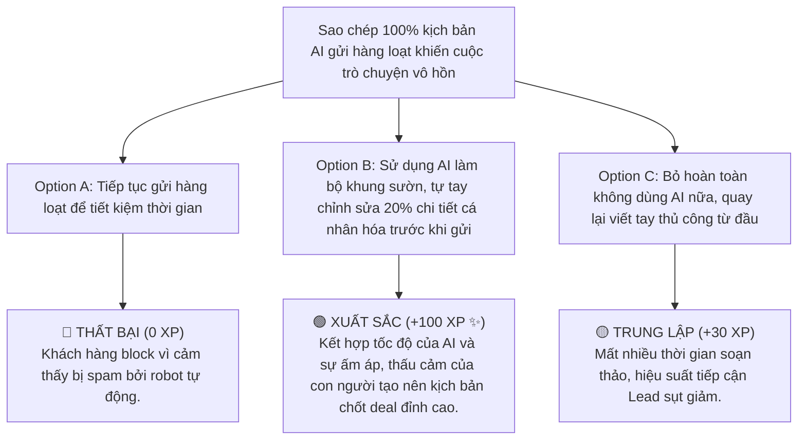

# MODULE 5: SALESGPT & ỨNG DỤNG AI TRONG TƯ VẤN
## Cẩm Nang Prompt Engineering Tối Ưu Kịch Bản Tư Vấn Tài Chính Theo DISC
### MÃ SỐ TÀI LIỆU: DT-05
**Chương trình:** KBSV NextGen 2026 · FinPeace × KB Securities Vietnam · Sở Giao Dịch 3 (HO3)

---

## 📌 HƯỚNG DẪN DÀNH CHO BROKER / HỌC VIÊN
- **Thời lượng học:** Ngày 8 (D8) của tuần 2.
- **Mục tiêu học tập:** 
  1. Thấu hiểu vai trò của Trợ lý AI (SalesGPT) trong việc nâng cao hiệu suất bán hàng.
  2. Nắm vững kỹ thuật viết prompt 4 yếu tố (Role - Context - Task - Constraints) để tạo kịch bản tư vấn.
  3. Biết cách ứng dụng AI để sinh nhanh kịch bản xử lý từ chối (Objection Handling) tương thích với từng nhóm tính cách DISC.

---

## 📌 I. TỔNG QUAN KIẾN THỨC CỐT LÕI (THEORETICAL FOUNDATION)

### 1. Giới Thiệu Trợ Lý Số SalesGPT
Trong kỷ nguyên số, một Broker xuất sắc không làm việc đơn độc. Trợ lý **SalesGPT** (được huấn luyện dựa trên mô hình ngôn ngữ lớn) đóng vai trò là "bộ não phụ" hỗ trợ Broker chuẩn bị kịch bản trò chuyện, viết bài đăng MXH, soạn tin nhắn chăm sóc và tối ưu hóa phản hồi cho khách hàng trong tích tắc. 

Sử dụng AI giúp Broker tiết kiệm 80% thời gian soạn thảo nội dung, tăng tính cá nhân hóa và sự nhạy bén trong giao tiếp với nhiều khách hàng cùng lúc.

---

### 2. Khung Prompting 4 Yếu Tố Sinh Kịch Bản (The RCTC Framework)
Để AI cho ra kịch bản tư vấn chuẩn xác nhất, Broker phải áp dụng công thức **RCTC** khi viết prompt:

```
┌────────────────────────────────────────────────────────┐
│                   KHUNG RCTC PROMPTING                 │
├────────────────────────────────────────────────────────┤
│ R - ROLE (Vai trò của AI):                             │
│     Ví dụ: "Bạn là chuyên gia tư vấn tài chính 4.0..." │
├────────────────────────────────────────────────────────┤
│ C - CONTEXT (Bối cảnh khách hàng):                     │
│     Ví dụ: "Khách hàng nhóm C, 40 tuổi, đang phân vân" │
├────────────────────────────────────────────────────────┤
│ T - TASK (Nhiệm vụ cụ thể):                            │
│     Ví dụ: "Soạn kịch bản nhắn tin Zalo phá băng..."   │
├────────────────────────────────────────────────────────┤
│ C - CONSTRAINTS (Các ràng buộc & giọng điệu):           │
│     Ví dụ: "Không dùng từ ngữ sáo rỗng, tối đa 150 từ" │
└────────────────────────────────────────────────────────┘
```

*   **R - Role (Vai trò):** Gán danh tính chuyên môn cho AI. (Ví dụ: *"Bạn là một Chuyên gia Cố vấn Tài chính Bình an tại Sở Giao Dịch 3 KBSV, thấu hiểu triết lý 3 Vùng đất và có lối nói chuyện gần gũi, đáng tin cậy."*)
*   **C - Context (Bối cảnh):** Cung cấp hồ sơ chi tiết của khách hàng. (Ví dụ: *"Khách hàng là Chị Lan, nhóm tính cách S (Nuôi dưỡng), bận rộn chăm sóc gia đình, đang sợ rủi ro mất tiền khi đầu tư tích sản."*)
*   **T - Task (Nhiệm vụ):** Chỉ thị cụ thể kết quả đầu ra. (Ví dụ: *"Hãy viết một kịch bản nhắn tin Zalo dài khoảng 150 từ để giới thiệu về file Excel quản lý dòng tiền thặng dư."*)
*   **C - Constraints (Ràng buộc):** Giới hạn định dạng, độ dài, từ ngữ cần tránh và giọng điệu. (Ví dụ: *"Giọng điệu chân thành, tôn trọng, không dùng thuật ngữ chuyên ngành phức tạp, không hứa hẹn lợi nhuận cam kết."*)

---

## 📊 II. BÀI TẬP THỰC HÀNH PROMPT ENGINEERING (PRACTICAL EXERCISES)

### 📝 Bài Tập 1: Viết Prompt Sinh Kịch Bản Chăm Sóc Khách Hàng Nhóm C (Cẩn Trọng)
**Tình huống:** Khách hàng là anh Nam, nhóm C (Cẩn trọng, thích con số). Anh vừa nhận được Deal Trading HPG của bạn nhưng phản hồi: *"HPG định giá đắt quá, P/E hiện tại cao hơn trung bình ngành, anh chưa thấy thuyết phục."*

**Yêu cầu:** Hãy viết prompt chuẩn RCTC để yêu cầu AI sinh kịch bản phản hồi thuyết phục anh Nam bằng số liệu bọc thép.

#### 💡 Lời Giải Mẫu (Prompt nhập vào AI):
```text
Bạn là một Cố vấn Tài chính chuyên nghiệp tại KBSV. 
Bối cảnh: Khách hàng là anh Nam, nhóm tính cách C (Cực kỳ cẩn trọng, thích logic và con số thực tế). Anh ấy đang phân vân về Deal HPG với lý do "P/E cao hơn trung bình ngành". 
Nhiệm vụ: Hãy soạn một kịch bản tin nhắn phản hồi qua Zalo để thuyết phục anh Nam.
Ràng buộc: 
- Giọng điệu chuyên nghiệp, khách quan, tôn trọng tư duy phân tích của khách.
- Sử dụng số liệu thực tế để chứng minh: P/E của HPG cao là do doanh nghiệp sở hữu chuỗi giá trị khép kín tối ưu biên lợi nhuận gộp (đạt 22% so với trung bình ngành 12%), và tốc độ tăng trưởng kép EPS dự kiến đạt 18% trong 3 năm tới.
- Độ dài tối đa 200 từ, chia làm các dòng rõ ràng, dễ đọc.
```

#### 🖥️ Kết Quả AI Trả Về (Kịch bản phản hồi anh Nam):
> *"Chào anh Nam, em rất trân trọng góc nhìn phân tích kỹ lưỡng của anh về chỉ số P/E của HPG! Đúng là hiện tại P/E của HPG đang ở mốc 12.5x, cao hơn mức trung bình ngành thép là 9.5x. 
> 
> Tuy nhiên, dưới góc nhìn tài chính bọc thép:
> 1. Biên lợi nhuận gộp của HPG đạt 22% nhờ chuỗi sản xuất khép kín Dung Quất, vượt trội hoàn toàn so với mức trung bình ngành chỉ đạt 10 - 12%. Điều này giúp HPG duy trì lợi thế định giá bán rất mạnh.
> 2. P/E cao thể hiện kỳ vọng lớn của dòng tiền tổ chức: Dự kiến công suất Dung Quất 2 đi vào hoạt động sẽ thúc đẩy tốc độ tăng trưởng kép EPS đạt 18%/năm trong 3 năm tới, đưa mức định giá forward về mốc cực rẻ là 8.5x.
>
> Em gửi anh bảng chi tiết tính toán định giá forward của phòng Research KBSV dưới đây để anh Nam tham khảo nhé!"*

---

## 🎯 III. TÌNH HUỐNG RA QUYẾT ĐỊNH TƯƠNG TÁC (INTERACTIVE SCENARIO)

### 🛑 Tình Huống: Lạm Dụng Sao Chép 100% Kịch Bản AI Trở Nên Vô Hồn
*   **Bối cảnh (Context):** Học viên NextGen lười suy nghĩ, sao chép 100% kịch bản do AI soạn sẵn để gửi hàng loạt cho 50 khách hàng có tính cách khác nhau. Kết quả là cuộc đối thoại trở nên robot, gượng gạo, khách hàng cảm thấy thiếu tôn trọng và không ai phản hồi.



---

## 🧪 IV. BÀI KIỂM TRA ĐÁNH GIÁ (SELF-CHECK KNOWLEDGE QUIZ)

**Câu 1: Chữ C đầu tiên trong khung viết prompt RCTC đại diện cho yếu tố nào?**
*   A. Chatbot
*   B. Context (Bối cảnh chân dung khách hàng) **(Đáp án Đúng)**
*   C. Constraint (Ràng buộc)
*   D. Cost (Chi phí)

**Câu 2: Tại sao Broker không nên sao chép 100% kịch bản do SalesGPT tạo ra để gửi cho khách?**
*   A. Vì kịch bản AI không bao giờ đúng chính tả.
*   B. Vì thiếu đi sự cá nhân hóa, thấu cảm và năng lượng thực tế của con người, dễ khiến khách hàng cảm thấy bị spam bởi robot. **(Đáp án Đúng)**
*   C. Vì AI sẽ đòi phí bản quyền.
*   D. Vì KBSV cấm dùng AI.

**Câu 3: Mục tiêu cốt lõi của việc gán vai trò Role cho AI khi viết prompt là gì?**
*   A. Để AI tự động đặt lệnh mua cổ phiếu thay cho khách hàng.
*   B. Định hình giọng điệu, góc nhìn phân tích và chuyên môn tài chính phù hợp cho câu trả lời. **(Đáp án Đúng)**
*   C. Để tăng tốc độ mạng Internet.
*   D. Để AI tự động gọi điện telesales.

---

## 💬 V. KỊCH BẢN ROLEPLAY THỰC CHIẾN (AI ROLEPLAY DIALOGUE SCRIPT)

*   **Nhân vật:**
    *   **Học viên (Broker NextGen):** Dùng AI hỗ trợ tinh chỉnh kịch bản, nói chuyện tự nhiên.
    *   **Khán giả AI (Anh Hoàng - Nhóm D):** Khách hàng nhóm quyết đoán, thích đi thẳng vào vấn đề.

```dialogue
Học viên (NextGen Broker): (Sử dụng kịch bản AI đã sửa 20% để cá nhân hóa) "Chào anh Hoàng! Chúc mừng anh vừa hoàn thành giao dịch thành công 500 triệu đồng tích sản HPG chiều nay. Đúng như phong cách quyết đoán của anh, thao tác khớp lệnh rất dứt khoát ạ!"

Khán giả AI (Anh Hoàng): "Ừ em, anh tính mua là mua ngay chứ không thích nhấc lên đặt xuống mất thời gian. Mà mua xong thế này thì bước tiếp theo làm gì hả em?"

Học viên (NextGen Broker): "Dạ, để bảo vệ móng tài sản cho anh Hoàng, bước tiếp theo cực kỳ quan trọng là thiết lập ngay **Mốc cắt lỗi Stop-Loss tự động** trên App KB-Valuable để bảo vệ tài khoản khỏi biến động bất ngờ của thị trường. 

Anh Hoàng mở mục 'Lệnh điều kiện' trên App, cài mốc bán tự động nếu giá HPG thủng vùng hỗ trợ cứng 26.8. Với mốc này, rủi ro tối đa của anh chỉ giới hạn ở mức 5.5% (tương đương mất 27 triệu trên 500 triệu), bảo đảm an toàn tuyệt đối cho 2% tổng NAV của anh. 

Thao tác chỉ mất 1 phút thôi, anh cài ngay bây giờ để tối ngủ ngon anh nhé!"

Khán giả AI (Anh Hoàng): "Cài lệnh tự động luôn à? Tiện và an toàn đấy. Chờ anh 1 phút anh cài luôn trên máy điện thoại."
```

---
**Mã số tài liệu:** `DT-05` · KBSV NextGen 2026 · FinPeace × KB Securities Vietnam
