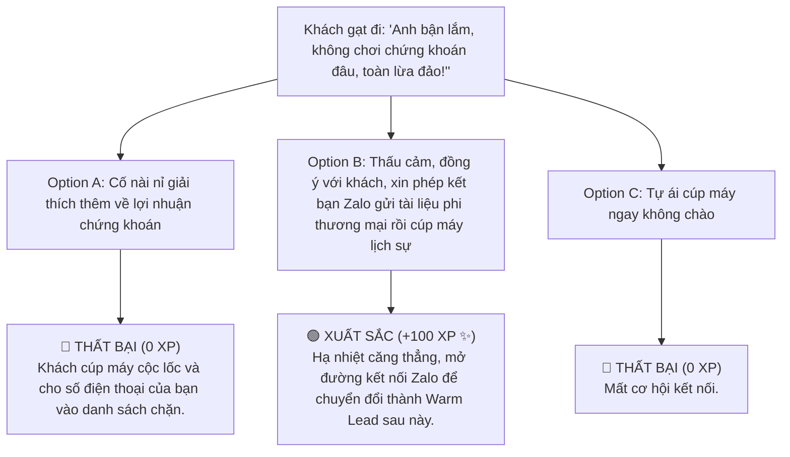

# MODULE 6: KỊCH BẢN TELESALES & TIẾP CẬN LEAD ĐA KÊNH
## Hướng Dẫn Vận Hành Phễu Khách Hàng CRM & Kỹ Thuật Telesales Thực Chiến
### MÃ SỐ TÀI LIỆU: DT-06
**Chương trình:** KBSV NextGen 2026 · FinPeace × KB Securities Vietnam · Sở Giao Dịch 3 (HO3)

---

## 📌 HƯỚNG DẪN DÀNH CHO BROKER / HỌC VIÊN
- **Thời lượng học:** Ngày 9 (D9) & Ngày 10 (D10) của tuần 2.
- **Mục tiêu học tập:** 
  1. Phân loại chuẩn xác trạng thái Lead trên CRM để tối ưu hóa thời gian gọi điện chăm sóc.
  2. Áp dụng cấu trúc cuộc gọi Telesales vàng để giữ chân khách hàng qua 30 giây đầu tiên.
  3. Viết tin nhắn Zalo/SMS Follow-up khéo léo để tạo sự tò mò và thiết lập lịch tư vấn tiếp theo.

---

## 📌 I. TỔNG QUAN KIẾN THỨC CỐT LÕI (THEORETICAL FOUNDATION)

### 1. Phân Loại Trạng Thái Lead Trên CRM
Một Broker 4.0 quản trị công việc bằng dữ liệu. Mọi dữ liệu khách hàng (Lead) thu thập được từ Fanpage "Sống trên Sàn", các video TikTok, các buổi Livestream, hay sự kiện tuyển dụng tại các trường Đại học (HVNH, NEU...) đều phải được cập nhật ngay lên hệ thống CRM và phân loại thành 3 trạng thái:
*   **Cold Lead (Lead nguội):** Khách hàng mới chỉ đăng ký thông tin nhận tài liệu hoặc điền form sự kiện, chưa từng tương tác trực tiếp hay biết rõ về thương hiệu cá nhân của Broker.
*   **Warm Lead (Lead ấm):** Khách hàng đã tương tác qua lại trên mạng xã hội (like, comment, thả tim video), hoặc đã nhận tài liệu miễn phí (file Excel, Ebook) từ Broker và có phản hồi tích cực.
*   **Hot Lead (Lead nóng):** Khách hàng chủ động nhắn tin hỏi về điểm mua cổ phiếu, thủ tục mở tài khoản, hoặc gói ưu đãi Margin của KBSV. Đây là những khách hàng cần ưu tiên gọi điện và chốt eKYC ngay lập tức.

---

### 2. Cấu Trúc Cuộc Gọi Telesales Vàng (The Golden Telesales Structure)
Để một cuộc gọi lạnh (Cold Call) không bị cúp máy ngay ở 5 giây đầu tiên, Broker cần tuân thủ cấu trúc 4 bước sau:

```
  ┌────────────────────────────────────────────────────────┐
  │              CẤU TRÚC CUỘC GỌI TELESALES VÀNG          │
  ├────────────────────────────────────────────────────────┤
  │ BƯỚC 1: CHÀO HỎI & MỞ ĐẦU TỰ NHIÊN (Giây 1 - 10)       │
  │         - Nêu rõ tên, đơn vị và mối liên hệ bối cảnh.  │
  ├────────────────────────────────────────────────────────┤
  │ BƯỚC 2: KHAI THÁC "NỖI ĐAU" & NHU CẦU (Giây 11 - 30)   │
  │         - Đặt câu hỏi ngắn khơi gợi sự quan tâm.       │
  ├────────────────────────────────────────────────────────┤
  │ BƯỚC 3: ĐỀ XUẤT GIẢI PHÁP - TRAO GIÁ TRỊ (Giây 31 - 60)│
  │         - Giới thiệu quà tặng/công cụ miễn phí.        │
  ├────────────────────────────────────────────────────────┤
  │ BƯỚC 4: CTA - THIẾT LẬP MỐC HẸN TIẾP THEO (Giây 61-90) │
  │         - Đặt lịch hẹn Zoom 15 phút hoặc kết bạn Zalo. │
  └────────────────────────────────────────────────────────┘
```

*   **Bước 1: Chào hỏi & Mở đầu tự nhiên (30s định vị):** Tránh cách mở bài robot kiểu *"Em chào anh, em gọi từ công ty chứng khoán..."*. Hãy nhắc đến bối cảnh chung. (Ví dụ: *"Chào anh Hùng, em là Nam - Cố vấn tài chính từ Sở Giao Dịch 3 KBSV. Em gọi để gửi tặng anh tài liệu phân bổ tài sản mà anh đã đăng ký trên Fanpage 'Sống trên Sàn' tối qua ạ."*)
*   **Bước 2: Khai thác nhu cầu:** Đặt câu hỏi ngắn gọn để tìm hiểu trạng thái tài chính của khách. (Ví dụ: *"Anh Hùng đã có kinh nghiệm đầu tư lâu chưa, hay mình đang tìm hiểu phương pháp tích sản dài hạn ạ?"*)
*   **Bước 3: Đề xuất giải pháp - Trao giá trị:** Đề xuất gửi tặng công cụ hữu ích (file Excel, Ebook) để giải quyết nhu cầu của họ.
*   **Bước 4: Chốt cuộc hẹn (CTA):** Xin kết bạn Zalo để gửi tài liệu và hẹn lịch Zoom ngắn để hướng dẫn sử dụng.

---

## 📊 II. BÀI TẬP THỰC HÀNH KỊCH BẢN (PRACTICAL EXERCISES)

### 📝 Bài Tập 1: Viết Script Telesales Tiếp Cận Sinh Viên Mới Tốt Nghiệp (Cold Lead)
**Bối cảnh:** Bạn có danh sách thông tin sinh viên năm cuối ĐH Kinh tế Quốc dân đăng ký nhận Ebook *"Khởi nghiệp đầu tư từ 1 triệu đồng"* tại ngày hội việc làm do KBSV đồng tổ chức. Hãy viết kịch bản cuộc gọi tiếp cận.

#### 💡 Lời Giải Mẫu:
> **Broker:** *"Alo, mình kết nối với bạn Minh đúng không ạ? Mình là Nam, Cố vấn Tài chính từ KBSV HO3. 
> 
> Hôm thứ Sáu tuần trước tại Ngày hội việc làm NEU, Minh có ghé gian hàng của KBSV và đăng ký nhận cuốn Ebook 'Khởi nghiệp đầu tư từ 1 triệu đồng' đúng không? Mình gọi điện để xác nhận đã gửi link tải bản PDF gốc qua Zalo cho Minh rồi nhé."*
>
> **Khách hàng (Minh):** *"Dạ vâng, em nhận được rồi ạ. Em cảm ơn anh."*
>
> **Broker:** *"Không có gì đâu em! Cuốn ebook đó thiết kế rất tinh gọn cho các bạn sinh viên mới ra trường để biết cách trích 10% thu nhập hàng tháng làm quỹ an toàn và tích sản cổ phiếu lớn như FPT, HPG chỉ từ vài trăm nghìn. 
>
> Minh đã thử mở tài khoản chứng khoán nào để trải nghiệm thực tế chưa, hay mình vẫn đang nghiên cứu lý thuyết thôi em?"*
>
> **Khách hàng (Minh):** *"Em chưa mở tài khoản bên nào anh ạ, cũng tính mở thử mà sợ thủ tục phức tạp và không biết mua mã nào."*
>
> **Broker:** *"Anh hiểu rồi. Hiện tại KBSV đang hỗ trợ mở tài khoản eKYC trực tuyến hoàn toàn miễn phí chỉ trong 3 phút là có tài khoản giao dịch ngay. Đặc biệt, Sở Giao Dịch 3 đang có ưu đãi tặng tiền thưởng nóng 50.000 VNĐ vào tài khoản cho các bạn sinh viên mới kích hoạt để trải nghiệm mua thử cổ phiếu đầu tiên. 
>
> Anh kết bạn Zalo số này để gửi hướng dẫn 3 bước mở tài khoản nhanh và tặng Minh danh mục 2 mã tích sản an toàn cho người mới nhé!"*

---

## 🎯 III. TÌNH HUỐNG RA QUYẾT ĐỊNH TƯƠNG TÁC (INTERACTIVE SCENARIO)

### 🛑 Tình Huống: Khách Hàng Gạt Đi "Anh Bận Lắm, Không Có Nhu Cầu Chứng Khoán Nhé"
*   **Bối cảnh (Context):** Bạn vừa giới thiệu tên xong thì khách hàng gạt phắt đi: *"Thôi anh bận lắm, anh không chơi chứng khoán đâu, toàn lừa đảo mất tiền thôi!"* và chuẩn bị cúp máy.



*   **Lời giải thích của chuyên gia FinPeace:** 
    *"Khi khách hàng nói 'chứng khoán lừa đảo', đó là vì họ đang ở Vùng Đất Hoang và từng chịu tổn thương do đầu tư thua lỗ. Phản hồi chuẩn mực: 'Dạ, em hoàn toàn đồng ý với anh! Nếu tự lướt sóng theo hội nhóm không có kiến thức thì mất tiền là chắc chắn ạ. Đó là lý do em gọi điện không phải để rủ anh chơi chứng khoán lướt sóng, mà chỉ muốn gửi tặng anh file Excel quản lý tài sản để anh tự quản lý tiền gia đình thôi ạ. Em xin phép kết bạn Zalo số này để gửi tặng anh nhé!'"*

---

## 🧪 IV. BÀI KIỂM TRA ĐÁNH GIÁ (SELF-CHECK KNOWLEDGE QUIZ)

**Câu 1: Trạng thái Lead "Warm Lead" trên CRM được định nghĩa là gì?**
*   A. Khách hàng chưa từng biết đến Broker.
*   B. Khách hàng đã tương tác qua lại trên mạng xã hội, nhận tài liệu miễn phí và có phản hồi tích cực. **(Đáp án Đúng)**
*   C. Khách hàng chủ động yêu cầu mở tài khoản ngay.
*   D. Khách hàng đã bị khóa tài khoản.

**Câu 2: Broker nên nói gì trong 10 giây đầu tiên của cuộc gọi Telesales để tránh bị coi là spam?**
*   A. Mời khách hàng vay Margin lãi suất cao.
*   B. Đọc ngay một danh mục 5 mã cổ phiếu khuyến nghị.
*   C. Chào hỏi tự nhiên, nêu rõ tên và nhắc đến bối cảnh đăng ký nhận tài liệu hoặc sự kiện của khách. **(Đáp án Đúng)**
*   D. Hỏi thu nhập hàng tháng của khách.

**Câu 3: Mục tiêu cốt lõi của tin nhắn Zalo Follow-up sau cuộc gọi Telesales là gì?**
*   A. Ép khách hàng nộp 100 triệu vào tài khoản ngay.
*   B. Gửi tài liệu giá trị đã hứa, củng cố uy tín cá nhân và thiết lập bước kết nối dài hạn. **(Đáp án Đúng)**
*   C. Gửi hình ảnh giải trí không liên quan.
*   D. Quảng cáo các dịch vụ ngoài ngành.

---

## 💬 V. KỊCH BẢN ROLEPLAY THỰC CHIẾN (AI ROLEPLAY DIALOGUE SCRIPT)

*   **Nhân vật:**
    *   **Học viên (Broker NextGen):** Chuyên nghiệp, thấu cảm, ứng biến nhanh.
    *   **Khán giả AI (Chị Vy - Nhóm tính cách I):** Khách hàng bận rộn, thích nói chuyện cởi mở nhưng dễ mất tập trung.

```dialogue
Học viên (NextGen Broker): "Alo, em xin phép được kết nối với chị Vy đúng không ạ?"

Khán giả AI (Chị Vy): "Ừ chị nghe đây, ai đấy em ơi?"

Học viên (NextGen Broker): "Dạ chị Vy, em là Nam - Cố vấn Tài chính từ Sở Giao Dịch 3 KBSV đây ạ. Em thấy chị Vy có để lại bình luận quan tâm đến Ebook '3 Vùng Đất Tài Chính' trên bài đăng của em hôm qua, nên em gọi điện để gửi tặng chị bản PDF qua Zalo ạ."

Khán giả AI (Chị Vy): "À thế hả em. Chị thấy cái hình vẽ 3 vùng đất hay hay nên comment thế thôi, chứ chị bận lắm, con cái rồi công việc bù đầu, không có thời gian nghiên cứu chứng khoán đâu em."

Học viên (NextGen Broker): "Dạ, em rất hiểu cuộc sống bận rộn của chị Vy ạ! Thực ra, 90% khách hàng đang đồng hành cùng em cũng là các chị em văn phòng bận rộn như chị. Lý do mọi người thích cuốn cẩm nang này vì nó thiết kế giải pháp 'Đầu tư thảnh thơi bằng tích sản tự động' - mỗi tháng hệ thống tự động trích một số tiền nhỏ mua tích sản cổ phiếu lớn, chị không cần phải nhìn bảng điện hàng ngày, tiền vẫn tự sinh sôi để lo cho tương lai các bé. 

Chị Vy có đang dùng số điện thoại này làm Zalo không ạ, em gửi file cẩm nang qua Zalo chị đọc lướt 2 phút lúc nghỉ trưa nhé?"

Khán giả AI (Chị Vy): "Có em, số này Zalo của chị luôn. Em gửi qua đi, chị bận quá chưa đọc được ngay đâu."

Học viên (NextGen Broker): "Dạ vâng, em đã gửi kết bạn Zalo rồi ạ. Chị Vy cứ thảnh thơi làm việc nhé, lúc nào rảnh chị xem qua file. Cuối tuần nếu chị Vy muốn thiết lập hũ tích sản tự động cho con, nhắn em hướng dẫn 3 phút mở tài khoản eKYC trực tuyến là xong ạ. Chúc chị Vy một tuần làm việc hiệu quả nhé!"

Khán giả AI (Chị Vy): "Ok em, cảm ơn em cố vấn rất lịch sự và tinh tế nhé. Chị đồng ý kết bạn rồi đó."
```

---
**Mã số tài liệu:** `DT-06` · KBSV NextGen 2026 · FinPeace × KB Securities Vietnam
