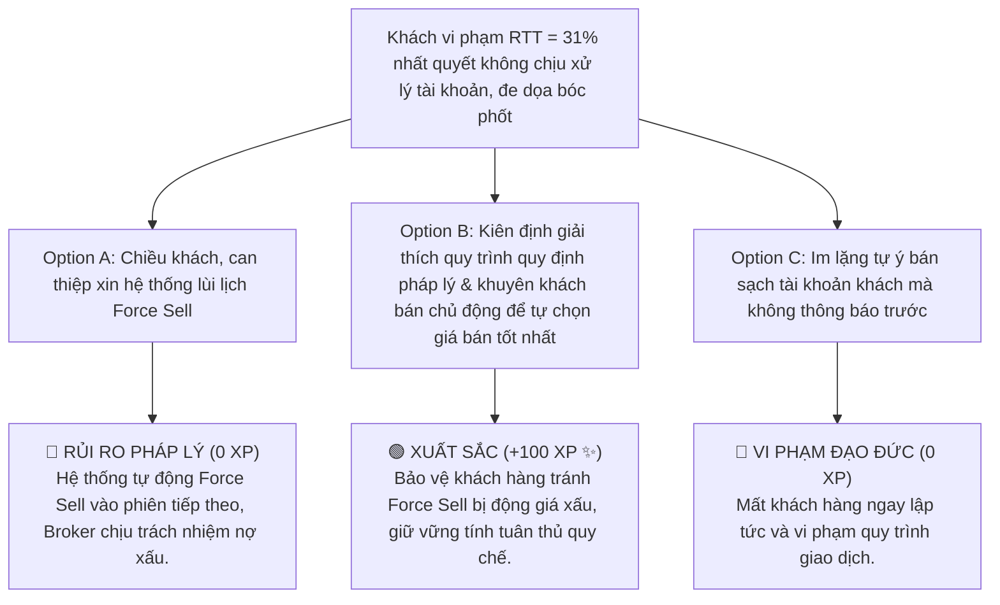

# MODULE 7: QUẢN TRỊ VỐN & GIAO DỊCH MARGIN
## Hướng Dẫn Vận Hành Hệ Thống Margin, Quản Trị Tỷ Lệ Ký Quỹ RTT & Xử Lý Khủng Hoảng Tài Khoản
### MÃ SỐ TÀI LIỆU: DT-07
**Chương trình:** KBSV NextGen 2026 · FinPeace × KB Securities Vietnam · Sở Giao Dịch 3 (HO3)

---

## 📌 HƯỚNG DẪN DÀNH CHO BROKER / HỌC VIÊN
- **Thời lượng học:** Ngày 11 (D11) & Ngày 12 (D12) của tuần 3.
- **Mục tiêu học tập:** 
  1. Thấu hiểu cơ chế đòn bẩy tài chính và cách tính toán Sức mua Margin.
  2. Nắm vững công thức quản trị Tỷ lệ tài sản ròng RTT tại KBSV để cảnh báo rủi ro cho khách hàng.
  3. Làm chủ quy trình tư vấn và kịch bản xử lý khủng hoảng khi tài khoản khách hàng bị Call Margin/Force Sell.
  4. Sử dụng gói ưu đãi lãi vay Margin tốt của KBSV làm đòn bẩy thu hút khách hàng năng động.

---

## 📌 I. TỔNG QUAN KIẾN THỨC CỐT LÕI (THEORETICAL FOUNDATION)

### 1. Bản Chất Của Giao Dịch Ký Quỹ Margin & Sức Mua Đòn Bẩy
Giao dịch ký quỹ (Margin Trading) là dịch vụ cho vay tiền của Công ty Chứng khoán (KBSV) dựa trên tài sản thế chấp (tiền mặt hoặc cổ phiếu có sẵn trong danh mục của khách hàng) để thực hiện mua chứng khoán. 

#### Ý nghĩa của Margin trong hoạt động môi giới:
*   **Đối với Khách hàng:** Gia tăng quy mô vốn để tận dụng cơ hội khi thị trường tăng trưởng mạnh (Vùng 3 Bứt Tốc).
*   **Đối với Broker:** Giúp khách hàng gia tăng giá trị tài sản ròng (NAV) giao dịch, từ đó tối ưu hóa phí giao dịch và doanh thu cho Broker.
*   **Tỷ lệ ký quỹ ban đầu (Initial Margin - IM):** Là tỷ lệ phần trăm vốn tự có tối thiểu mà khách hàng phải có để thực hiện đặt lệnh mua. (Ví dụ: Tỷ lệ ký quỹ 50% có nghĩa là khách hàng nộp 100 triệu sẽ được vay thêm tối đa 100 triệu, nâng tổng sức mua lên 200 triệu).

---

### 2. Quản Trị Tỷ Lệ Ký Quỹ Thực Tế RTT (Maintenance Margin Ratio)
Hệ thống quản trị rủi ro của KBSV giám sát trạng thái tài khoản ký quỹ theo thời gian thực thông qua chỉ số **RTT (Tỷ lệ tài sản ròng)**:

$$\text{RTT} = \frac{\text{Tài Sản Ròng}}{\text{Tổng Tài Sản Cổ Phiếu}} \times 100\% = \frac{\text{Tổng Giá Trị Danh Mục Cổ Phiếu} - \text{Dư Nợ Vay Margin}}{\text{Tổng Giá Trị Danh Mục Cổ Phiếu}} \times 100\%$$

```
┌────────────────────────────────────────────────────────┐
│                   HỆ THỐNG PHÂN PHÂN VÙNG RTT          │
├────────────────────────────────────────────────────────┤
│ RTT >= 45%: AN TOÀN (Safe Zone)                        │
│ - Danh mục chịu biến động giảm giá bình thường.        │
├────────────────────────────────────────────────────────┤
│ 35% <= RTT < 45%: CẢNH BÁO (Warning Zone)              │
│ - Bắt đầu hạn chế mua mới, chuẩn bị phương án dự phòng.│
├────────────────────────────────────────────────────────┤
│ 30% <= RTT < 35%: CALL MARGIN (Call Zone)              │
│ - Vi phạm tỷ lệ ký quỹ. Cần bổ sung tiền/bán cổ phiếu. │
├────────────────────────────────────────────────────────┤
│ RTT < 30%: FORCE SELL (Giải chấp cưỡng bức)            │
│ - Hệ thống tự động đặt lệnh giải chấp đưa RTT về 40%.   │
└────────────────────────────────────────────────────────┘
```

#### Quy trình xử lý vi phạm Call Margin:
*   Khi RTT giảm xuống dưới **35%**, hệ thống gửi tin nhắn Call Margin tự động.
*   Khách hàng có thời gian khắc phục trước **14:30 ngày làm việc tiếp theo**.
*   **Cách thức đưa RTT về ngưỡng an toàn tối thiểu (40%):**
    1.  *Nộp thêm tiền mặt* vào tài khoản.
    2.  *Bán chủ động một phần cổ phiếu* rủi ro để giảm dư nợ vay.

---

### 3. Gói Ưu Đãi Lãi Vay Margin KBSV - Vũ Khí Chốt Deal
Để gia tăng tính cạnh tranh trên thị trường và thúc đẩy phí giao dịch, KBSV HO3 cung cấp các gói ưu đãi lãi vay Margin vượt trội:
*   *Lãi suất ưu đãi thấp* dành riêng cho tài khoản mới mở eKYC (ví dụ: lãi suất chỉ từ 7.5% - 8.5%/năm).
*   *Gói miễn lãi Margin ngắn ngày* (ví dụ: miễn lãi T+3 hoặc T+5).
*   *Ý nghĩa tư vấn:* Broker sử dụng gói này làm "Hook" (mồi câu) tiếp cận các khách hàng thuộc nhóm D (Kiến tạo) hoặc nhóm I (Kết nối) đang giao dịch năng động tại các công ty chứng khoán khác có lãi suất vay cao (12% - 14%/năm).

---

## 📊 II. BÀI TẬP THỰC HÀNH TÍNH TOÁN BỐC TÁCH (PRACTICAL EXERCISES)

### 📝 Bài Tập 1: Tính Toán Xử Lý Tài Khoản Vi Phạm Call Margin
**Thông tin tài khoản khách hàng:**
*   Tổng giá trị danh mục ban đầu: 400.000.000 VNĐ.
*   Vốn tự có (Equity): 200.000.000 VNĐ.
*   Dư nợ vay Margin (Debt): 200.000.000 VNĐ.
*   Mã cổ phiếu thế chấp: SSI.
*   Do thị trường sụt giảm, giá cổ phiếu SSI giảm 25% khiến tổng giá trị danh mục chỉ còn 300.000.000 VNĐ.

**Yêu cầu:**
1. Tính tỷ lệ RTT hiện tại. Tài khoản đã bị vi phạm Call Margin chưa?
2. Tính số tiền mặt cần nộp thêm để đưa RTT về mốc an toàn 40%.
3. Nếu không nộp tiền, khách hàng phải bán bớt bao nhiêu tiền cổ phiếu SSI để đưa RTT về mốc an toàn 40%?

#### 💡 Lời Giải Chi Tiết:

1.  **Tính RTT hiện tại:**
    $$\text{Tài sản ròng hiện tại} = 300.000.000 - 200.000.000 = 100.000.000\text{ VNĐ}$$
    $$\text{RTT} = \frac{100.000.000}{300.000.000} \times 100\% = 33.3\%$$
    *Đánh giá:* Vì $30\% \le \text{RTT} < 35\%$, tài khoản **bị vi phạm Call Margin**.

2.  **Tính số tiền mặt cần nộp thêm ($X$):**
    $$\frac{100.000.000 + X}{300.000.000 + X} = 0.4 \implies 100.000.000 + X = 120.000.000 + 0.4X$$
    $$0.6X = 20.000.000 \implies X \approx 33.333.333\text{ VNĐ}$$
    *Kết luận:* Khách hàng cần nộp thêm tối thiểu **33.334.000 VNĐ** tiền mặt.

3.  **Tính giá trị cổ phiếu cần bán chủ động ($Y$):**
    *   Khi bán cổ phiếu giá trị $Y$, tổng giá trị danh mục giảm đi $Y$, dư nợ vay Margin giảm đi $Y$, vốn tự có (tài sản ròng) giữ nguyên không đổi (100.000.000 VNĐ).
    $$\frac{100.000.000}{300.000.000 - Y} = 0.4 \implies 100.000.000 = 120.000.000 - 0.4Y$$
    $$0.4Y = 20.000.000 \implies Y = 50.000.000\text{ VNĐ}$$
    *Kết luận:* Khách hàng cần bán bớt **50.000.000 VNĐ** cổ phiếu SSI.

---

## 🎯 III. TÌNH HUỐNG RA QUYẾT ĐỊNH TƯƠNG TÁC (INTERACTIVE SCENARIO)

### 🛑 Tình Huống: Xử Lý Khách Hàng Vi Phạm RTT Nhất Quyết Không Chịu Xử Lý Tài Khoản
*   **Bối cảnh (Context):** Tài khoản khách hàng vi phạm mức RTT = 31% nhưng khách hàng cố chấp không chịu nộp tiền và cấm Broker bán cổ phiếu vì: *"Nó giảm sâu thế này rồi kiểu gì chả bật lại, bán đi là mất hàng. Bên em mà tự ý bán giải chấp của anh là anh lên mạng bóc phốt cạch mặt!"*



---

## 🧪 IV. BÀI KIỂM TRA ĐÁNH GIÁ (SELF-CHECK KNOWLEDGE QUIZ)

**Câu 1: Khi tài khoản bị rơi vào trạng thái Force Sell (RTT < 30%), hệ thống quản trị rủi ro sẽ tự động đặt lệnh giải chấp để đưa RTT về mốc an toàn tối thiểu là bao nhiêu?**
*   A. Đưa về mốc 30%
*   B. Đưa về mốc 40% **(Đáp án Đúng)**
*   C. Đưa về mốc 50%
*   D. Bán sạch 100% tài khoản về 0

**Câu 2: Khi bán chủ động cổ phiếu để nâng tỷ lệ RTT, biến số nào trong công thức RTT sẽ giữ nguyên không đổi?**
*   A. Tổng giá trị tài sản cổ phiếu
*   B. Dư nợ vay Margin
*   C. Tài sản ròng (Equity / Vốn tự có) **(Đáp án Đúng)**
*   D. Chỉ số RTT

**Câu 3: Gói ưu đãi lãi vay Margin của KBSV thường được Broker sử dụng làm "Hook" tiếp cận hiệu quả nhất đối với nhóm khách hàng nào?**
*   A. Khách hàng F0 nhút nhát ở Vùng Đất Hoang.
*   B. Khách hàng giao dịch năng động có NAV lớn (nhóm D/I) thích tối ưu hóa chi phí vốn. **(Đáp án Đúng)**
*   C. Khách hàng sắp nghỉ hưu ưu tiên gửi tiết kiệm.
*   D. Khách hàng đầu tư thụ động vào ETF.

---

## 💬 V. KỊCH BẢN ROLEPLAY THỰC CHIẾN (AI ROLEPLAY DIALOGUE SCRIPT)

*   **Nhân vật:**
    *   **Học viên (Broker NextGen):** Điềm tĩnh, nguyên tắc, thấu cảm nhóm tính cách D (quyết đoán, nóng tính).
    *   **Khán giả AI (Anh Tiến):** Khách hàng VIP, tài khoản RTT = 31.5% đang nóng nảy khi bị gọi điện thông báo.

```dialogue
Khán giả AI (Anh Tiến): "Này em, tài khoản của anh giảm thế này anh tự biết! Bên em đừng có gọi giục nộp tiền hay dọa Force Sell gì cả. Cấm tự ý bán cổ phiếu SSI của anh đấy, bán đi lúc nó tăng lại thì ai đền cho anh?"

Học viên (NextGen Broker): "Dạ anh Tiến ơi, em rất hiểu sự bực bội và áp lực của anh khi thị trường chung biến động xấu làm tài khoản của mình bị ảnh hưởng. Bản thân em cũng rất tiếc khi phải thông báo tin này cho anh. 

Tuy nhiên, với tư cách là người đồng hành quản lý tài sản cho anh, em bắt buộc phải chia sẻ quy chế vận hành tự động của hệ thống để bảo vệ an toàn cho anh Tiến. 

Chỉ số RTT hiện tại của anh đang ở mốc 31.5%, tức là đã chạm ngưỡng Call Margin. Theo quy định pháp lý của Ủy ban Chứng khoán và quy chế tự động của hệ thống KBSV, nếu RTT giảm dưới 30%, hệ thống Quản trị rủi ro của công ty sẽ tự động kích hoạt lệnh Force Sell bán giải chấp vào đúng 14:15 chiều mai để đưa tài khoản về 40% mà không qua ý kiến Broker hay khách hàng."

Khán giả AI (Anh Tiến): "Hệ thống tự động bán à? Phiền phức thế nhỉ, thế giờ có cách nào anh tự xử lý được không?"

Học viên (NextGen Broker): "Dạ có anh Tiến ạ! Để anh luôn là người chủ động nắm quyền kiểm soát tài sản của mình, em đề xuất 2 giải pháp bọc thép:
- Giải pháp 1: Anh chuyển khoản nộp thêm 35 triệu VNĐ vào tài khoản chứng khoán trước 14:00 ngày mai. Khi đó RTT của anh lập tức quay về mốc 40% an toàn và anh giữ nguyên được số cổ phiếu SSI đợi nhịp bật nảy.
- Giải pháp 2: Anh chủ động đặt lệnh bán hạ tỷ trọng 50 triệu cổ phiếu SSI vào phiên sáng mai. Bán chủ động giúp anh tự lựa chọn được mức giá tốt nhất, thay vì để hệ thống tự động bán giải chấp cưỡng bức giá sàn vào phiên chiều.

Anh Tiến thấy phương án nào thuận tiện cho dòng tiền hiện tại của anh hơn ạ?"

Khán giả AI (Anh Tiến): "Ừ, để hệ thống tự động bán giá sàn thì dở quá. Anh sẽ chuyển khoản nộp thêm 35 triệu vào luôn phiên sáng mai. Cảm ơn em đã gọi điện phân tích rõ ràng nhé!"
```

---
**Mã số tài liệu:** `DT-07` · KBSV NextGen 2026 · FinPeace × KB Securities Vietnam
