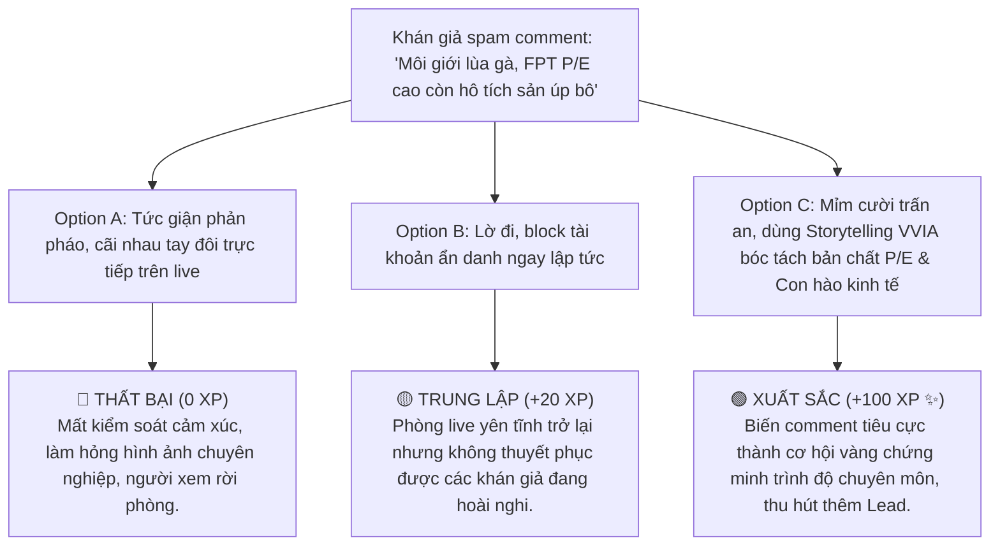

# MODULE 13: KỸ THUẬT LIVESTREAM TƯ VẤN ĐẦU TƯ
## Cẩm Nang Làm Chủ Phòng Live 90 Phút & Chiến Thuật Chuyển Đổi Lead Cho Financial KOC
### MÃ SỐ TÀI LIỆU: DT-13
**Chương trình:** KBSV NextGen 2026 · FinPeace × KB Securities Vietnam · Sở Giao Dịch 3 (HO3)

---

## 📌 HƯỚNG DẪN DÀNH CHO BROKER / HỌC VIÊN
- **Thời lượng:** Ca thực hành 90 phút hàng ngày trong giai đoạn thực chiến (Tuần 3 - 6).
- **Mục tiêu học tập:** 
  1. Biết cách thiết lập phòng livestream tiêu chuẩn (hình ảnh, âm thanh, công cụ hiển thị biểu đồ).
  2. Làm chủ kịch bản livestream 90 phút chia làm 3 phần rõ ràng.
  3. Biết cách tương tác, xử lý từ chối và xử lý comment tiêu cực thời gian thực.
  4. Áp dụng kỹ thuật CTA (Call to Action) tinh tế để chuyển đổi người xem thành khách hàng mở tài khoản eKYC.

---

## 📌 I. TỔNG QUAN KIẾN THỨC CỐT LÕI (THEORETICAL FOUNDATION)

### 1. Sự Dịch Chuyển Từ Tư Vấn 1-on-1 Sang Livestream 1-to-Many
Trong mô hình môi giới truyền thống, một Broker phải dành 8 tiếng mỗi ngày để gọi điện telesales hoặc nhắn tin tư vấn cho từng khách hàng đơn lẻ. Hiệu suất tiếp cận cực kỳ hạn chế. 

Với mô hình **Financial KOC 4.0**, livestream là công cụ đòn bẩy mạnh mẽ nhất giúp Broker tiếp cận **hàng trăm, hàng ngàn nhà đầu tư cùng một lúc (1-to-Many)**. Một phiên live 90 phút chuẩn chỉnh không chỉ giúp Broker xây dựng thương hiệu cá nhân nhanh chóng mà còn tạo ra phễu thu hút Lead mở tài khoản eKYC tự động với chi phí bằng 0.

### 2. Thiết Lập Phòng Live Tiêu Chuẩn (Livestream Studio Set-up)
Để tạo ra cảm giác tin cậy về mặt tài chính chuyên nghiệp, phòng livestream của Broker NextGen cần tuân thủ nghiêm ngặt các quy chuẩn kỹ thuật sau:
*   **Hình ảnh (Visual):**
    *   *Camera:* Độ phân giải tối thiểu 1080p (sử dụng camera điện thoại iPhone đời mới hoặc webcam chuyên dụng). Góc máy quay từ ngực trở lên, đảm bảo Broker giao tiếp bằng mắt (Eye-contact) trực diện với ống kính.
    *   *Bối cảnh (Background):* Gọn gàng, sạch sẽ. Nên có logo nhận diện thương hiệu **KBSV NextGen** hoặc tủ sách tài chính phía sau để tạo không khí tri thức. Tránh bối cảnh lộn xộn hoặc quá tối.
    *   *Ánh sáng (Lighting):* Sử dụng 1 đèn Ring Light phía trước mặt (Soft light) và 1 đèn LED màu ấm phía sau (Backlight) để tạo khối và chiều sâu cho khung hình. Tránh hiện tượng ngược sáng.
*   **Âm thanh (Audio):**
    *   Sử dụng mic cài áo không dây (như Rode Wireless hoặc GoChek) để loại bỏ tiếng ồn xung quanh. Tiếng nói của Broker phải rõ ràng, ấm áp, không bị rè hay vang.
*   **Công cụ hiển thị (Display Tools):**
    *   Sử dụng phần mềm OBS Studio hoặc TikTok Live Studio để chia màn hình: 70% diện tích hiển thị biểu đồ kỹ thuật (FireAnt / TradingView) và BCTC doanh nghiệp; 30% diện tích hiển thị khung hình của Broker và mã QR Code mở tài khoản eKYC của chi nhánh HO3.

```
┌────────────────────────────────────────────────────────┐
│                        OBS STUDIO                      │
├───────────────────────────────┬────────────────────────┤
│                               │                        │
│                               │      BROKER VIDEO      │
│                               │      (Góc máy dọc)     │
│        BIỂU ĐỒ TRADING        │                        │
│          (TradingView)        ├────────────────────────┤
│                               │                        │
│                               │      MÃ QR eKYC        │
│                               │   (Mở tài khoản 3')    │
│                               │                        │
└───────────────────────────────┴────────────────────────┘
```

### 3. Kịch Bản Livestream 90 Phút Tiêu Chuẩn (The 3-Part Live Script)
Một phiên livestream thành công cần được phân bổ thời gian và nội dung chặt chẽ để giữ chân người xem và chuyển đổi Lead:

```
┌─────────────────────────────────────────────────────────────────────────┐
│                    KỊCH BẢN PHÂN BỔ THỜI GIAN 90 PHÚT                   │
├───────────────────┬─────────────────────────────────┬───────────────────┤
│  15 PHÚT ĐẦU      │          50 PHÚT GIỮA           │   25 PHÚT CUỐI    │
│  Nhận định vĩ mô  │  Phân tích Deal VTA/SIP & FA    │  Hỏi đáp Q&A &    │
│  & VNINDEX        │  Chấm điểm ma trận tọa độ       │  eKYC CTA         │
└───────────────────┴─────────────────────────────────┴───────────────────┘
```

#### Phần 1: Nhận diện thị trường & Vĩ mô (15 phút đầu)
*   **Nội dung:** Broker tóm tắt tin tức vĩ mô nổi bật trong ngày (áp dụng kỹ năng nghiên cứu thứ cấp vĩ mô 2 lớp). Đánh giá nhanh xu hướng chỉ số VNINDEX dưới góc độ kỹ thuật (đang sideway tích lũy hay trong trend tăng/giảm).
*   **Mục tiêu:** Tạo "Hook" giữ chân người xem ngay lập tức bằng số liệu thực tế, định vị năng lực chuyên môn của Broker.

#### Phần 2: Phân tích cơ hội - Đưa ra Deal Strategy (50 phút giữa)
*   **Nội dung:** Giới thiệu các mã cổ phiếu tiêu biểu trong danh mục theo dõi (Watchlist).
    *   *Đối với tích sản SIP:* Trình bày luận điểm doanh nghiệp qua 4 tiêu chí lọc InvestWise. Giải thích Biên an toàn bằng câu chuyện kể sống động.
    *   *Đối với lướt sóng VTA:* Trực tiếp chấm điểm ma trận tọa độ 2 chiều (Trend Score và Sideway Score). Chỉ rõ các mức **Entry (Vùng mua) - Stop Loss (Cắt lỗ) - Take Profit (Chốt lời)** cụ thể.
*   **Mục tiêu:** Thể hiện giá trị thực tế của dịch vụ tư vấn đồng hành.

#### Phần 3: Tương tác Q&A & Kêu gọi hành động (25 phút cuối)
*   **Nội dung:** Trả lời trực tiếp các câu hỏi của người xem về danh mục cá nhân của họ dựa trên các công cụ phân tích (hướng dẫn họ cách tự phân bổ tài sản 3 Vùng đất).
*   **CTA (Call to Action):** Hướng dẫn mở tài khoản eKYC và nộp tiền vào hệ thống để được add vào VIP Telegram/Zalo nhận tín hiệu Deal real-time.

---

## 📊 II. BÀI TẬP THỰC HÀNH KỊCH BẢN (PRACTICAL EXERCISES)

### 📝 Bài Tập 1: Viết Script Cho 3 Phút Mở Đầu (The Hook Phase)
**Đề bài:** Hãy viết kịch bản nói chi tiết cho 3 phút đầu tiên khi bắt đầu phiên livestream trong bối cảnh thị trường VNINDEX bất ngờ giảm 20 điểm vào phiên chiều.

#### 💡 Lời Giải Mẫu:
> *"Chào mừng tất cả các anh chị nhà đầu tư đã quay trở lại với phiên Livestream định kỳ lúc 15h30 của [Tên Broker] - Cố vấn tài chính tại Sở Giao Dịch 3 KBSV.
>
> Vâng, em biết là chiều nay điện thoại của các anh chị đang rung lên liên tục và tài khoản của chúng ta đang hiển thị những sắc đỏ khá áp lực đúng không ạ? VNINDEX hôm nay bốc hơi hơn 20 điểm với khối lượng giao dịch đột biến. Rất nhiều hội nhóm đang hô hào 'thị trường sập rồi', 'bán tháo bằng mọi giá thôi'. 
>
> Nhưng các anh chị ơi, trước khi chúng ta bấm nút đặt lệnh trong hoảng loạn, hãy cùng dành ra 3 phút ngồi lại đây cùng em. Hôm nay, em sẽ dùng **Bản đồ 3 Vùng Đất Tài Chính** để bóc tách cho các anh chị thấy: Nhịp chỉnh 20 điểm này thực chất là một cơn giông bão ngắn hạn quét qua Vùng Đất Hoang, hay lại chính là **cơ hội vàng** để chúng ta gom thêm cổ phiếu xuất chúng giá chiết khấu cho Vùng 2 Tích Lũy? Em sẽ chấm điểm trực tiếp 3 mã cổ phiếu 'quốc dân' HPG, FPT và SSI ngay sau đây để anh chị có kế hoạch hành động tối nay. Anh chị nghe rõ âm thanh và hình ảnh thì thả tim cho em biết nhé!"*

### 📝 Bài Tập 2: Thiết Kế Kịch Bản Trình Bày Deal Trading VTA Trên Sóng Live
**Đề bài:** Hãy viết kịch bản Broker giới thiệu mã cổ phiếu HPG theo hệ thống chấm điểm VTA và lên Deal Strategy trên Live.

#### 💡 Lời Giải Mẫu:
> *"Bây giờ, em xin phép chuyển sang mã cổ phiếu tâm điểm ngày hôm nay: HPG (Tập đoàn Hòa Phát). Rất nhiều anh chị đang hỏi em có nên mua lướt sóng HPG lúc này không. Hãy cùng em chạy ma trận chấm điểm VTA độc quyền của FinPeace nhé:
>
> 1. Về **Trend Score (Động lượng xu hướng):** HPG xuất hiện Golden Cross khi giá cắt lên cụm SMA30/SMA60 (+1 điểm); đường MACD cắt lên Signal Line (+1 điểm); dải SuperTrend đang cho tín hiệu mây xanh nâng đỡ (+1 điểm). Tổng điểm Trend đạt 3/5.
> 2. Về **Sideway Score (Độ nén dao động):** RSI của HPG đang ở mốc 58, cực kỳ an toàn vì chưa chạm vùng quá mua 70 (+1 điểm); Bollinger Bands đang bó hẹp cho thấy độ nén tích lũy rất chặt (+1 điểm). Tổng điểm Sideway đạt 3/5.
>
> Với tổng điểm tọa độ [3/3], HPG đang cho tín hiệu tích lũy cạn kiệt Vol cực kỳ đẹp để chuẩn bị bứt phá. Kế hoạch giao dịch (Deal Strategy) bọc thép cho HPG như sau:
> *   **Vùng mua (Entry):** Quanh vùng giá 28.2 - 28.5 (ngay tại Mid-band của Bollinger).
> *   **Cắt lỗ (Stop Loss):** Bắt buộc đặt tại giá 26.8 (thủng dải dưới Bollinger và MA60). Mức lỗ tối đa chỉ là 5.5% - hoàn toàn tuân thủ quy tắc quản trị rủi ro 2% tổng NAV của chúng ta.
> *   **Chốt lời (Take Profit):** Kỳ vọng nhịp tăng đối xứng lên vùng đỉnh cũ 31.5 (lợi nhuận tiềm năng +11%).
>
> Các anh chị quét mã QR trên màn hình mở tài khoản eKYC KBSV để nhận thông báo điểm mua real-time ngay khi khớp nhé!"*

---

## 🎯 III. TÌNH HUỐNG RA QUYẾT ĐỊNH TƯƠNG TÁC (INTERACTIVE SCENARIO)

### 🛑 Tình Huống: Xử Lý Khán Giả Spam Comment Chê Bai, Tiêu Cực Thời Gian Thực
*   **Bối cảnh (Context):** Bạn đang phân tích Deal tích sản FPT trên Live thì một tài khoản ẩn danh liên tục spam comment: *"Môi giới NextGen toàn lùa gà thôi, FPT định giá P/E cao ngất ngưởng rồi còn hô hào tích sản để úp bô à?"*. Số lượng người xem (view) bắt đầu dao động và một số khán giả khác bắt đầu hoang mang.



*   **Lời giải thích của chuyên gia FinPeace:** 
    *"Đối với một Financial KOC, comment tiêu cực là món quà. Thay vì né tránh hoặc cãi vã, việc mỉm cười cảm ơn và sử dụng câu chuyện **See's Candy** để giải thích tại sao Warren Buffett sẵn sàng trả giá P/E cao cho một doanh nghiệp sở hữu **Con hào kinh tế lớn (Economic Moat)** sẽ lập tức chinh phục toàn bộ khán giả trong phòng live, khẳng định vị thế chuyên gia thực thụ của bạn."*

---

## 🧪 IV. BÀI KIỂM TRA ĐÁNH GIÁ (SELF-CHECK KNOWLEDGE QUIZ)

**Câu 1: Tỷ lệ diện tích phân bổ màn hình livestream tối ưu trên phần mềm OBS/TikTok Live Studio cho Broker là gì?**
*   A. 100% mặt Broker, không cần show biểu đồ.
*   B. 50% biểu đồ, 50% mặt Broker.
*   C. 70% biểu đồ kỹ thuật/BCTC, 30% mặt Broker và mã QR eKYC. **(Đáp án Đúng)**
*   D. 100% biểu đồ, Broker chỉ nói không cần xuất hiện.

**Câu 2: Trong kịch bản 90 phút livestream, phần quan trọng nhất để chuyển đổi người xem thành khách hàng thực tế là gì?**
*   A. Nói liên tục về vĩ mô thế giới suốt 90 phút.
*   B. Đưa ra Deal Strategy cụ thể và kêu gọi hành động CTA mở tài khoản eKYC. **(Đáp án Đúng)**
*   C. Hát giao lưu và chơi minigame tặng quà.
*   D. Show số tài khoản cá nhân chứng minh lãi.

**Câu 3: Khi gặp comment chê bai tiêu cực trên live, thái độ ứng xử chuẩn mực của Broker NextGen là gì?**
*   A. Block ngay không cần giải thích.
*   B. Mỉm cười cảm ơn, giữ vững cảm xúc và sử dụng kiến thức chuyên môn/storytelling để phân tích logic làm rõ vấn đề. **(Đáp án Đúng)**
*   C. Cãi nhau tay đôi để bảo vệ danh dự bản thân.
*   D. Tắt livestream ngay lập tức để tránh khủng hoảng.

---

## 💬 V. KỊCH BẢN ROLEPLAY THỰC CHIẾN (AI ROLEPLAY DIALOGUE SCRIPT)

*   **Nhân vật:**
    *   **Học viên (Host Live Stream):** Bình tĩnh, năng lượng tích cực, dùng công cụ VTA/VVIA giải thích.
    *   **Khán giả AI (Anh Thành - Nhóm tính cách C):** Cẩn trọng, hoài nghi, đặt câu hỏi khó về kỹ thuật.

```dialogue
Khán giả AI (Anh Thành): "Em ơi, HPG đang nằm dưới MA200 mà em bảo xu hướng đẹp để mua lướt sóng? Anh thấy các chỉ báo kỹ thuật khác như RSI đang cắm đầu xuống, mua vào lúc này có phải là bắt dao rơi không?"

Học viên (NextGen Broker): "Cảm ơn câu hỏi rất chi tiết và mang tính kỹ thuật cao của anh Thành ạ! Đây là câu hỏi mà em tin rất nhiều anh chị lướt sóng ngắn hạn đang thắc mắc. 

Đúng như anh Thành quan sát, thị giá HPG hiện tại đang nằm dưới MA200 một chút và RSI ngắn hạn đang điều chỉnh giảm. Tuy nhiên, nếu áp dụng Khung giao dịch VTA 3 bước:

Bước 1 - Identify cấu trúc sóng: HPG đang ở pha tích lũy đáy (Pha A sang Pha B của chu kỳ Wyckoff) với khối lượng giao dịch (Volume) cạn kiệt. Điều này có nghĩa là lực bán tháo của dòng tiền lớn đã dừng lại, giá giảm không kèm Vol là tín hiệu cạn cung chứ không phải bắt dao rơi.

Bước 2 - Validate chỉ báo: RSI điều chỉnh về mốc 42 chính là vùng nén lò xo chuẩn bị cho nhịp bật nảy. Chúng ta không mua đuổi khi RSI > 70, mà gom dần khi RSI ở vùng thấp tích lũy này.

Bước 3 - Execute kế hoạch: Đó là lý do tại sao em đặt mức Stop Loss cực kỳ ngắn tại giá 26.8 (ngay dưới biên hộp Darvas). Nếu sai, chúng ta mất tối đa 5% để bảo vệ 2% NAV. Nhưng nếu đúng, nhịp bật nảy đối xứng sẽ mang lại cho anh Thành biên lợi nhuận trên 11% khi giá tiến về cạnh trên.

Anh Thành thấy kế hoạch quản trị rủi ro này của em đã đủ bọc thép con số chưa ạ? Nếu anh muốn nhận file Excel tính toán điểm mua chi tiết của deal HPG này, anh quét nhanh mã QR bên góc màn hình mở tài khoản eKYC, em sẽ gửi tặng anh ngay nhé!"

Khán giả AI (Anh Thành): "Phân tích logic và quản trị rủi ro SL/TP chặt chẽ thế này thì anh yên tâm rồi. Anh vừa quét mã eKYC mở tài khoản xong, duyệt hỗ trợ anh vào nhóm tín hiệu nhé!"
```

---
**Mã số tài liệu:** `DT-13` · KBSV NextGen 2026 · FinPeace × KB Securities Vietnam
