# SƠ ĐỒ CẤU TRÚC HỆ THỐNG THÔNG TIN (SITEMAP DESIGN)
## DỰ ÁN: NEXTGEN ONLINE LEARNING HUB
*Sở hữu bởi: **FinPeace** (Logo Chính) · Phát triển cho: **Sở Giao Dịch 3 (HO3) - KB Securities Vietnam** (Logo Phụ)*
*Target Profile: **Gen Z, Fresher Kinh tế - Tài chính***

---

## 📌 I. TỔNG QUAN LUỒNG TRUY CẬP PHÂN QUYỀN (ACCESS FLOW)

Hệ thống thông tin `nextgen.finpeace.cloud` được chia thành các lớp giao diện dựa trên phân quyền người dùng (Role-based Access Control - RBAC):
1.  **Giao diện Public (Pre-login):** Thu hút, giới thiệu dự án, phễu tuyển dụng.
2.  **Giao diện Học viên (Learner Dashboard):** Quản lý theo tài khoản **Magic Link Passwordless Login** (học viên truy cập trực tiếp qua email link cá nhân, không cần password).
3.  **Giao diện Mentor/Trainer (Trì hoãn - Phase 2):** Đăng nhập qua Mentor Magic Link để quản lý danh sách học viên riêng lẻ được phân công cho account đó.
4.  **Giao diện Admin (Trì hoãn - Phase 2):** Cắt giảm trong giai đoạn đầu để tinh gọn hệ thống.

---

## 🗺️ II. SƠ ĐỒ CẤU TRÚC CHI TIẾT (MAP ARCHITECTURE)

```mermaid
graph TD
    %% Define Styles %%
    classDef default fill:#FAFAF7,stroke:#8B7355,stroke-width:1px,color:#1A1A1A;
    classDef brand fill:#F5A623,stroke:#8B7355,stroke-width:2px,color:#fff;
    classDef highlight fill:#FAFAF7,stroke:#E05050,stroke-width:1.5px,color:#1A1A1A;
    
    %% Root Navigation %%
    ROOT["nextgen.finpeace.cloud"]:::brand --> PUBLIC["1. PUBLIC ZONE (Khách vãng lai/Ứng viên)"]
    ROOT --> LEARNER["2. LEARNER ZONE (Học viên - Magic Link Login)"]
    ROOT -.-> MENTOR["3. MENTOR ZONE (Mentor - Phase 2)"]
    
    %% 1. Public Zone %%
    PUBLIC --> PUB_LAND["Giao diện Landing Page giới thiệu"]
    PUBLIC --> PUB_RECRUIT["Trang thông tin tuyển dụng & Đăng ký tuyển"]
    PUBLIC --> PUB_TEST["Bài test sàng lọc trực tuyến (ASK Test)"]
    
    %% 2. Learner Zone %%
    LEARNER --> L_DASH["Giao diện chính - Dashboard"]
    L_DASH --> L_DASH_DAILY["CRM Checklist & Daily Routine Tracker"]
    L_DASH --> L_DASH_NOTI["Trung tâm thông báo & Phản hồi từ Mentor"]
    
    LEARNER --> L_KNOWLEDGE["A. KNOWLEDGE ZONE (Học & Thi)"]
    L_KNOWLEDGE --> L_KN_CURRICULUM["Lộ trình 42 ngày (Mở khóa theo tiến độ)"]
    L_KN_CURRICULUM --> L_KN_DETAIL["Trang chi tiết ngày học (Video + Lý thuyết + Bài tập)"]
    L_KN_DETAIL --> L_KN_DOWNLOAD["Download Cheatsheets thực hành (PDF/HTML Print-only)"]
    L_KNOWLEDGE --> L_KN_QUIZ["Trang làm Quiz đánh giá năng lực hằng ngày"]
    L_KNOWLEDGE --> L_KN_GRADUATION["Trang nộp Báo cáo tốt nghiệp & Đăng ký slide"]
    
    LEARNER --> L_CONTENT["B. CONTENT LAB (Sáng tạo KOC)"]
    L_CONTENT --> L_CON_SCRIPT["Thư viện Script viết video 60s & Live 90m"]
    L_CONTENT --> L_CON_REVIEW["Trang đăng tải video kiểm duyệt & Feedback"]
    L_CONTENT --> L_CON_STORIES["Ngân hàng câu chuyện tài chính thực tế"]
    
    LEARNER --> L_TOOLKIT["C. SALES & SUPPORT TOOLKIT (Vũ khí số)"]
    L_TOOLKIT --> L_TL_VTA["Bộ công cụ vẽ Deal Strategy & Tính tỷ lệ Risk-Reward"]
    L_TOOLKIT --> L_TL_CRM["Bảng theo dõi khách hàng eKYC & Active Standard"]
    L_TOOLKIT -.-> L_TL_CHATBOT["Độc lập: Discord/Telegram Sales Chatbot (Không tốn Credit Web)"]
    
    LEARNER --> L_BATTLE["D. RISING STARS BATTLE (Đấu trường)"]
    L_BATTLE --> L_BT_LEADERBOARD["Bảng xếp hạng liên kết AUM / Số TK / Điểm Social"]
    L_BATTLE --> L_BT_DEATH["Trạng thái Sudden Death (Mốc sinh tồn tuần)"]
    L_BATTLE --> L_BT_REWARDS["Rewards Store (Đổi XP lấy voucher / tiền mặt)"]
    
    %% 3. Mentor Zone (Phase 2) %%
    MENTOR -.-> M_DASH["Giao diện chính - Dashboard Mentor"]
    MENTOR -.-> M_STUDENTS["Danh sách quản lý học viên theo Mentor Account"]
    MENTOR -.-> M_GRADING["Cổng chấm điểm Role-play (ASK Rubric)"]
```

---

## 📋 III. MÔ TẢ CHI TIẾT CÁC PHÂN KHU CHỨC NĂNG

### 1. Phân khu Giao diện Public (Pre-login)
*   **Nhận diện:** Logo **FinPeace** hiển thị chính ở vị trí nổi bật nhất. Logo **KBSV** hiển thị phụ (đúng chuẩn nhận diện của website NextGen hiện tại tại `https://nextgen.finpeace.cloud/`).
*   **Landing Page (`/`):** Tôn vinh hình ảnh Broker 4.0 - Digital Wealth Advisor. Có video pitching chương trình, các mốc thời gian tuyển dụng và nút ứng tuyển nhanh.
*   **Trang Tuyển Dụng (`/tuyen-dung`):** Công bố cơ chế lương thưởng đột phá của HO3 (Lương cứng 10M + 50% hoa hồng DTT), lộ trình thăng tiến 3 năm rõ ràng.
*   **Trang ASK Test (`/kiem-tra-dau-vao`):** Trắc nghiệm trực tuyến 20 câu sàng lọc kỹ năng mềm & thái độ tăng trưởng (Growth Mindset).

### 2. Giao diện Học viên (Learner Dashboard)
Khu vực học tập hoạt động hàng ngày của học viên (Target Profile: Gen Z) được quản lý cá nhân hóa:
*   **Cơ chế đăng nhập:** Đăng nhập không cần mật khẩu thông qua **Magic Link** gửi tới email của học viên. Link này dẫn trực tiếp tới không gian học cá nhân của họ.
*   **Dashboard chính (`/dashboard`):** Hiển thị chỉ số XP (Điểm kinh nghiệm), cấp độ, nhiệm vụ hàng ngày (Daily Quest).
*   **Lộ trình 42 ngày (`/khoa-hoc`):** Giao diện cuộn trực quan giống bản đồ game. Học viên chỉ mở khóa được ngày tiếp theo khi đã làm bài test và nộp checklist ngày cũ.
*   **Trang bài học (`/khoa-hoc/day-xx`):**
    *   *Trình xem video:* Bài giảng ngắn dưới 5 phút.
    *   *Nội dung chi tiết:* Text chuyên sâu kèm bảng công thức, kịch bản mẫu.
    *   *Nút download cheatsheet:* Liên kết đến các file HTML in ấn A4 bọc thép để học viên in ra dán trước bàn làm việc.
*   **Trang kiểm tra (`/khoa-hoc/day-xx/test`):** Trắc nghiệm 5 câu có chấm điểm và hiển thị đáp án giải thích chi tiết ngay lập tức.
*   **Rising Stars Battle (`/dau-truong`):**
    *   *Bảng xếp hạng (`/dau-truong/leaderboard`):* Vinh danh Top 10 học viên xuất sắc nhất chi nhánh theo ngày/tuần/tháng.
    *   *Sudden Death Tracker (`/dau-truong/survival`):* Giao diện đèn tín hiệu đỏ/vàng/xanh biểu hiện trạng thái sống còn của học viên dựa trên chỉ số active Standard hàng tuần.
*   **Sales & Support Toolkit (`/toolkit`):**
    *   *VTA Deal Scorer (`/toolkit/deal-scorer`):* Máy tính tích hợp đồ thị giá, tự động xuất điểm hiệu quả deal dựa trên mốc Entry, SL, TP học viên nhập vào.
    *   *Sales Support Chatbot:* Được tách biệt thành **công cụ chatbot độc lập tích hợp trên Discord / Telegram** của chương trình nhằm tối ưu hóa chi phí API Credit, không tích hợp trực tiếp trên Web.

### 3. Giao diện Giảng viên & Mentor (Trì hoãn sang Phase 2)
*   *Mục đích:* Triển khai sau khi giao diện học viên đã hoàn thiện để tránh rối rắm.
*   *Tính năng chính:* Đăng nhập theo email/magic link của giảng viên/mentor để truy cập dashboard nhìn được các tài khoản học viên riêng rẽ do mentor đó quản lý trực tiếp.
*   *Grading:* Mentor chấm điểm Role-play (ASK Rubric 50-40-10) trực tiếp trên giao diện quản lý của từng học viên.

### 4. Phân khu Quản trị hệ thống (Admin Panel)
*   *Quyết định:* **Cắt bỏ hoàn toàn khỏi Phase 1** để giảm độ phức tạp cho luồng vận hành ban đầu. Admin sẽ thao tác trực tiếp qua cơ sở dữ liệu hoặc công cụ database trực quan đơn giản.

---

## 🧸 IV. HƯỚNG DẪN TÍCH HỢP BỘ MASCOT (MASCOT INTEGRATION GUIDELINES)

Hệ thống sẽ sử dụng bộ Mascot chính thức của KB Securities (gồm 3 nhóm nhân vật: **Flexi, Investor, Trader** với định dạng Light/Dark mode) để làm giao diện sinh động, trẻ trung và hấp dẫn Gen Z:

1.  **Màn hình Login (Magic Link Landing Page):**
    *   Sử dụng hình ảnh Mascot `original` (Trạng thái trung lập, thân thiện) vẫy tay chào mừng học viên đăng nhập.
2.  **Trang Ngày Học Chi Tiết & Làm Quiz:**
    *   *Trong khi học / Đọc bài viết:* Mascot nhóm `trader/investor` trạng thái `tìm kiếm` hoặc `băn khoăn` được đặt bên cạnh các hộp kiến thức/câu hỏi Quiz để tăng tính gợi mở.
    *   *Khi trả lời đúng bài test:* Hiện pop-up Mascot trạng thái `trader OK` hoặc `vui vẻ`.
    *   *Khi trả lời sai hoặc gặp cảnh báo tuân thủ:* Hiện Mascot trạng thái `băn khoăn`.
3.  **Trang Bảng Xếp Hạng & Battle Arena:**
    *   Sử dụng Mascot trạng thái `háo hức` (háo hức đua top) để trang trí trên Banner Leaderboard.
4.  **Trang Đổi Thưởng (Rewards Store) & Tốt Nghiệp:**
    *   *Khi quy đổi quà thành công:* Mascot trạng thái `thảnh thơi` (thảnh thơi thụ hưởng thành quả) hoặc `cảm ơn` (cảm ơn sự nỗ lực).
    *   *Màn hình chúc mừng tốt nghiệp (Day 41-42):* Mascot trạng thái `cảm ơn` đội mũ cử nhân chúc mừng học viên.

*Đường dẫn tài nguyên Mascot trên hệ thống:* [KB Mascot Assets](file:///Users/yenle/Documents/kbsvnextgen/.agents/skills/kbsv-nextgen/resources/02-tuyen-dung/assets/KB%20Mascot/)
