# SƠ ĐỒ CẤU TRÚC HỆ THỐNG THÔNG TIN (SITEMAP DESIGN)
## DỰ ÁN: NEXTGEN ONLINE LEARNING HUB
*Sở hữu bởi: **FinPeace** · Phát triển cho: **Sở Giao Dịch 3 (HO3) - KB Securities Vietnam** · Target Profile: **Gen Z, Fresher Kinh tế - Tài chính***

---

## 📌 I. TỔNG QUAN LUỒNG TRUY CẬP PHÂN QUYỀN (ACCESS FLOW)

Hệ thống thông tin `nextgen.finpeace.cloud` được chia thành 4 lớp giao diện dựa trên phân quyền người dùng (Role-based Access Control - RBAC):
1.  **Giao diện Public (Pre-login):** Thu hút, giới thiệu dự án, phễu tuyển dụng.
2.  **Giao diện Học viên (Learner Dashboard):** Không gian trung tâm phục vụ học tập, rèn luyện kỹ năng, sử dụng công cụ AI và theo dõi bảng xếp hạng thực chiến.
3.  **Giao diện Mentor/Trainer:** Công cụ quản lý lớp học, chấm điểm Role-play theo khung ASK và phê duyệt Báo cáo tốt nghiệp.
4.  **Giao diện Admin (FinPeace & KBSV HO3):** Cấu trúc dữ liệu, đồng bộ hóa eKYC/AUM từ KBSV back-office, quản lý tài khoản.

---

## 🗺️ II. SƠ ĐỒ CẤU TRÚC CHI TIẾT (MAP ARCHITECTURE)

```mermaid
graph TD
    %% Define Styles %%
    classDef default fill:#FAFAF7,stroke:#8B7355,stroke-width:1px,color:#1A1A1A;
    classDef brand fill:#F5A623,stroke:#8B7355,stroke-width:2px,color:#fff;
    classDef highlight fill:#FAFAF7,stroke:#E05050,stroke-width:1.5px,color:#1A1A1A;
    
    %% Root Navigation %%
    ROOT["nextgen.finpeace.cloud"]:::brand --> PUBLIC["1. PUBLIC ZONE (Khách vãng lai/Ứng viên)"]
    ROOT --> LEARNER["2. LEARNER ZONE (Học viên - Đăng nhập)"]
    ROOT --> MENTOR["3. MENTOR ZONE (Giảng viên/Cố vấn)"]
    ROOT --> ADMIN["4. ADMIN ZONE (Quản trị hệ thống)"]
    
    %% 1. Public Zone %%
    PUBLIC --> PUB_LAND["Giao diện Landing Page giới thiệu"]
    PUBLIC --> PUB_RECRUIT["Trang thông tin tuyển dụng & Đăng ký tuyển"]
    PUBLIC --> PUB_TEST["Bài test sàng lọc trực tuyến (ASK Test)"]
    
    %% 2. Learner Zone %%
    LEARNER --> L_DASH["Giao diện chính - Dashboard"]
    L_DASH --> L_DASH_DAILY["CRM Checklist & Daily Routine Tracker"]
    L_DASH --> L_DASH_NOTI["Trung tâm thông báo & Phản hồi từ Mentor"]
    
    LEARNER --> L_KNOWLEDGE["A. KNOWLEDGE ZONE (Học & Thi)"]
    L_KNOWLEDGE --> L_KN_CURRICULUM["Lộ trình 42 ngày (Khóa/Mở khóa theo tiến độ)"]
    L_KN_CURRICULUM --> L_KN_DETAIL["Trang chi tiết ngày học (Video + Lý thuyết + Bài tập)"]
    L_KN_DETAIL --> L_KN_DOWNLOAD["Download Cheatsheets thực hành (PDF/HTML Print-only)"]
    L_KNOWLEDGE --> L_KN_QUIZ["Trang làm Quiz đánh giá năng lực hằng ngày"]
    L_KNOWLEDGE --> L_KN_GRADUATION["Trang nộp Báo cáo tốt nghiệp & Đăng ký slide"]
    
    LEARNER --> L_CONTENT["B. CONTENT LAB (Sáng tạo KOC)"]
    L_CONTENT --> L_CON_SCRIPT["Thư viện Script viết video 60s & Live 90m"]
    L_CONTENT --> L_CON_REVIEW["Trang đăng tải video kiểm duyệt & Feedback"]
    L_CONTENT --> L_CON_STORIES["Ngân hàng câu chuyện tài chính thực tế"]
    
    LEARNER --> L_TOOLKIT["C. SALES & AI TOOLKIT (Vũ khí số)"]
    L_TOOLKIT --> L_TL_GPT["Trang tương tác SalesGPT (DISC objection handler)"]
    L_TOOLKIT --> L_TL_VTA["Bộ công cụ vẽ Deal Strategy & Tính tỷ lệ Risk-Reward"]
    L_TOOLKIT --> L_TL_CRM["Bảng theo dõi khách hàng eKYC & Active Standard"]
    
    LEARNER --> L_BATTLE["D. RISING STARS BATTLE (Đấu trường)"]
    L_BATTLE --> L_BT_LEADERBOARD["Bảng xếp hạng liên kết AUM / Số TK / Điểm Social"]
    L_BATTLE --> L_BT_DEATH["Trạng thái Sudden Death (Mốc sinh tồn tuần)"]
    L_BATTLE --> L_BT_REWARDS["Rewards Store (Đổi XP lấy voucher / tiền mặt)"]
    
    %% 3. Mentor Zone %%
    MENTOR --> M_DASH["Giao diện chính - Dashboard Mentor"]
    MENTOR --> M_STUDENTS["Danh sách quản lý học viên thực tập"]
    MENTOR --> M_GRADING["Cổng chấm điểm tương tác"]
    M_GRADING --> M_GR_ROLEPLAY["Biểu mẫu chấm điểm Role-play (ASK Rubric 50-40-10)"]
    M_GRADING --> M_GR_GRADUATION["Đánh giá phê duyệt Báo cáo tốt nghiệp & Slide"]
    
    %% 4. Admin Zone %%
    ADMIN --> A_DASH["Giao diện Dashboard Admin"]
    ADMIN --> A_USERS["Quản lý tài khoản (Học viên, Mentor, Admin)"]
    ADMIN --> A_SYNC["Đồng bộ hóa dữ liệu giao dịch từ KBSV back-office (Excel import)"]
    ADMIN --> A_LOCKER["Quản lý khóa/mở các module học tập"]
```

---

## 📋 III. MÔ TẢ CHI TIẾT CÁC PHÂN KHU CHỨC NĂNG

### 1. Phân khu Giao diện Public (Pre-login)
*   ** Landing Page (`/`):** Tôn vinh hình ảnh Broker 4.0 - Digital Wealth Advisor. Có video pitching chương trình, các mốc thời gian tuyển dụng và nút kêu gọi ứng tuyển (CTA).
*   **Trang Tuyển Dụng (`/tuyen-dung`):** Công bố cơ chế lương thưởng đột phá của HO3 (Lương cứng 10M + 50% hoa hồng DTT), lộ trình thăng tiến 3 năm rõ ràng.
*   **Trang ASK Test (`/kiem-tra-dau-vao`):** Trắc nghiệm trực tuyến 20 câu sàng lọc kỹ năng mềm & thái độ tăng trưởng (Growth Mindset).

### 2. Phân khu Học viên (Learner Dashboard)
Đây là khu vực học tập hoạt động hàng ngày của học viên (Target Profile: Gen Z) được thiết kế theo triết lý Game hóa (Gamification):
*   **Dashboard chính (`/dashboard`):** Hiển thị chỉ số XP (Điểm kinh nghiệm), cấp độ, nhiệm vụ hàng ngày (Daily Quest - ví dụ: *Hoàn thành bài đọc lúc 9:00, Gặp khách hàng lúc 14:00, Đăng video TikTok trước 18:00*).
*   **Lộ trình 42 ngày (`/khoa-hoc`):** Giao diện cuộn trực quan giống bản đồ game. Học viên chỉ mở khóa được ngày tiếp theo khi đã làm bài test và nộp checklist ngày cũ (Ngăn chặn học dồn, học đối phó).
*   **Trang bài học (`/khoa-hoc/day-xx`):**
    *   *Trình xem video:* Bài giảng ngắn dưới 5 phút.
    *   *Nội dung chi tiết:* Text chuyên sâu kèm bảng công thức, kịch bản mẫu.
    *   *Nút download cheatsheet:* Liên kết đến các file HTML in ấn A4 bọc thép để học viên in ra dán trước bàn làm việc.
*   **Trang kiểm tra (`/khoa-hoc/day-xx/test`):** Trắc nghiệm 5 câu có chấm điểm và hiển thị đáp án giải thích chi tiết ngay lặp tức.
*   **Rising Stars Battle (`/dau-truong`):**
    *   *Bảng xếp hạng (`/dau-truong/leaderboard`):* Vinh danh Top 10 học viên xuất sắc nhất chi nhánh theo ngày/tuần/tháng.
    *   *Sudden Death Tracker (`/dau-truong/survival`):* Giao diện đèn tín hiệu đỏ/vàng/xanh biểu hiện trạng thái sống còn của học viên. Nếu đèn chuyển sang đỏ do không đạt KPI Standard tối thiểu trong tuần (từ Tuần 3), hệ thống sẽ tự động khóa tài khoản truy cập.
*   **AI Toolkit (`/toolkit`):**
    *   *SalesGPT (`/toolkit/salesgpt`):* Chatbot AI giả lập chân dung các nhóm khách hàng D-I-S-C khác nhau để học viên chat tập phản xạ xử lý từ chối.
    *   *VTA Deal Scorer (`/toolkit/deal-scorer`):* Máy tính tích hợp đồ thị giá, tự động xuất điểm hiệu quả deal dựa trên mốc Entry, SL, TP học viên nhập vào.

### 3. Phân khu Giảng viên & Mentor
*   **Student Manager (`/mentor/hoc-vien`):** Quản lý tiến độ hoàn thành bài học của từng cá nhân trong nhóm quản lý.
*   **Role-play Grading Portal (`/mentor/cham-diem`):** Biểu mẫu số hóa phiếu đánh giá phỏng vấn/role-play theo khung ASK. Mentor tick điểm trên app điện thoại lúc học viên đang thuyết trình trực tiếp tại Content Lab HO3.
*   **Graduation Reviewer (`/mentor/tot-nghiep`):** Cổng phê duyệt file báo cáo tốt nghiệp (.pdf) và slide thuyết trình (.pptx) của học viên trước khi bảo vệ trước Hội đồng.

### 4. Phân khu Quản trị hệ thống (Admin Panel)
*   **Import Data Engine (`/admin/sync`):** Tính năng cho phép Admin import file Excel trích xuất từ phần mềm KBSV chứa thông tin active Standard và số dư NAV của khách hàng theo mã giới thiệu của học viên. Hệ thống tự động tính điểm thi đua và đẩy lên Leaderboard theo thời gian thực.
*   **Curriculum Unlocker (`/admin/curriculum`):** Quản lý các mốc thời gian mở khóa/khóa các học phần bắt buộc của cả khóa.

---

## 🎨 IV. TIÊU CHUẨN ĐỒ HỌA GIAO DIỆN (UI DESIGN SYSTEM)
*   **Theme:** Sleek Warm Tech (Chuyên nghiệp tài chính kết hợp công nghệ hiện đại).
*   **Màu sắc:** Yellow `#F5A623` (Năng lượng, Gen Z, KBSV), Brown `#8B7355` (Kỷ luật, vững vàng, FinPeace), Warm Background `#FAFAF7` (Dịu mắt, tăng thời gian on-site đọc bài).
*   **Typography:** Header dùng `Space Grotesk`, Body dùng `Inter`.
